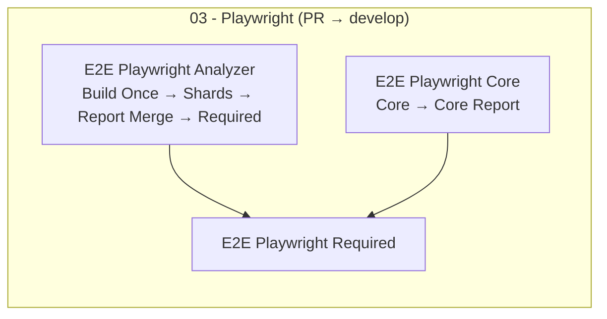

# Playwright CI Stabilization and Acceleration

## 014 FILE Ownership Note

Analyzer harness FILE E2E expectations during remediation:

- Shared `analyzer-imports` volume must be available to the bridge container.
- Bridge watcher is expected to detect and forward FILE artifacts.
- OpenELIS should validate ingestion/processing outcomes, not be the default
  directory poller.

## Why this exists

This document defines the Playwright CI execution contract for OpenELIS so CI
remains fast, deterministic, and debuggable while still validating analyzer
harness end-to-end behavior.

## Baseline before remediation

- Analyzer workflow:
  `[.github/workflows/e2e-playwright-analyzer-harness-manual.yml](../../.github/workflows/e2e-playwright-analyzer-harness-manual.yml)`
  - 2 shards, each performing full Maven + plugin + Docker build.
  - 30 minute job timeout per shard.
  - Docker cache aggressively pruned before every run.
  - Blob reporter enabled, but no merged HTML report fan-in.
- Core workflow:
  `[.github/workflows/e2e-playwright.yml](../../.github/workflows/e2e-playwright.yml)`
  - Single Playwright job with Docker rebuild in the test job.
  - 30 minute job timeout.
  - Docker cache aggressively pruned before every run.
- Harness bind-mount gap:
  - `file-import-results` requires
    `projects/analyzer-harness/volume/analyzer-imports`.
  - CI compose override did not bind this host path to `/data/analyzer-imports`.

## New CI topology



**Why the harness runs inside Playwright on PRs:** On `develop`,
`e2e-playwright-analyzer-harness-manual.yml` historically only defined
`workflow_dispatch`, so GitHub never scheduled a separate **Analyzer E2E
(Harness)** run for pull requests. `e2e-playwright.yml` already had
`pull_request` → develop. The reusable workflow
[`.github/workflows/e2e-playwright-analyzer-harness-reusable.yml`](../../.github/workflows/e2e-playwright-analyzer-harness-reusable.yml)
is invoked from Playwright so every PR runs core + analyzer harness. Manual runs
still use
[`.github/workflows/e2e-playwright-analyzer-harness-manual.yml`](../../.github/workflows/e2e-playwright-analyzer-harness-manual.yml)
(`workflow_dispatch`).

## Workflow contracts

### Analyzer harness (reusable + manual entry)

- Implemented in `e2e-playwright-analyzer-harness-reusable.yml`; PR path: job
  `03 - Playwright / Analyzer Harness` in `e2e-playwright.yml`.
- Build once in `build-once`:
  - Maven artifacts and plugin jars are built once.
  - Docker images are built once using Buildx with GHA cache scope
    `analyzer-e2e`.
  - Plugin jars are uploaded as short-lived artifacts.
  - Docker images are pushed to GHCR with PR-scoped tags and mapped for shard
    pull/retag.
- Test shards in `test-shards`:
  - Download plugin jars + image-map artifacts.
  - Restore plugin jars and pull/retag Docker images from GHCR.
  - Start compose stack with `--no-build`.
  - Load fixtures and seed analyzers.
  - Run harness shards.
  - Upload `blob-report` per shard.
- Demo shards in `demo-shards`:
  - Use the same prebuilt artifacts and GHCR image mapping as harness shards.
  - Run `demo` in 2 shards (`Demo 1/2`, `Demo 2/2`) for better wall-clock
    balance.
  - Upload `blob-report` per shard.
- Merge in `merge-reports`:
  - Download all harness + demo shard blob reports.
  - Merge to a single HTML report with `playwright merge-reports`.
- Enforce in `analyzer-e2e-gate`:
  - Required gate fails if shard or merge jobs fail.
- File import timing contract:
  - Harness webapp sets `-Dfile.import.poll.interval=5000` in
    `.github/ci/ci.analyzer-harness.yml`.
  - Playwright jobs set `FILE_IMPORT_POLL_MS=5000` +
    `FILE_IMPORT_DROP_BUFFER_MS=45000` in
    `.github/workflows/e2e-playwright-analyzer-harness-reusable.yml`.
  - `frontend/playwright/tests/file-import-results.spec.ts` computes
    `maxWaitMs = 2 * FILE_IMPORT_POLL_MS + FILE_IMPORT_DROP_BUFFER_MS`.
  - These values must stay aligned to avoid false timeouts/flakiness.
- UI naming for nested reusable jobs:
  - `03 - Playwright / Analyzer Harness / Build Once`
  - `03 - Playwright / Analyzer Harness / Shard ...` (raw matrix expression may
    appear when skipped due to upstream failure)
  - `03 - Playwright / Analyzer Harness / Demo 1/2`
  - `03 - Playwright / Analyzer Harness / Demo 2/2`
  - `03 - Playwright / Analyzer Harness / Report Merge`
  - `03 - Playwright / Analyzer Harness / Required`

### Core Playwright workflow

- In parallel with analyzer harness: build images with Buildx cache scope
  `playwright-core`, start compose, run `core-app`.
- Analyzer harness can be intentionally skipped on a PR by adding label
  `skip-analyzer-e2e`; the analyzer job is then marked `skipped`.
- Upload blob report, merge to HTML in a fan-in job.
- `03 Checkpoint` fails if core tests, report merge, **or** the analyzer harness
  reusable workflow fails (single blocking gate for PRs). Analyzer `skipped` is
  treated as intentional pass.

## CI naming map

- `Build + Test` and `01 Checkpoint` from `.github/workflows/backend.yml`
- `Image`, `Static`, and `02 Checkpoint` from `.github/workflows/frontend.yml`
- `Core`, `Core Report`, `Analyzer Harness`, and `03 Checkpoint` from
  `.github/workflows/e2e-playwright.yml`
- `Core|Storage|Admin|Independent` and `04 Checkpoint` from
  `.github/workflows/e2e-cypress-deprecated.yml`
- `Automation / Merge Conflicts`, `Validation / i18n`, `Validation / SpecKit`,
  `Projects / Catalyst / Gateway|Agents|MCP` for ancillary PR checks

## Video and demo test policy

- CI runs `core-demo` on the build stack (`e2e-playwright.yml`) and
  `harness-demo` on the full analyzer harness reusable workflow.
- `core-demo-video` auto-runs in PR-associated downstream CI only when PR diffs
  touch `frontend/playwright/tests/demo/core/**`.
- `harness-demo-video` auto-runs in PR-associated downstream CI only when PR
  diffs touch `frontend/playwright/tests/demo/harness/**`, and remains available
  via `E2E / Playwright / Analyzer Harness (Manual)`.
- `frontend/playwright/tests/manual-only/**` is excluded from ordinary PR CI and
  auto-video selection.
- Canonical local commands:

```bash
cd frontend
CLEANUP=false TEST_USER=admin TEST_PASS='<password>' npm run pw:test:core-demo-video
# or harness story recordings:
CLEANUP=false TEST_USER=admin TEST_PASS='<password>' npm run pw:test:harness-demo-video
```

- Script implementation:
  - `pw:test:video` delegates to `pw:test:harness-demo-video` (harness stories).
  - `PLAYWRIGHT_VIDEO=on` and `PLAYWRIGHT_SLOWMO=500` are set by the
    `*-demo-video` npm scripts.

## Test tiers and intent

- `core-app`: core foundational verification on the build stack.
- `core-demo`: core user-story proof (video-ready).
- `harness-foundational`: harness foundational verification.
- `harness-demo`: harness user-story proof in CI.
- `harness-manual-only`: real-device/operator-managed tests, manual-only.
- `harness-demo-video`: opt-in video evidence path for selected PRs/manual runs.

## Develop enforcement model

CI enforcement is split into two layers:

- **Ruleset-managed CI status checks (required):**
  - `01 Checkpoint`
  - `02 Checkpoint`
  - `03 Checkpoint`
  - `04 Checkpoint`
- **Classic branch protection (non-CI settings only):**
  - required PR reviews
  - code owner review requirements
  - conversation resolution and other branch settings

The old required contexts (`checkFormat-build-unitTest-and-run`,
`build-prod-frontend-image`, `build-and-run-qa-tests`) are replaced by the new
names above as part of the ruleset cutover.
