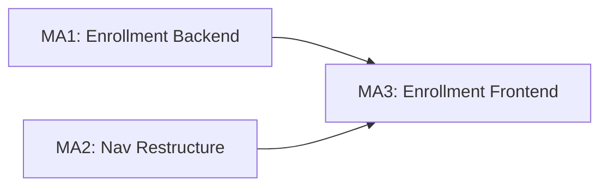

# Implementation Plan: EQA Enrollment & Navigation Addendum

**Branch**: `005-eqa-module` | **Date**: 2026-02-24 | **Parent Plan**:
[../plan.md](../plan.md) **Input**:
[eqa-enrollment-addendum-v3.md](eqa-enrollment-addendum-v3.md) +
[eqa-enrollment-mockup.jsx](eqa-enrollment-mockup.jsx)

## Summary

Extend the existing EQA module with navigation restructuring, self-enrollment in
external EQA programs (My Programs), provider-side participant enrollment, EQA
orders listing, and Order Entry integration for test/panel pre-population.

**Technical approach**: Add 4 new database tables for enrollment (DM-007 through
DM-010) via Liquibase, create corresponding JPA entities following the existing
5-layer pattern, restructure sidebar navigation from one EQA parent to two ("EQA
Tests" + "EQA Management") plus standalone "Alerts", and build 6 new React pages
using Carbon Design System.

## Technical Context

**Extends**: Existing EQA module (M1-M8 milestones, all 124 tasks complete)
**New Scope**: 4 new entities, 10+ new API endpoints, 6 new frontend pages,
navigation restructure

### Existing Codebase (already built)

- **EQAProgram**: Entity with `providerName` field (DM-002 already satisfied)
- **EQAManagementDashboard.js**: Lab participant view (needs repurposing)
- **EQADistributionDashboard.js**: Distribution management
- **ProgramManagement.js**: Program CRUD with ParticipantsTab
- **EQASampleEntry.js**: Order Entry EQA checkbox + program selection
- **Navigation**: Database-driven menu system (`clinlims.menu` table)
- **Backend**: Complete 5-layer architecture for EQA, Alerts, QC
- **i18n**: 260+ `eqa.*` keys in en.json/fr.json

### What Needs to Be Built

1. **Enrollment entities**: `EQAProgramEnrollment`, `EQALabProgramEnrollment`,
   `EQALabEnrollmentLabUnit`, `EQALabEnrollmentTestMap`
2. **Navigation restructure**: "EQA Tests" parent (Orders + My Programs), "EQA
   Management" parent (Programs + Participants + Distributions + Results),
   "Alerts" standalone
3. **Frontend pages**: EQA Orders, My Programs (with inline enrollment form),
   Participants page (with enrollment modal + withdraw modal)
4. **Order Entry extension**: Populate EQA Program dropdown from My Programs,
   pre-populate tests/panels from enrollment mappings
5. **API endpoints**: 10 new endpoints per addendum Section 7

## Constitution Check

- [x] **I. Configuration-Driven**: No country-specific branches. Provider names
      free-text with typeahead (BR-012). Enrollment status configurable.
- [x] **II. Carbon Design System**: All new UI uses @carbon/react. Mockup uses
      Lucide icons for reference only; implementation uses Carbon equivalents
      (DataTable, Modal, Select, Tag, Search, Button).
- [x] **III. FHIR/IHE**: New entities get standard `lastupdated` column. No
      external FHIR exposure needed for enrollment records.
- [x] **IV. Layered Architecture**: 5-layer pattern for all new entities.
      Services compile enrollment data within transaction. No @Transactional in
      controllers.
- [x] **V. TDD**: Unit tests for enrollment service logic, ORM validation for
      new entities, frontend tests for new pages.
- [x] **VI. Schema Management**: Liquibase changesets eqa-009 and eqa-010.
      Rollback scripts included.
- [x] **VII. Internationalization**: All new strings via React Intl. New keys
      from addendum Section 8 localization tags.
- [x] **VIII. Security**: RBAC via existing roles. EQA coordinator role for
      enrollment management. Audit trail on all enrollment changes.
- [x] **IX. Spec-Driven Iteration**: 3 milestones (MA1-MA3) below.

**GATE RESULT: PASS**

## Milestone Plan

| ID      | Branch Suffix           | Scope                                        | Verification                | Depends On |
| ------- | ----------------------- | -------------------------------------------- | --------------------------- | ---------- |
| MA1     | ma1-enrollment-backend  | Liquibase + Entities + DAOs + Services       | ORM validation + Unit tests | -          |
| [P] MA2 | ma2-nav-restructure     | Menu Liquibase + Routes + Page shells        | Manual QA + i18n complete   | -          |
| MA3     | ma3-enrollment-frontend | Full enrollment UI + Order Entry integration | Jest + manual QA            | MA1, MA2   |

### Milestone Dependency Graph



### Milestone Details

#### MA1: Enrollment Backend (Foundation)

**Liquibase**:

- `eqa-009-create-enrollment-tables.xml` — 4 new tables, sequences, constraints

**Entities** (in `org.openelisglobal.eqa.valueholder`):

- `EQAProgramEnrollment` — Provider-side org enrollment
- `EQALabProgramEnrollment` — Self-enrollment in external programs
- `EQALabEnrollmentLabUnit` — Lab unit mapping for self-enrollment
- `EQALabEnrollmentTestMap` — Test/panel mapping for self-enrollment

**DAOs** (in `org.openelisglobal.eqa.dao` + `daoimpl`):

- `EQAProgramEnrollmentDAO` + `EQAProgramEnrollmentDAOImpl`
- `EQALabProgramEnrollmentDAO` + `EQALabProgramEnrollmentDAOImpl`

**Services** (in `org.openelisglobal.eqa.service`):

- `EQAProgramEnrollmentService` / `Impl` — CRUD, status transitions, unique
  constraint enforcement
- `EQALabProgramEnrollmentService` / `Impl` — CRUD, test/panel mapping
  management, provider typeahead query

**Controllers** (in `org.openelisglobal.eqa.controller.rest`):

- `EQAEnrollmentRestController` — Provider-side enrollment endpoints
  - `GET /rest/eqa/programs/{programId}/enrollments`
  - `POST /rest/eqa/programs/{programId}/enrollments`
  - `PUT /rest/eqa/programs/{programId}/enrollments/{id}`
  - `GET /rest/eqa/eligible-organizations`
- `EQAMyProgramsRestController` — Self-enrollment endpoints
  - `GET /rest/eqa/my-programs`
  - `GET /rest/eqa/my-programs/{id}`
  - `POST /rest/eqa/my-programs`
  - `PUT /rest/eqa/my-programs/{id}`
  - `DELETE /rest/eqa/my-programs/{id}`
  - `GET /rest/eqa/providers`
- `EQAOrdersRestController` — EQA orders listing
  - `GET /rest/eqa/orders`
  - `GET /rest/eqa/orders/summary`

**Tests**:

- `EQAEnrollmentHibernateMappingTest` — ORM validation for 4 new entities
- `EQAProgramEnrollmentServiceTest` — Status transitions, duplicate prevention
- `EQALabProgramEnrollmentServiceTest` — CRUD, mapping management

#### MA2: Navigation Restructure (Parallel)

**Liquibase**:

- `eqa-010-restructure-menu.xml` — Restructure `clinlims.menu` entries:
  - Deactivate old `menu_eqa` parent
  - Create `menu_eqa_tests` parent (order 35): Orders, My Programs
  - Create `menu_eqa_mgmt` parent (order 36): Programs, Participants,
    Distributions, Results & Analysis
  - Move `menu_alerts` to standalone top-level (order 38)

**Frontend Routes** (in `App.js`):

- `/EQAOrders` → `EQAOrdersPage`
- `/EQAMyPrograms` → `MyProgramsPage`
- `/EQAParticipants` → `EQAParticipantsPage`
- Existing: `/EQAManagement` (Programs), `/EQADistribution`, `/Alerts`

**Page Shells** (minimal components with routing):

- `EQAOrdersPage.js` — Skeleton with breadcrumb, title, empty DataTable
- `MyProgramsPage.js` — Skeleton with breadcrumb, title, empty DataTable
- `EQAParticipantsPage.js` — Skeleton with program selector, empty DataTable

**i18n**:

- Add all keys from addendum Section 8 to en.json and fr.json
- Add `banner.menu.eqa.tests`, `banner.menu.eqa.tests.tooltip`,
  `banner.menu.eqa.tests.orders`, `banner.menu.eqa.tests.myPrograms`,
  `banner.menu.eqa.mgmt`, `banner.menu.eqa.mgmt.tooltip`,
  `banner.menu.eqa.mgmt.programs`, `banner.menu.eqa.mgmt.participants`,
  `banner.menu.eqa.mgmt.distributions`, `banner.menu.eqa.mgmt.results`

#### MA3: Enrollment Frontend (Full Implementation)

**EQA Tests → Orders** (`EQAOrdersPage.js`):

- Summary tiles: Pending, In Progress, Overdue, Completed This Month
- DataTable: Lab Number, EQA Program, Provider, Status, Deadline, Priority, Date
  Entered, Actions (overflow menu)
- Search bar + filter dropdowns (status, program, priority, date range)
- "Enter New EQA Test" button → `/SampleAdd?isEQA=true`
- Fetches from `GET /rest/eqa/orders` and `/rest/eqa/orders/summary`

**EQA Tests → My Programs** (`MyProgramsPage.js`):

- DataTable: Program Name, Provider, Lab Units (tags), Tests/Panels (tags),
  Status, Actions
- Inline enrollment form (expand below row — per mockup pattern):
  - Program Name (required), Provider (typeahead), Description
  - Test Mapping section: Lab Units multi-select, Tests multi-select, Panels
    multi-select
  - Active toggle, Save/Cancel buttons
- "Enroll in Program" button opens inline form at top
- Edit via row action → expands inline form pre-populated
- Deactivate/Reactivate via overflow menu
- Fetches from `GET /rest/eqa/my-programs`
- Provider typeahead from `GET /rest/eqa/providers`
- Lab units from `GET /rest/test-sections`
- Tests from `GET /rest/tests` (active only)
- Panels from `GET /rest/panels` (active only)

**EQA Management → Participants** (`EQAParticipantsPage.js`):

- Program selector dropdown at top (from `GET /rest/eqa/programs`)
- DataTable: Organization Name, Code, District, Enrollment Date, Status, Actions
- Local lab marked with "(This Lab)" tag
- "Enroll Participant" button → Modal with searchable org multi-select
  - Already-enrolled orgs marked/disabled
  - Bulk enroll via `POST /rest/eqa/programs/{id}/enrollments`
- Status management: Suspend/Withdraw/Reactivate via overflow menu
  - Withdraw shows confirmation modal with reason textarea
  - `PUT /rest/eqa/programs/{id}/enrollments/{enrollmentId}`

**Order Entry Integration**:

- Populate EQA Program dropdown from active My Programs enrollments
  (`GET /rest/eqa/my-programs` filtered `isActive=true`)
- When program selected, fetch test/panel mappings
- Pre-populate test/panel selection in Add Sample step (overridable)
- Pre-filter lab unit selector if lab units mapped

**Tests**:

- `EQAOrdersPage.test.jsx` — Renders summary tiles, table, filters
- `MyProgramsPage.test.jsx` — Enrollment form, inline expand, CRUD
- `EQAParticipantsPage.test.jsx` — Program selector, enrollment modal, status
  management

## Project Structure (New Files)

```text
# Backend
src/main/java/org/openelisglobal/eqa/
├── valueholder/
│   ├── EQAProgramEnrollment.java          # NEW (DM-007)
│   ├── EQALabProgramEnrollment.java       # NEW (DM-008)
│   ├── EQALabEnrollmentLabUnit.java       # NEW (DM-009)
│   └── EQALabEnrollmentTestMap.java       # NEW (DM-010)
├── dao/
│   ├── EQAProgramEnrollmentDAO.java       # NEW
│   └── EQALabProgramEnrollmentDAO.java    # NEW
├── daoimpl/
│   ├── EQAProgramEnrollmentDAOImpl.java   # NEW
│   └── EQALabProgramEnrollmentDAOImpl.java # NEW
├── service/
│   ├── EQAProgramEnrollmentService.java   # NEW
│   ├── EQAProgramEnrollmentServiceImpl.java # NEW
│   ├── EQALabProgramEnrollmentService.java # NEW
│   └── EQALabProgramEnrollmentServiceImpl.java # NEW
└── controller/rest/
    ├── EQAEnrollmentRestController.java   # NEW
    ├── EQAMyProgramsRestController.java   # NEW
    └── EQAOrdersRestController.java       # NEW

# Database Migrations
src/main/resources/liquibase/3.3.x.x/
├── eqa-009-create-enrollment-tables.xml   # NEW
└── eqa-010-restructure-menu.xml           # NEW

# Backend Tests
src/test/java/org/openelisglobal/eqa/
├── EQAEnrollmentHibernateMappingTest.java # NEW
├── service/
│   ├── EQAProgramEnrollmentServiceTest.java # NEW
│   └── EQALabProgramEnrollmentServiceTest.java # NEW
└── controller/
    ├── EQAEnrollmentRestControllerTest.java # NEW
    └── EQAMyProgramsRestControllerTest.java # NEW

# Frontend
frontend/src/components/eqa/
├── EQAOrdersPage.js                       # NEW (FR-010)
├── MyProgramsPage.js                      # NEW (FR-013)
├── EQAParticipantsPage.js                 # NEW (FR-011.2)
├── InlineEnrollmentForm.js                # NEW (enrollment form)
├── EnrollOrgModal.js                      # NEW (org selection modal)
├── WithdrawModal.js                       # NEW (withdraw confirmation)
└── __tests__/
    ├── EQAOrdersPage.test.jsx             # NEW
    ├── MyProgramsPage.test.jsx            # NEW
    └── EQAParticipantsPage.test.jsx       # NEW

# i18n (MODIFIED)
frontend/src/languages/
├── en.json                                # MODIFIED: add addendum keys
└── fr.json                                # MODIFIED: add addendum keys

# Routes (MODIFIED)
frontend/src/App.js                        # MODIFIED: add new routes
```

## Testing Strategy

### MA1 Tests (Backend)

- **ORM Validation**: `EQAEnrollmentHibernateMappingTest` — All 4 new entities
  build SessionFactory successfully, <5s, no database
- **Unit Tests**: `EQAProgramEnrollmentServiceTest` —
  - Enroll organization (happy path)
  - Duplicate enrollment prevented (same org + program + Active)
  - Status transitions: Active→Suspended, Suspended→Active, Active→Withdrawn
  - Invalid transitions rejected (Withdrawn→Active)
- **Unit Tests**: `EQALabProgramEnrollmentServiceTest` —
  - Create self-enrollment with test/panel mappings
  - Update enrollment (replace mappings)
  - Soft delete (set isActive=false)
  - Provider typeahead union query

### MA2 Tests (Navigation)

- **Manual QA**: Navigation renders correct structure after Liquibase migration
- **i18n**: All new keys present in en.json and fr.json

### MA3 Tests (Frontend)

- **Jest**: `EQAOrdersPage.test.jsx` — Renders tiles, table, handles filters
- **Jest**: `MyProgramsPage.test.jsx` — Inline form expand/collapse, CRUD
- **Jest**: `EQAParticipantsPage.test.jsx` — Modal, status badges, bulk enroll

## Design Artifacts

| Artifact         | Path                                       | Status               |
| ---------------- | ------------------------------------------ | -------------------- |
| Research         | `addendum/research.md`                     | Complete             |
| Data Model       | `addendum/data-model.md`                   | Complete             |
| API Contracts    | `addendum/contracts/eqa-addendum-api.yaml` | Complete             |
| Plan             | `addendum/plan.md`                         | Complete (this file) |
| Mockup Reference | `addendum/eqa-enrollment-mockup.jsx`       | Provided             |
| Spec             | `addendum/eqa-enrollment-addendum-v3.md`   | Provided             |
