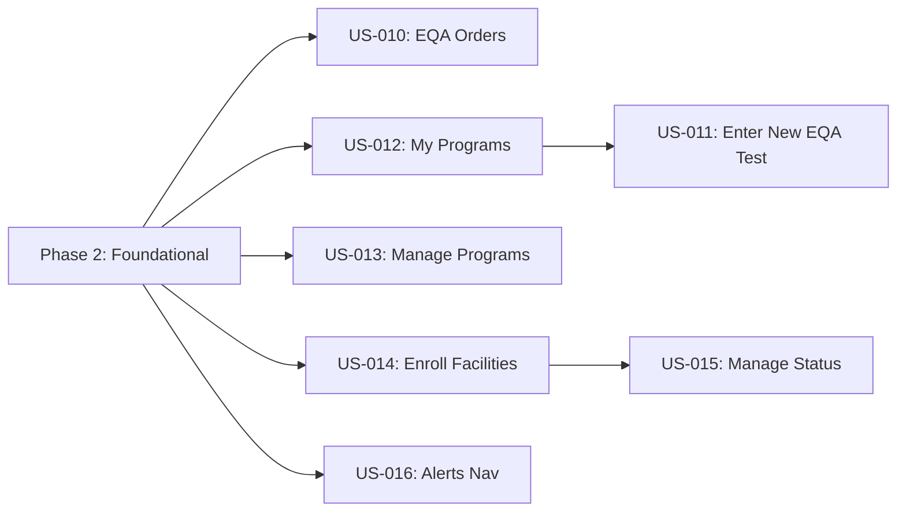

# Tasks: EQA Enrollment & Navigation Addendum

**Input**: Design documents from `/specs/005-eqa-module/addendum/`
**Prerequisites**: plan.md (required), eqa-enrollment-addendum-v3.md (spec),
research.md, data-model.md, contracts/eqa-addendum-api.yaml

**Tests**: Tests are **MANDATORY** per Constitution Principle V. Backend uses
JUnit 4 + Mockito. Frontend uses React Testing Library + Jest.

**Organization**: Tasks grouped by user story from addendum Section 4 (US-010
through US-016). Foundational tasks include all shared infrastructure (entities,
DAOs, migrations, i18n, routes).

## Format: `[ID] [P?] [Story] Description`

- **[P]**: Can run in parallel (different files, no dependencies)
- **[Story]**: Which user story (US010–US016) from addendum Section 4

## Path Conventions

- **Backend**: `src/main/java/org/openelisglobal/eqa/`
- **Migrations**: `src/main/resources/liquibase/3.3.x.x/`
- **Backend Tests**: `src/test/java/org/openelisglobal/eqa/`
- **Frontend**: `frontend/src/components/eqa/`
- **i18n**: `frontend/src/languages/`
- **Routes**: `frontend/src/App.js`

---

## Phase 1: Setup (Liquibase Migrations)

**Purpose**: Database schema changes for enrollment tables and navigation
restructure

- [x] T001 Create Liquibase migration for 4 enrollment tables (DM-007 through
      DM-010) with sequences, FKs, constraints, and partial unique index in
      `src/main/resources/liquibase/3.3.x.x/eqa-009-create-enrollment-tables.xml`
- [x] T002 [P] Create Liquibase migration for sidebar menu restructure
      (deactivate old menu_eqa parent, create menu_eqa_tests + menu_eqa_mgmt
      parents, move menu_alerts to standalone) in
      `src/main/resources/liquibase/3.3.x.x/eqa-010-restructure-menu.xml`
- [x] T003 Register eqa-009 and eqa-010 changesets in master changelog
      `src/main/resources/liquibase/dbChangelog.xml`

---

## Phase 2: Foundational (Entities, DAOs, i18n, Routes)

**Purpose**: Core infrastructure that MUST be complete before ANY user story can
be implemented

**CRITICAL**: No user story work can begin until this phase is complete

### Backend Entities

- [x] T004 [P] Create EQAProgramEnrollment entity (DM-007: provider-side org
      enrollment with status lifecycle) in
      `src/main/java/org/openelisglobal/eqa/valueholder/EQAProgramEnrollment.java`
- [x] T005 [P] Create EQALabProgramEnrollment entity (DM-008: self-enrollment in
      external programs) in
      `src/main/java/org/openelisglobal/eqa/valueholder/EQALabProgramEnrollment.java`
- [x] T006 [P] Create EQALabEnrollmentLabUnit entity (DM-009: lab unit mapping
      join table) in
      `src/main/java/org/openelisglobal/eqa/valueholder/EQALabEnrollmentLabUnit.java`
- [x] T007 [P] Create EQALabEnrollmentTestMap entity (DM-010: test/panel mapping
      with CHECK constraint) in
      `src/main/java/org/openelisglobal/eqa/valueholder/EQALabEnrollmentTestMap.java`

### Backend DAOs

- [x] T008 [P] Create EQAProgramEnrollmentDAO interface in
      `src/main/java/org/openelisglobal/eqa/dao/EQAProgramEnrollmentDAO.java`
- [x] T009 [P] Create EQAProgramEnrollmentDAOImpl in
      `src/main/java/org/openelisglobal/eqa/daoimpl/EQAProgramEnrollmentDAOImpl.java`
- [x] T010 [P] Create EQALabProgramEnrollmentDAO interface in
      `src/main/java/org/openelisglobal/eqa/dao/EQALabProgramEnrollmentDAO.java`
- [x] T011 [P] Create EQALabProgramEnrollmentDAOImpl in
      `src/main/java/org/openelisglobal/eqa/daoimpl/EQALabProgramEnrollmentDAOImpl.java`

### Backend Tests (Foundational)

- [x] T012 Create EQAEnrollmentHibernateMappingTest for ORM validation of all 4
      new entities in
      `src/test/java/org/openelisglobal/eqa/EQAEnrollmentHibernateMappingTest.java`

### Internationalization

- [x] T013 [P] Add all addendum Section 8 i18n keys (75+ keys) to
      `frontend/src/languages/en.json`
- [x] T014 [P] Add all addendum Section 8 i18n keys with French translations to
      `frontend/src/languages/fr.json`
- [x] T015 [P] Add navigation menu i18n keys (banner.menu.eqa.tests,
      banner.menu.eqa.mgmt, etc.) to both `frontend/src/languages/en.json` and
      `frontend/src/languages/fr.json`

### Frontend Routes & Page Shells

- [x] T016 Add new routes in `frontend/src/App.js`: /EQAOrders → EQAOrdersPage,
      /EQAMyPrograms → MyProgramsPage, /EQAParticipants → EQAParticipantsPage
- [x] T017 [P] Create EQAOrdersPage shell (breadcrumb, title, empty DataTable)
      in `frontend/src/components/eqa/EQAOrdersPage.js`
- [x] T018 [P] Create MyProgramsPage shell (breadcrumb, title, empty DataTable)
      in `frontend/src/components/eqa/MyProgramsPage.js`
- [x] T019 [P] Create EQAParticipantsPage shell (program selector, breadcrumb,
      title, empty DataTable) in
      `frontend/src/components/eqa/EQAParticipantsPage.js`

**Checkpoint**: Foundation ready — all entities mapped, DAOs wired, routes
registered, page shells render, i18n keys present. User story implementation can
now begin.

---

## Phase 3: US-010 — View EQA Test Orders (Priority: P1) MVP

**Goal**: Lab technicians can see all EQA test orders with status, deadlines,
filtering, and summary tiles.

**Independent Test**: Navigate to EQA Tests → Orders; DataTable shows EQA orders
sorted by deadline; summary tiles display correct counts; filters narrow
results.

### Backend for US-010

- [x] T020 [P] [US010] Create EQAOrdersRestController with
      `GET /rest/eqa/orders` (query SampleEQA joined with Sample, support
      status/programId/priority/from/to/search params) and
      `GET /rest/eqa/orders/summary` in
      `src/main/java/org/openelisglobal/eqa/controller/rest/EQAOrdersRestController.java`
- [x] T021 [P] [US010] Write EQAOrdersRestControllerTest (mock service, verify
      filtering params, verify summary response shape) in
      `src/test/java/org/openelisglobal/eqa/controller/EQAOrdersRestControllerTest.java`

### Frontend for US-010

- [x] T022 [US010] Implement EQAOrdersPage: summary tiles (Pending/In
      Progress/Overdue/Completed This Month), DataTable with columns per
      FR-010.1, search bar, filter dropdowns (status/program/priority/date
      range), "Enter New EQA Test" button, overflow menu actions per FR-010.5 in
      `frontend/src/components/eqa/EQAOrdersPage.js`
- [x] T023 [US010] Write EQAOrdersPage.test.jsx: renders summary tiles, renders
      DataTable with mock data, filter interactions, "Enter New EQA Test" button
      navigates correctly in
      `frontend/src/components/eqa/__tests__/EQAOrdersPage.test.jsx`

**Checkpoint**: EQA Orders page fully functional — lab technicians can view,
search, and filter their EQA orders.

---

## Phase 4: US-012 — Enroll in External EQA Program (Priority: P1) MVP

**Goal**: Lab managers can self-enroll in external EQA programs with optional
test/panel mapping that pre-populates Order Entry.

**Independent Test**: Navigate to EQA Tests → My Programs; click "Enroll in
Program"; fill form with program name, provider, select tests/panels; save;
enrollment appears in table with correct tags.

### Backend for US-012

- [x] T024 [P] [US012] Create EQALabProgramEnrollmentService interface with
      CRUD + provider typeahead query in
      `src/main/java/org/openelisglobal/eqa/service/EQALabProgramEnrollmentService.java`
- [x] T025 [US012] Create EQALabProgramEnrollmentServiceImpl: CRUD operations,
      test/panel/lab-unit mapping management, cascading saves, soft delete
      (isActive=false), provider union query in
      `src/main/java/org/openelisglobal/eqa/service/EQALabProgramEnrollmentServiceImpl.java`
- [x] T026 [US012] Write EQALabProgramEnrollmentServiceTest: create enrollment
      with mappings, update enrollment (replace mappings), soft delete, provider
      typeahead union query in
      `src/test/java/org/openelisglobal/eqa/service/EQALabProgramEnrollmentServiceTest.java`
- [x] T027 [P] [US012] Create EQAMyProgramsRestController with
      `GET /rest/eqa/my-programs`, `GET /rest/eqa/my-programs/{id}`,
      `POST /rest/eqa/my-programs`, `PUT /rest/eqa/my-programs/{id}`,
      `DELETE /rest/eqa/my-programs/{id}`, `GET /rest/eqa/providers` in
      `src/main/java/org/openelisglobal/eqa/controller/rest/EQAMyProgramsRestController.java`
- [x] T028 [P] [US012] Write EQAMyProgramsRestControllerTest in
      `src/test/java/org/openelisglobal/eqa/controller/EQAMyProgramsRestControllerTest.java`

### Frontend for US-012

- [x] T029 [US012] Create InlineEnrollmentForm component: Program Name
      (required), Provider (typeahead from GET /rest/eqa/providers),
      Description, Lab Units multi-select (from GET /rest/test-sections), Tests
      multi-select (from GET /rest/tests), Panels multi-select (from GET
      /rest/panels), Active toggle, Save/Cancel in
      `frontend/src/components/eqa/InlineEnrollmentForm.js`
- [x] T030 [US012] Implement MyProgramsPage: DataTable with columns per FR-013.1
      (Program Name, Provider, Lab Units tags, Tests/Panels tags, Status badge,
      Actions), "Enroll in Program" button, inline enrollment form
      expand/collapse, edit via row action, deactivate/reactivate via overflow
      menu in `frontend/src/components/eqa/MyProgramsPage.js`
- [x] T031 [US012] Write MyProgramsPage.test.jsx: renders table, inline form
      expand/collapse, enrollment CRUD, deactivate/reactivate, provider
      typeahead in
      `frontend/src/components/eqa/__tests__/MyProgramsPage.test.jsx`

**Checkpoint**: My Programs page fully functional — lab managers can self-enroll
in external EQA programs with test/panel mappings.

---

## Phase 5: US-011 — Enter New EQA Test (Priority: P2)

**Goal**: Lab technicians can quickly enter a new EQA test order with
pre-populated program, tests, and panels from My Programs enrollment.

**Independent Test**: Click "Enter New EQA Test" on Orders page; Order Entry
opens with EQA checkbox pre-checked; EQA Program dropdown shows active My
Programs; selecting a program pre-populates tests/panels.

**Depends on**: US-012 (My Programs provides the enrollment data)

### Frontend for US-011

- [x] T032 [US011] Extend Order Entry to populate EQA Program dropdown from
      active My Programs enrollments (`GET /rest/eqa/my-programs?isActive=true`)
      and pre-filter lab unit selector if lab units mapped in
      `frontend/src/components/addOrder/Index.js` and
      `frontend/src/components/addOrder/OrderEntryAdditionalQuestions.js`
- [x] T033 [US011] Implement test/panel pre-population: when EQA program
      selected in Order Entry, fetch `GET /rest/eqa/my-programs/{id}` and
      pre-select mapped tests/panels in Add Sample step (overridable) in
      `frontend/src/components/addOrder/` relevant files
- [x] T034 [US011] Wire "Enter New EQA Test" button on EQAOrdersPage to navigate
      to `/SampleAdd?isEQA=true` per BR-015 context passing in
      `frontend/src/components/eqa/EQAOrdersPage.js`

**Checkpoint**: Order Entry integration complete — EQA program selection
pre-populates tests/panels from My Programs enrollment.

---

## Phase 6: US-013 — Manage EQA Programs as Provider (Priority: P2)

**Goal**: EQA coordinators can create and manage EQA programs their lab
distributes, with provider typeahead suggestions.

**Independent Test**: Navigate to EQA Management → Programs; existing program
CRUD works; provider field has typeahead suggestions from union of managed
programs + self-enrollments; participant count column displays.

### Backend for US-013

- [x] T035 [US013] Extend existing EQAProgramRestController to include
      participant count in GET response (join count from eqa_program_enrollment
      where status=Active) and wire provider typeahead from
      EQAMyProgramsRestController's `/rest/eqa/providers` endpoint in
      `src/main/java/org/openelisglobal/eqa/controller/rest/EQAProgramRestController.java`

### Frontend for US-013

- [x] T036 [US013] Update ProgramManagement.js to show "Enrolled Participants"
      count column, add provider typeahead using GET /rest/eqa/providers in
      program create/edit modal in
      `frontend/src/components/eqa/EQAProgram/ProgramManagement.js`

**Checkpoint**: Programs management enhanced — provider typeahead and
participant counts visible.

---

## Phase 7: US-014 — Enroll Facilities in EQA Program (Priority: P2)

**Goal**: EQA coordinators can enroll organizations from the Organizations table
into programs they distribute.

**Independent Test**: Navigate to EQA Management → Participants; select a
program; click "Enroll Participant"; search organizations in modal;
already-enrolled orgs disabled; select and confirm bulk enrollment; enrolled
orgs appear in DataTable.

### Backend for US-014

- [x] T037 [P] [US014] Create EQAProgramEnrollmentService interface in
      `src/main/java/org/openelisglobal/eqa/service/EQAProgramEnrollmentService.java`
- [x] T038 [US014] Create EQAProgramEnrollmentServiceImpl: bulk enrollment,
      duplicate prevention (unique org+program where Active), eligible
      organizations query with already-enrolled markers in
      `src/main/java/org/openelisglobal/eqa/service/EQAProgramEnrollmentServiceImpl.java`
- [x] T039 [US014] Write EQAProgramEnrollmentServiceTest: enroll org happy path,
      duplicate prevention, eligible orgs with enrollment markers in
      `src/test/java/org/openelisglobal/eqa/service/EQAProgramEnrollmentServiceTest.java`
- [x] T040 [P] [US014] Create EQAEnrollmentRestController with
      `GET /rest/eqa/programs/{programId}/enrollments`,
      `POST /rest/eqa/programs/{programId}/enrollments`,
      `GET /rest/eqa/eligible-organizations` in
      `src/main/java/org/openelisglobal/eqa/controller/rest/EQAEnrollmentRestController.java`
- [x] T041 [P] [US014] Write EQAEnrollmentRestControllerTest in
      `src/test/java/org/openelisglobal/eqa/controller/EQAEnrollmentRestControllerTest.java`

### Frontend for US-014

- [x] T042 [US014] Create EnrollOrgModal component: searchable multi-select of
      organizations (from GET /rest/eqa/eligible-organizations?programId={id}),
      already-enrolled orgs marked/disabled, "(This Lab)" tag on local lab, bulk
      confirm in `frontend/src/components/eqa/EnrollOrgModal.js`
- [x] T043 [US014] Implement EQAParticipantsPage: program selector dropdown
      (from GET /rest/eqa/programs), DataTable with columns per FR-011.2
      (Organization Name, Code, District, Enrollment Date, Status badge,
      Actions), "Enroll Participant" button opens EnrollOrgModal, "(This Lab)"
      tag in `frontend/src/components/eqa/EQAParticipantsPage.js`
- [x] T044 [US014] Write EQAParticipantsPage.test.jsx: program selector changes
      table, enrollment modal opens/closes, bulk enroll, "(This Lab)" tag
      renders in
      `frontend/src/components/eqa/__tests__/EQAParticipantsPage.test.jsx`

**Checkpoint**: Participant enrollment functional — coordinators can enroll
organizations in programs.

---

## Phase 8: US-015 — Manage Participant Enrollment Status (Priority: P3)

**Goal**: EQA coordinators can suspend, withdraw, or reactivate participant
enrollments with audit trail.

**Independent Test**: On Participants page, use overflow menu to Suspend an
active participant; status changes to Suspended. Withdraw shows confirmation
modal with reason; status changes to Withdrawn. Reactivate a suspended
participant; status returns to Active.

**Depends on**: US-014 (Participants page and enrollment entity)

### Backend for US-015

- [x] T045 [US015] Add status transition logic to
      EQAProgramEnrollmentServiceImpl: Active→Suspended, Suspended→Active,
      Active→Withdrawn, Suspended→Withdrawn; reject invalid transitions
      (Withdrawn→Active); record status_changed_date and status_changed_by in
      `src/main/java/org/openelisglobal/eqa/service/EQAProgramEnrollmentServiceImpl.java`
- [x] T046 [US015] Write status transition tests: valid transitions succeed,
      invalid transitions rejected, withdrawal reason saved, audit fields
      populated in
      `src/test/java/org/openelisglobal/eqa/service/EQAProgramEnrollmentServiceTest.java`
- [x] T047 [US015] Add
      `PUT /rest/eqa/programs/{programId}/enrollments/{enrollmentId}` endpoint
      for status updates to
      `src/main/java/org/openelisglobal/eqa/controller/rest/EQAEnrollmentRestController.java`

### Frontend for US-015

- [x] T048 [US015] Create WithdrawModal component: confirmation message, reason
      textarea (optional), Confirm/Cancel buttons in
      `frontend/src/components/eqa/WithdrawModal.js`
- [x] T049 [US015] Add Suspend/Withdraw/Reactivate overflow menu actions to
      EQAParticipantsPage: Suspend calls PUT with status=Suspended, Withdraw
      opens WithdrawModal then calls PUT with status=Withdrawn + reason,
      Reactivate calls PUT with status=Active in
      `frontend/src/components/eqa/EQAParticipantsPage.js`

**Checkpoint**: Full enrollment lifecycle management — coordinators can manage
participant status with audit trail.

---

## Phase 9: US-016 — Access Alerts (Priority: P3)

**Goal**: Alerts dashboard accessible as a standalone sidebar item after
navigation restructure.

**Independent Test**: Alerts appears as a top-level sidebar item (not nested
under EQA); renders existing alerts dashboard with all alert types.

- [x] T050 [US016] Verify Alerts renders correctly as standalone sidebar item
      after menu restructure (no functional changes needed, just ensure
      navigation migration eqa-010 correctly moves menu_alerts to top-level) —
      manual QA against `frontend/src/components/alerts/AlertsDashboard.js`

**Checkpoint**: Alerts standalone navigation confirmed.

---

## Phase 10: Polish & Cross-Cutting Concerns

**Purpose**: Formatting, verification, and quality assurance

- [x] T051 [P] Run backend formatting `mvn spotless:apply`
- [x] T052 [P] Run frontend formatting `cd frontend && npm run format`
- [x] T053 Verify all addendum Section 8 i18n keys present in both
      `frontend/src/languages/en.json` and `frontend/src/languages/fr.json`
- [x] T054 Run all backend tests
      `mvn test -pl . -Dtest="org.openelisglobal.eqa.**"`
- [x] T055 Run all frontend tests
      `cd frontend && npx react-scripts test --watchAll=false --testPathPattern="components/eqa"`

---

## Dependencies & Execution Order

### Phase Dependencies

- **Setup (Phase 1)**: No dependencies — can start immediately
- **Foundational (Phase 2)**: Depends on Setup completion — BLOCKS all user
  stories
- **User Stories (Phase 3–9)**: All depend on Foundational phase completion
  - US-010 (Orders) and US-012 (My Programs) can start in parallel
  - US-011 (Enter New EQA Test) depends on US-012
  - US-013 (Manage Programs) can start independently after Foundational
  - US-014 (Enroll Facilities) can start independently after Foundational
  - US-015 (Manage Status) depends on US-014
  - US-016 (Alerts) can start independently after Foundational
- **Polish (Phase 10)**: Depends on all user stories being complete

### User Story Dependencies



### Within Each User Story

- Tests (backend) MUST be written — verify they FAIL before implementation
- Entities/Services before Controllers
- Controllers before Frontend pages
- Core implementation before integration

### Parallel Opportunities

- **Phase 2**: All entity tasks (T004–T007) in parallel; all DAO tasks
  (T008–T011) in parallel; i18n tasks (T013–T015) in parallel; page shells
  (T017–T019) in parallel
- **Phase 3 + Phase 4**: US-010 and US-012 can execute in parallel after Phase 2
- **Phase 6 + Phase 7**: US-013 and US-014 can execute in parallel
- **Within each story**: Backend controller + test tasks marked [P] can run in
  parallel with service tasks

---

## Parallel Example: Phase 2 (Foundational)

```bash
# Launch all entities in parallel:
Task: "Create EQAProgramEnrollment entity in valueholder/EQAProgramEnrollment.java"
Task: "Create EQALabProgramEnrollment entity in valueholder/EQALabProgramEnrollment.java"
Task: "Create EQALabEnrollmentLabUnit entity in valueholder/EQALabEnrollmentLabUnit.java"
Task: "Create EQALabEnrollmentTestMap entity in valueholder/EQALabEnrollmentTestMap.java"

# Then launch all DAOs in parallel:
Task: "Create EQAProgramEnrollmentDAO + Impl"
Task: "Create EQALabProgramEnrollmentDAO + Impl"

# i18n and page shells in parallel:
Task: "Add i18n keys to en.json"
Task: "Add i18n keys to fr.json"
Task: "Create EQAOrdersPage shell"
Task: "Create MyProgramsPage shell"
Task: "Create EQAParticipantsPage shell"
```

## Parallel Example: User Stories (after Phase 2)

```bash
# US-010 and US-012 can run in parallel:
Task: "Implement EQAOrdersPage (US-010)"
Task: "Implement MyProgramsPage + enrollment service (US-012)"

# Then US-011 (depends on US-012):
Task: "Extend Order Entry for EQA program pre-population (US-011)"
```

---

## Implementation Strategy

### MVP First (US-010 + US-012)

1. Complete Phase 1: Setup (Liquibase migrations)
2. Complete Phase 2: Foundational (entities, DAOs, i18n, routes)
3. Complete Phase 3: US-010 (EQA Orders page)
4. Complete Phase 4: US-012 (My Programs with self-enrollment)
5. **STOP and VALIDATE**: Test both stories independently
6. Deploy/demo if ready — lab can view orders and self-enroll in programs

### Incremental Delivery

1. Setup + Foundational → Foundation ready
2. US-010 + US-012 → MVP (view orders, self-enroll) → Demo
3. US-011 → Order Entry integration → Demo
4. US-013 + US-014 → Provider-side management → Demo
5. US-015 → Status lifecycle → Demo
6. US-016 → Alerts navigation → Demo
7. Each story adds value without breaking previous stories

---

## Notes

- [P] tasks = different files, no dependencies
- [Story] label maps task to specific user story for traceability
- Each user story should be independently completable and testable
- Verify tests fail before implementing (TDD per Constitution Principle V)
- Run `mvn spotless:apply` and `cd frontend && npm run format` before every
  commit
- All new UI uses Carbon Design System components (@carbon/react)
- All strings via React Intl — no hardcoded text
- @Transactional on services ONLY, never on controllers
- JUnit 4 (NOT JUnit 5): `import org.junit.Test`,
  `@RunWith(MockitoJUnitRunner.class)`
