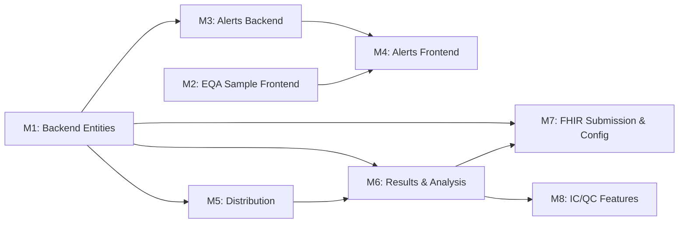

# Implementation Plan: External Quality Assurance (EQA) Module

**Branch**: `005-eqa-module` | **Date**: 2025-11-18 | **Spec**:
[spec.md](spec.md) **Input**: Feature specification from
`/specs/005-eqa-module/spec.md`

## Summary

Implement a comprehensive External Quality Assurance (EQA) module for
proficiency testing in OpenELIS Global. The module enables laboratories to: (1)
receive and process incoming EQA samples with deadline tracking and priority
management, (2) create and distribute EQA samples to participating laboratories,
(3) collect results and perform statistical analysis (Z-scores), and (4) manage
a centralized alerts dashboard for all time-sensitive laboratory activities.

**Technical approach**: Extend the existing `Sample` entity with EQA-specific
fields, create new `EQAProgram`, `EQADistribution`, and `EQAResult` entities
with JPA annotations, extend the existing polymorphic `Alert` entity with new
EQA-specific alert types, and build React frontend components using Carbon
Design System. Leverage existing FHIR integration for inter-laboratory result
submission and existing barcode/shipment infrastructure for distributions.

## Technical Context

**Language/Version**: Java 21 LTS (OpenJDK/Temurin) + React 17 (JavaScript)
**Primary Dependencies**:

- Backend: Spring Framework 6.2.2 (Traditional Spring MVC), Hibernate 5.6.15,
  Jakarta EE 9 (`jakarta.persistence`), HAPI FHIR R4 6.6.2
- Frontend: @carbon/react v1.15, @carbon/charts-react v1.5.2 (for LJ charts),
  React Intl 5.20.12, SWR 2.0.3, Formik 2.2.9 + Yup 0.29.2 **Storage**:
  PostgreSQL 14+ via JPA/Hibernate, Liquibase 4.8.0 for migrations **Testing**:
- Backend: JUnit 4 (4.13.1) + Mockito 2.21.0 (NOT JUnit 5)
- Frontend: Jest + React Testing Library
- E2E: Cypress 12.17.3 **Target Platform**: Docker containers on Ubuntu 20.04+
  (Tomcat 10 / Jakarta EE 9) **Project Type**: Web application (Java backend +
  React frontend) **Performance Goals**:
- Alert dashboard: <2s load for 200 alerts (SC-007)
- Statistical analysis: <2s calculation for 50 participants (SC-005)
- PDF report generation: <5s for 50 participants (SC-006)
- FHIR API result submissions: <5s end-to-end (SC-011) **Constraints**:
- EQA sample registration: <3 minutes full workflow (SC-001)
- 50 concurrent result submissions without degradation (SC-008)
- Alert escalation: exactly 4 hours with 99.9% accuracy (SC-003, SC-012)
- Zero patient data in EQA records (SC-014) **Scale/Scope**:
- 7 user stories (2 P1, 3 P2, 2 P3)
- 53 functional requirements + 18 IC/QC requirements (FR-029a through FR-029r)
- 5 new/modified entities, ~15 new backend files, ~20 new frontend components
- ~8 new REST endpoints, 4 new Liquibase changesets

### Existing Codebase Integration Points

**Critical Discovery: Existing Systems to Extend (NOT Recreate)**

1. **Alert Entity** (ALREADY EXISTS):

   - `org.openelisglobal.alert.valueholder.Alert` - Polymorphic alert entity
   - `AlertType` enum: FREEZER_TEMPERATURE, EQUIPMENT_FAILURE, INVENTORY_LOW,
     SAMPLE_TRACKING, OTHER
   - `AlertService` with deduplication (30-min window), event publishing
   - `AlertRestController` at `/rest/alerts` with GET/PUT endpoints
   - **Plan**: Add new AlertType values: `EQA_DEADLINE`, `SAMPLE_EXPIRATION`,
     `STAT_UPCOMING`, `STAT_OVERDUE`, `CRITICAL_UNACKNOWLEDGED`

2. **Sample Entity** (EXTEND):

   - `org.openelisglobal.sample.valueholder.Sample` extends `EnumValueItemImpl`
   - Uses XML mapping (`Sample.hbm.xml`) with `StringSequenceGenerator`
   - Has `OrderPriority` enum (ROUTINE, ASAP, STAT, TIMED, FUTURE_STAT)
   - `fhir_uuid`, `accessionNumber`, `priority`, `statusId` fields exist
   - **Plan**: Add EQA fields to Sample (or create SampleEQA extension entity)

3. **Program Entity** (ALREADY EXISTS):

   - `org.openelisglobal.program.valueholder.Program` - existing program concept
   - `ProgramSample` junction table with JPA annotations
   - Programs fetched via `/rest/user-programs`
   - **Plan**: Create separate `EQAProgram` entity (distinct from Program, which
     is for questionnaire-based workflows)

4. **Organization Entity** (REUSE):

   - `org.openelisglobal.organization.valueholder.Organization`
   - Has `organizationName`, `isActive`, `fhirUuid`, hierarchical parent
   - Used for clinic/lab identification
   - **Plan**: Reference as EQA provider and participant organizations

5. **Notification System** (REUSE):

   - Multi-channel: Email, SMS, Client (in-app), WebPush
   - `NotificationRestController` at `/rest/notifications`
   - Carbon `InlineNotification` + `ToastNotification` in frontend
   - **Plan**: Use for EQA deadline escalation notifications

6. **Sample Entry Workflow** (MODIFY):

   - 4-step ProgressIndicator: Patient → Program → Sample → Order
   - `addOrder/Index.js` orchestrates tabs
   - `OrderEntryAdditionalQuestions.js` handles program selection
   - `AddOrder.js` handles requester/priority
   - **Plan**: Add EQA checkbox on PatientInfo tab, EQA fields on Program tab

7. **Scheduled Jobs** (EXTEND):

   - `SchedulerConfig.java` with Quartz + `@Scheduled` support
   - `ModbusPollingService` uses `@Scheduled(fixedDelayString=...)` pattern
   - **Plan**: Add `EQADeadlineAlertScheduler` using same pattern

8. **FHIR Integration** (REUSE):

   - `FhirPersistanceService` for CRUD operations
   - `FhirTransformService` for entity ↔ FHIR conversion
   - Supports DiagnosticReport, Observation, ServiceRequest
   - **Plan**: Use for EQA result submission between instances

9. **Barcode/Shipment** (REUSE):
   - `BarcodeLabelMaker`, `BarcodeInformationService` exist
   - StorageBox, shipment functionality available
   - **Plan**: Leverage for distribution barcode generation

## Constitution Check

_GATE: Must pass before Phase 0 research. Re-check after Phase 1 design._

Verify compliance with
[OpenELIS Global Constitution](../../.specify/memory/constitution.md):

- [x] **Configuration-Driven**: No country-specific code branches planned. EQA
      programs, alert thresholds (72h/24h/4h), statistical parameters, and QC
      frequency rules all stored in configuration tables. Z-score thresholds
      (2.0/3.0) configurable per program.
- [x] **Carbon Design System**: UI uses @carbon/react exclusively. Spec
      explicitly maps all UI elements to Carbon components (CR-001): Checkbox,
      FormGroup, Select, DatePicker, Tag, DataTable, Modal, FileUploader, Tile,
      ToastNotification, ProgressIndicator, StructuredList, @carbon/charts-react
      for LJ charts.
- [x] **FHIR/IHE Compliance**: EQA result submissions between OpenELIS instances
      use FHIR R4 DiagnosticReport/Observation resources via existing
      `FhirPersistanceService`. New entities get `fhir_uuid` columns.
- [x] **Layered Architecture**: Backend follows 5-layer pattern. New entities:
      EQAProgram, EQADistribution, EQAResult, EQAProgramTest with JPA/Hibernate
      annotations (NOT XML mappings). DAOs extend `BaseDAOImpl<Entity, String>`.
      Services annotated `@Service` + `@Transactional`. Controllers extend
      `BaseRestController` with NO `@Transactional`. Services compile all data
      within transaction (prevent LazyInitializationException).
  - **Note on Sample extension**: The existing `Sample` entity uses XML mapping
    (`Sample.hbm.xml`). Adding EQA fields requires either (a) extending the XML
    mapping (legacy pattern, exempt per constitution) or (b) creating a separate
    `SampleEQA` entity with JPA annotations that references Sample via FK.
    **Decision: Option (b)** - create `SampleEQA` entity to keep new code on JPA
    annotations.
- [x] **Test Coverage**: Full test pyramid planned: Unit tests (JUnit 4 +
      Mockito) for statistical calculations, alert generation, validation rules.
      ORM validation tests for new entities. Integration tests for workflows.
      E2E tests (Cypress) for critical user journeys. >80% backend, >70%
      frontend coverage goals.
  - E2E tests follow Constitution V.5: individual execution, data-testid
    selectors, cy.session() for login, API-based test data setup.
- [x] **Schema Management**: All database changes via Liquibase changesets in
      `src/main/resources/liquibase/3.3.x.x/`. New tables: `eqa_program`,
      `eqa_distribution`, `eqa_result`, `eqa_program_test`, `sample_eqa`.
      AlertType enum extended via Liquibase. Rollback scripts included.
- [x] **Internationalization**: All UI strings via React Intl. New message keys
      for EQA labels, alert messages, button text, form fields, error messages.
      Minimum en + fr translations per constitution.
- [x] **Security & Compliance**: RBAC for EQA coordinator role via `sys_role`
      table. Audit trail via `BaseObject.sys_user_id` + `lastupdated` on all EQA
      entities. Input validation: numeric result ranges, deadline validation,
      organization validation. Electronic signature audit (user ID, timestamp,
      IP address).

**GATE RESULT: PASS** - No constitution violations. No complexity justification
required.

### Post-Design Re-Evaluation (Phase 1 Complete)

_Re-checked after Phase 1 design artifacts: data-model.md,
contracts/eqa-api.yaml, quickstart.md_

- [x] **I. Configuration-Driven**: Verified in data-model.md — Z-score
      thresholds, alert intervals (72h/24h/4h), QC frequency, Westgard rule
      enable/disable all stored in DB tables (configurable per program/test). No
      country-specific branches in contracts or data model.
- [x] **II. Carbon Design System**: Verified in quickstart.md — All UI
      components reference @carbon/react (Checkbox, Select, DataTable, Tag,
      Modal, DatePicker, Tile, ToastNotification, ProgressIndicator,
      StructuredList, FileUploader). LJ charts use @carbon/charts-react. No
      Bootstrap/Tailwind in any design artifact.
- [x] **III. FHIR/IHE Compliance**: Verified in contracts — M7 endpoints POST
      `/eqa/samples/{id}/submit` use FHIR R4 DiagnosticReport+Observation
      bundles. All new entities (EQAProgram, EQADistribution, EQAResult) have
      `fhir_uuid` columns in data-model.md.
- [x] **IV. Layered Architecture**: Verified in plan.md project structure —
      5-layer pattern: valueholder/ → dao/ → daoimpl/ → service/ → controller/.
      All new entities use JPA annotations. `SampleEQA` uses JPA to reference
      XML-mapped `Sample` via FK (no XML modification). Services have
      `@Transactional`, controllers do NOT. Services compile all data within
      transaction boundaries.
- [x] **V. Test Coverage**: Verified in quickstart.md — TDD workflow with
      Red-Green-Refactor. ORM validation tests (Step 1), Unit tests (Step 2),
      Integration tests (Step 3), Frontend tests (Step 4), E2E tests (Step 6).
      JUnit 4 + Mockito (NOT JUnit 5). E2E: individual execution per V.5,
      data-testid selectors, cy.session() for login.
- [x] **VI. Schema Management**: Verified in data-model.md — 5 Liquibase
      changesets (eqa-001 through eqa-005) in `liquibase/3.3.x.x/`. Tables,
      sequences, indexes, unique constraints all defined. Rollback supported.
- [x] **VII. Internationalization**: Verified in quickstart.md — en.json and
      fr.json i18n keys defined for all EQA, Alert, and QC UI strings. All
      strings use `eqa.*`, `alerts.*`, `qc.*` namespacing via React Intl.
- [x] **VIII. Security**: Verified in contracts — All endpoints require session
      authentication. RBAC via `sys_role` for EQA coordinator. Audit trail on
      all entities. Electronic signature stores user ID, timestamp, IP address.
      Late submission requires supervisor approval.
- [x] **IX. Spec-Driven Iteration**: Verified in plan.md — 8 milestones (M1-M8)
      with dependency graph. Each milestone = 1 PR. Parallel milestone M2 marked
      with `[P]`. Branch naming: `feat/005-eqa-module-m{N}-{desc}`.

**POST-DESIGN GATE RESULT: PASS** - All design artifacts comply with
Constitution v1.8.1 (9 principles). No violations found.

## Milestone Plan

_GATE: Features >3 days MUST define milestones per Constitution Principle IX.
Each milestone = 1 PR. Use `[P]` prefix for parallel milestones._

### Milestone Table

| ID     | Branch Suffix          | Scope                                       | User Stories | Verification                        | Depends On |
| ------ | ---------------------- | ------------------------------------------- | ------------ | ----------------------------------- | ---------- |
| M1     | m1-backend-entities    | Liquibase + Entities + DAOs + Base Services | US1, US2     | ORM validation + Unit tests pass    | -          |
| [P] M2 | m2-eqa-sample-frontend | EQA sample entry UI + work queue badges     | US1          | Jest tests + Manual QA              | -          |
| M3     | m3-alerts-backend      | Alert type extensions + Deadline scheduler  | US2, US6     | Unit + Integration tests pass       | M1         |
| M4     | m4-alerts-frontend     | Alerts dashboard UI                         | US2, US6     | Jest + E2E tests pass               | M3, M2     |
| M5     | m5-distribution        | EQA distribution workflow (full stack)      | US3          | Unit + Integration + E2E tests pass | M1         |
| M6     | m6-results-analysis    | Result collection + Statistical analysis    | US4          | Unit + Integration tests pass       | M1, M5     |
| M7     | m7-submission-fhir     | FHIR result submission + EQA config admin   | US5, US7     | Integration + E2E tests pass        | M1, M6     |
| M8     | m8-qc-ic               | IC/QC: LJ charts, Westgard, e-signatures    | US4 (IC)     | Unit + Jest + E2E tests pass        | M6         |

**Legend**:

- **[P]**: Parallel milestone - can be developed alongside other milestones
- **Sequential** (no prefix): Must complete before dependent milestones
- **Branch**: `feat/005-eqa-module-m{N}-{desc}`

### Milestone Dependency Graph



### Milestone Details

#### M1: Backend Entities & Core Services (P1 Foundation)

- Liquibase changesets for all new tables
- JPA entities: `EQAProgram`, `EQAProgramTest`, `EQADistribution`, `EQAResult`,
  `SampleEQA`
- Extend `AlertType` enum with EQA types
- DAOs extending `BaseDAOImpl`
- Core services: `EQAProgramService`, `EQADistributionService`,
  `EQAResultService`, `SampleEQAService`
- ORM validation tests for all new entities

#### M2: EQA Sample Entry Frontend (P1 - Parallel)

- EQA checkbox on PatientInfo tab
- Disabled demographics with "N/A" when EQA selected
- EQA-specific fields on Program tab (provider, program, sample ID, participant
  ID, deadline, priority)
- EQA badge/icon (Carbon Tag) in work queues
- Work queue filter for EQA samples
- i18n messages (en + fr)

#### M3: Alerts Backend (P1/P2)

- `EQADeadlineAlertScheduler` using `@Scheduled`
- Alert generation at 72h, 24h, 4h intervals
- Sample expiration alert generation
- STAT order alert generation
- Alert escalation logic (4-hour timer)
- Alert acknowledgment with resolution comments
- REST endpoints for alert management

#### M4: Alerts Dashboard Frontend (P2)

- Summary tiles (Critical, EQA Deadlines, Overdue STAT, Expiring Samples)
- Alerts DataTable with severity color coding
- "My Alerts" filter by lab section
- Search/filter by type, severity, lab number
- Pagination (25/50/100/200)
- Auto-refresh every 60 seconds
- Alert acknowledgment modal with required comment

#### M5: EQA Distribution (P2)

- Distribution creation workflow with ProgressIndicator
- Organization multi-select for participants
- Batch sample/order creation per participant
- Barcode generation integration
- Shipment/box integration for physical distribution
- Master sample → distribution sample tracking

#### M6: Results Collection & Analysis (P2)

- Manual result entry screen
- CSV/Excel batch import with validation
- Z-score calculation engine
- Performance classification (Acceptable/Questionable/Unacceptable)
- Statistical display (StructuredList)
- PDF report generation
- Minimum 5-participant validation

#### M7: FHIR Submission & Config Admin (P3)

- FHIR R4 result submission to external providers
- Submission audit trail
- Late submission workflow (supervisor approval)
- EQA Program Management admin screen
- Program CRUD with test/panel assignment

#### M8: Internal Control / QC Features (P2 - Extended)

- Levey-Jennings chart generation (@carbon/charts-react)
- Westgard rules engine (1-2s, 1-3s, 2-2s, R-4s, 4-1s, 10-x)
- Configurable rules per test type
- QC comments on IC measurements
- Electronic signature for QC report review
- Instrument-level QC frequency configuration
- QC compliance metrics tracking

### PR Strategy

- **Spec PR**: `spec/005-eqa-module` → `develop` (specification documents only)
- **Feature branch**: `feat/005-eqa-module` from `develop` (integration branch)
- **Milestone PRs**: `feat/005-eqa-module-m{N}-{desc}` → `feat/005-eqa-module`
- **Final PR**: `feat/005-eqa-module` → `develop`

## Project Structure

### Documentation (this feature)

```text
specs/005-eqa-module/
├── plan.md              # This file
├── research.md          # Phase 0 output
├── data-model.md        # Phase 1 output
├── quickstart.md        # Phase 1 output
├── contracts/           # Phase 1 output
│   └── eqa-api.yaml     # OpenAPI 3.0 specification
└── tasks.md             # Phase 2 output (/speckit.tasks)
```

### Source Code (repository root)

```text
# Backend (Java)
src/main/java/org/openelisglobal/
├── eqa/
│   ├── valueholder/
│   │   ├── EQAProgram.java
│   │   ├── EQAProgramTest.java
│   │   ├── EQADistribution.java
│   │   ├── EQAResult.java
│   │   └── SampleEQA.java
│   ├── dao/
│   │   ├── EQAProgramDAO.java
│   │   ├── EQAProgramTestDAO.java
│   │   ├── EQADistributionDAO.java
│   │   ├── EQAResultDAO.java
│   │   └── SampleEQADAO.java
│   ├── daoimpl/
│   │   └── [*DAOImpl.java for each DAO]
│   ├── service/
│   │   ├── EQAProgramService.java
│   │   ├── EQAProgramServiceImpl.java
│   │   ├── EQADistributionService.java
│   │   ├── EQADistributionServiceImpl.java
│   │   ├── EQAResultService.java
│   │   ├── EQAResultServiceImpl.java
│   │   ├── EQAStatisticsService.java
│   │   ├── EQAStatisticsServiceImpl.java
│   │   ├── SampleEQAService.java
│   │   └── SampleEQAServiceImpl.java
│   ├── controller/
│   │   └── rest/
│   │       ├── EQAProgramRestController.java
│   │       ├── EQADistributionRestController.java
│   │       ├── EQAResultRestController.java
│   │       └── EQAAlertRestController.java
│   └── scheduler/
│       └── EQADeadlineAlertScheduler.java
├── alert/
│   └── valueholder/
│       └── AlertType.java          # MODIFIED: add EQA types
└── qc/                              # M8: IC/QC module
    ├── valueholder/
    ├── service/
    └── controller/

# Database Migrations
src/main/resources/liquibase/3.3.x.x/
├── eqa-001-create-eqa-program-tables.xml
├── eqa-002-create-eqa-distribution-tables.xml
├── eqa-003-create-sample-eqa-table.xml
├── eqa-004-extend-alert-types.xml
└── eqa-005-create-qc-tables.xml

# Backend Tests
src/test/java/org/openelisglobal/eqa/
├── EQAHibernateMappingValidationTest.java
├── service/
│   ├── EQAStatisticsServiceTest.java
│   ├── EQAProgramServiceTest.java
│   ├── EQADistributionServiceTest.java
│   └── EQAResultServiceTest.java
└── controller/
    └── [*RestControllerTest.java]

# Frontend (React)
frontend/src/components/
├── eqa/
│   ├── EQASampleEntry.js            # EQA fields for sample entry
│   ├── EQABadge.js                  # Reusable EQA tag/badge
│   ├── EQADistribution/
│   │   ├── CreateDistribution.js    # Multi-step wizard
│   │   ├── DistributionList.js
│   │   └── DistributionDetail.js
│   ├── EQAResults/
│   │   ├── ManualResultEntry.js
│   │   ├── BatchImport.js
│   │   ├── StatisticsDisplay.js
│   │   └── PerformanceReport.js
│   ├── EQAProgram/
│   │   ├── ProgramManagement.js
│   │   └── ProgramForm.js
│   └── EQASubmission/
│       └── ResultSubmission.js
├── alerts/
│   ├── AlertsDashboard.js           # Main alerts dashboard
│   ├── AlertSummaryTiles.js         # Summary cards
│   ├── AlertsTable.js               # Data table
│   └── AlertAcknowledgeModal.js     # Ack modal
└── qc/                              # M8: IC/QC components
    ├── LeveyJenningsChart.js
    ├── WestgardRulesDisplay.js
    ├── QCComments.js
    ├── ElectronicSignature.js
    └── QCFrequencyConfig.js

# Frontend Tests
frontend/src/components/eqa/__tests__/
frontend/src/components/alerts/__tests__/
frontend/cypress/e2e/
├── eqaSampleEntry.cy.js
├── eqaDistribution.cy.js
├── alertsDashboard.cy.js
└── eqaResults.cy.js

# i18n
frontend/src/languages/
├── en.json                          # MODIFIED: add eqa.* keys
└── fr.json                          # MODIFIED: add eqa.* keys
```

**Structure Decision**: Web application pattern following existing OpenELIS
conventions. New `eqa/` package under `org.openelisglobal` for backend. New
`eqa/`, `alerts/`, `qc/` component directories for frontend. All new entities
use JPA annotations (not XML mappings).

## Complexity Tracking

> No constitution violations detected. No complexity justification required.

## Testing Strategy

**Reference**:
[OpenELIS Testing Roadmap](../../.specify/guides/testing-roadmap.md)

### Coverage Goals

- **Backend**: >80% code coverage (measured via JaCoCo)
- **Frontend**: >70% code coverage (measured via Jest)
- **Critical Paths**: 100% coverage for Z-score calculation, alert generation
  timing, deadline enforcement, patient data isolation (EQA ≠ patient data)

### Test Types

- [x] **Unit Tests**: Service layer business logic (JUnit 4 + Mockito)

  - `EQAStatisticsServiceTest` - Z-score calculation with known datasets
  - `EQAProgramServiceTest` - Program CRUD, activation/deactivation
  - `EQADistributionServiceTest` - Distribution creation, validation
  - `EQAResultServiceTest` - Result submission, duplicate handling
  - `EQADeadlineAlertSchedulerTest` - Alert timing accuracy
  - Template: `.specify/templates/testing/JUnit4ServiceTest.java.template`
  - Test Slicing: `@RunWith(MockitoJUnitRunner.class)`
  - Mocking: `@Mock` (NOT `@MockBean`)

- [x] **DAO Tests**: Persistence layer testing (Traditional Spring MVC)

  - Pattern: `BaseWebContextSensitiveTest` with real DAO beans
  - Focus: Custom HQL queries, pagination, filtering

- [x] **Controller Tests**: REST API endpoints (Traditional Spring MVC)

  - Pattern: `BaseWebContextSensitiveTest` + `MockMvc`
  - Focus: Request/response mapping, validation, authorization

- [x] **ORM Validation Tests**: Entity mapping validation (Constitution V.4)

  - `EQAHibernateMappingValidationTest` - All 5 new entities
  - MUST execute in <5 seconds, NO database connection
  - SDD Checkpoint: After M1 (Entities)

- [x] **Integration Tests**: Full workflow testing (Traditional Spring MVC)

  - EQA sample registration end-to-end
  - Distribution creation with sample generation
  - Result submission and statistical calculation
  - Pattern: `BaseWebContextSensitiveTest`

- [x] **Frontend Unit Tests**: React component logic (Jest + RTL)

  - EQA form components, badge rendering, statistics display
  - Alert dashboard filtering, pagination logic
  - Coverage Goal: >70%

- [x] **E2E Tests**: Critical user workflows (Cypress)
  - `eqaSampleEntry.cy.js` - US1: Register and process EQA sample
  - `alertsDashboard.cy.js` - US2/US6: Monitor deadlines and alerts
  - `eqaDistribution.cy.js` - US3: Create distribution
  - `eqaResults.cy.js` - US4: Collect results and analyze
  - Individual execution during development (Constitution V.5)
  - data-testid selectors, cy.session() for login

### Test Data Management

- **Backend**:

  - **Unit Tests**: Builder pattern for EQAProgram, EQAResult, Alert test data
  - **DAO/Integration**: `@Transactional` rollback for clean state

- **Frontend**:
  - **E2E Tests (Cypress)**:
    - [x] API-based setup via `cy.request()` for EQA programs, organizations
    - [x] Fixture loader for baseline data
    - [x] `cy.intercept()` as spy-first for API assertions
    - [x] `cy.session()` for login state

### Checkpoint Validations

- [x] **After M1 (Entities)**: ORM validation tests must pass
- [x] **After M1 (Services)**: Backend unit tests must pass
- [x] **After M3 (Alert Controllers)**: Integration tests must pass
- [x] **After M2/M4 (Frontend)**: Jest unit tests AND E2E tests must pass
