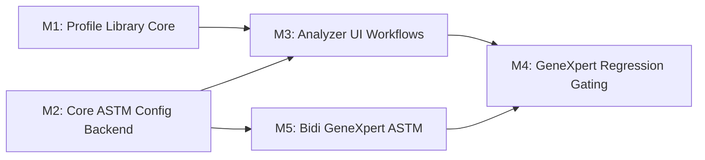

# Implementation Plan: Generic ASTM Plugin Profiles v1.2

**Branch**: `feat/012-generic-astm-plugin-profiles` | **Date**: 2026-02-27 |
**Spec**: [spec.md](./spec.md)  
**Input**: Feature specification from
`/specs/012-generic-astm-plugin-profiles/spec.md`  
**Jira**: OGC-337

## Summary

Deliver v1.2 generic ASTM profile capabilities (FR-014 to FR-025) with a
GeneXpert-first validation path that matches the currently tested harness
workflow and avoids replacing working 011 infrastructure.

Technical strategy is evolutionary, not a rewrite:

1. Add missing domain capabilities (profiles, QC rules, transforms, extraction
   overrides, aggregation mode, abnormal flag mapping, pending code queue, lab
   unit assignment).
2. Reuse proven 011 surfaces where possible (default config loading, generic
   plugin routing, mapping preview pipeline, analyzer harness).
3. Keep analyzer-instance/runtime configuration separate from profile defaults
   (snapshot-on-apply, no live profile inheritance).
4. Gate every milestone with GeneXpert workflow regression checks.

## Technical Context

**Language/Version**: Java 21 (Spring MVC 6.2.11), React 17, PostgreSQL 14+  
**Primary Dependencies**: Hibernate/JPA, Liquibase, Carbon (`@carbon/react`),
React Intl, analyzer plugin submodule, analyzer mock submodule, analyzer bridge
submodule  
**Storage**: PostgreSQL (`clinlims`) with Liquibase-managed schema  
**Testing**: JUnit 4 + Mockito, `BaseWebContextSensitiveTest`, Jest, Playwright
(harness E2E), Cypress where applicable  
**Target Platform**: Web application + Docker harness
(`projects/analyzer-harness`)  
**Project Type**: Monorepo web app (backend + frontend + submodules)  
**Performance Goals**:

- Add/Edit analyzer from profile in under 10 minutes for GeneXpert path
- Simulator preview returns in <5 seconds for 10KB ASTM payload
- No regression in test-connection success for fixture analyzer `2013`
  **Constraints**:
- Snapshot-on-apply only (no reapply workflow in this release)
- No country-specific branching; all behavior configuration-driven
- Preserve existing GeneXpert harness topology and bridge routing behavior
- Avoid duplicate mapping stacks when existing 011 artifacts already cover core
  behavior **Scale/Scope**:
- New backend domain objects and endpoints under analyzer module
- Analyzer setup + mapping UI expansion across existing analyzer screens
- Liquibase additions in `3.4.x.x`
- Test expansion across backend, frontend, and harness E2E

### GeneXpert Baseline (Research Anchors)

- Superproject baseline includes end-to-end GeneXpert readiness and contention
  handling (`f75556556`, `617155847`, `40dba1510`).
- `plugins` currently pinned to `4e4cb39` (phantom `ANALYZER_ID` dependency
  removed).
- `tools/analyzer-mock-server` currently pinned to `4c8f1aa` (TCP listener +
  simulation API can run together).
- `tools/openelis-analyzer-bridge` currently pinned to `6200254`
  (timeout/contention fixes for real-device path).

## Constitution Check

_GATE: Must pass before Phase 0 research. Re-check after Phase 1 design._

Verify compliance with
[OpenELIS Global Constitution](../../.specify/memory/constitution.md):

- [x] **Configuration-Driven**: Profile + rule system is configuration-first, no
      analyzer-specific Java branches.
- [x] **Carbon Design System**: UI additions use existing analyzer Carbon
      components and patterns.
- [x] **FHIR/IHE Compliance**: No new external FHIR resource contract required;
      internal analyzer config feature.
- [x] **Layered Architecture**: New backend features will follow Valueholder →
      DAO → Service → Controller → Form.
  - JPA annotations only for new entities.
  - Transactions limited to service layer.
- [x] **Test Coverage**: Unit, integration, and E2E gates planned with GeneXpert
      regression coverage.
- [x] **Schema Management**: Liquibase-only schema changes in
      `src/main/resources/liquibase/3.4.x.x/`.
- [x] **Internationalization**: New UI strings via React Intl (`en` + `fr`
      minimum).
- [x] **Security & Compliance**: RBAC enforced per clarified roles (`LAB_USER`,
      `LAB_SUPERVISOR`, `LAB_ADMIN`), plus audit metadata and input validation.

**Complexity Justification**: No constitutional violations planned.

## Milestone Plan

_GATE: Features >3 days define milestone PRs per Constitution Principle IX._

### Milestone Table

| ID     | Branch Suffix                  | Scope                                                                                                                                                          | User Stories       | Verification                                                                              | Depends On |
| ------ | ------------------------------ | -------------------------------------------------------------------------------------------------------------------------------------------------------------- | ------------------ | ----------------------------------------------------------------------------------------- | ---------- |
| M1     | m1-profile-library-core        | Backend profile domain (`FR-022..025`), import/export, SemVer lineage/latest policy, lab unit backend                                                          | US1, US6           | Unit + integration tests for profile + lab unit APIs; built-in import bootstrap passes    | -          |
| [P] M2 | m2-core-astm-config-backend    | Backend runtime config (`FR-014..021`) including QC rules, transforms, extraction, queue                                                                       | US2, US3, US4, US5 | Unit + integration tests for validation and state transitions                             | -          |
| M3     | m3-analyzer-ui-workflows       | Add/Edit analyzer UI, profile selector, lab units UI, mapping/simulator UX                                                                                     | US1..US6           | Jest + Playwright/Cypress UI workflow tests pass                                          | M1, M2     |
| M4     | m4-genexpert-regression-gating | Harness validation, real GeneXpert gate (all 4 pathways), non-regression hardening                                                                             | US1..US6           | Harness smoke + bidi pathways + test-connection + simulator + pending-code workflows pass | M3, M5     |
| [P] M5 | m5-bidi-genexpert-astm         | Bidirectional GeneXpert ASTM: Q-segment responder (plugin), order sender, results query, mock Q-segment support, harness scripts, real-device validation gates | US7 (FR-026)       | Mock: all 4 pathways green; Real: all 4 pathways validated per GeneXpert Rev-E LIS spec   | M2         |

### Milestone Dependency Graph



### PR Strategy

- **Spec branch**: `spec/012-ogc-337-generic-astm-plugin-profiles` (already in
  progress).
- **Milestone branches**:
  - `feat/012-ogc-337-generic-astm-plugin-profiles-m1-profile-library-core`
  - `feat/012-ogc-337-generic-astm-plugin-profiles-m2-core-astm-config-backend`
  - `feat/012-ogc-337-generic-astm-plugin-profiles-m3-analyzer-ui-workflows`
  - `feat/012-ogc-337-generic-astm-plugin-profiles-m4-genexpert-regression-gating`
  - `feat/012-ogc-337-generic-astm-plugin-profiles-m5-bidi-genexpert-astm`

## Project Structure

### Documentation (this feature)

```text
specs/012-generic-astm-plugin-profiles/
├── spec.md
├── plan.md
├── research.md
├── data-model.md
├── quickstart.md
├── contracts/
│   └── analyzer-profiles-api.yaml
└── tasks.md
```

### Source Code (repository root)

```text
# Backend
src/main/java/org/openelisglobal/analyzer/
├── valueholder/              # new profile/rule/config entities
├── dao/                      # new DAOs + query helpers
├── service/                  # profile import/export, simulator, pending code, QC checks
├── controller/               # profile and runtime config REST endpoints
└── form/                     # request/response forms

src/main/resources/liquibase/3.4.x.x/
└── 01x-0xx-*.xml             # profile + config tables and indexes

# Frontend
frontend/src/components/analyzers/
├── AnalyzerForm/             # profile selection + lab unit assignment
├── FieldMapping/             # transform/extraction/flags/simulator UI extensions
└── ...                       # supporting modals and tabs

frontend/src/services/analyzerService.js
frontend/src/languages/en.json
frontend/src/languages/fr.json

# Harness validation (existing, consumed for testing)
projects/analyzer-harness/
tools/analyzer-mock-server/
tools/openelis-analyzer-bridge/
```

**Structure Decision**: Extend existing analyzer module and UI surfaces; do not
introduce parallel microservices or a second analyzer configuration stack.

## Complexity Tracking

No constitution violations requiring exception tracking.

## Testing Strategy

**Reference**:
[OpenELIS Testing Roadmap](../../.specify/guides/testing-roadmap.md)

### Coverage Goals

- **Backend**: >80% coverage on new profile/config services.
- **Frontend**: >70% coverage on analyzer form + mapping UI additions.
- **Critical Paths**: 100% for activation gating (QC required), profile import
  version policy, and GeneXpert test-connection non-regression.

### Test Types

- [x] **Unit Tests**: Service-level logic for profile import/versioning, QC rule
      evaluation, transform validation, pending code retention.
- [x] **DAO Tests**: Query correctness for profile lineage/latest and pending
      code capping logic.
- [x] **Controller Tests**: REST authorization and validation behavior for new
      endpoints.
- [x] **ORM Validation Tests**: New entity mapping validation in <5 seconds (no
      DB required).
- [x] **Integration Tests**: End-to-end backend workflows in
      `BaseWebContextSensitiveTest`.
- [x] **Frontend Unit Tests**: Analyzer form/profile selector tabs and simulator
      rendering.
- [x] **E2E Tests**:
  - Playwright: analyzer harness GeneXpert connection and workflow regression.
  - Cypress/Playwright UI path checks for profile import/apply/simulator as
    appropriate.

### Test Data Management

- **Backend**:
  - Unit tests use builders/factories for profile payload variants.
  - Integration tests use DBUnit datasets and fixture loader scripts.
- **E2E/Harness**:
  - Use `src/test/resources/load-test-fixtures.sh` for stable baseline.
  - Use `projects/analyzer-harness/scripts/test-genexpert-astm.sh` for ASTM push
    validation.
  - Keep simulator and bridge on pinned commits during implementation to isolate
    feature changes.

### Checkpoint Validations

- [x] **After M1**: Profile import/export/version policy tests pass.
- [x] **After M2**: QC/transform/extraction/aggregation backend tests pass.
- [x] **After M3**: Analyzer UI and i18n tests pass.
- [x] **After M5**: All 4 bidirectional pathways green against mock; real-device
      validation checklist completed; Q-segment responder + order send + results
      query unit/integration tests pass.
- [x] **After M4**: GeneXpert harness smoke suite, all 4 bidi pathway
      regressions, and test-connection regressions pass.

## Phase 0 Research Output

See [research.md](./research.md). Key outcomes:

- Existing 011 analyzer and harness investments already cover major
  infrastructure needed for v1.2.
- Current system already distinguishes plugin-type defaults from
  analyzer-instance runtime fields; v1.2 should extend that pattern.
- GeneXpert workflow is stable enough to use as the primary regression gate.
- Overengineering risk is highest if we duplicate existing mapping/simulator
  surfaces; plan explicitly avoids this.

## Phase 1 Design Artifacts

- [data-model.md](./data-model.md)
- [contracts/analyzer-profiles-api.yaml](./contracts/analyzer-profiles-api.yaml)
- [quickstart.md](./quickstart.md)

## Profiles-as-Config-Files Alignment

**Key Decision**: Built-in profiles are sourced from
`projects/analyzer-profiles/` (renamed from `projects/analyzer-defaults/`).
Profile IDs map 1:1 to the JSON files in this directory.

### Current State (from 011)

- Canonical analyzer default configs live in
  `projects/analyzer-defaults/{astm,hl7}/*.json`.
- Exposed via `GET /rest/analyzer/defaults` and
  `GET /rest/analyzer/defaults/{protocol}/{name}`.
- Frontend `handleDefaultConfigSelect()` sets only plugin-level fields
  (`identifierPattern`, `analyzerType`, `protocolVersion`, `pluginTypeId`).
- Docker mounts the directory read-only at `/data/analyzer-defaults`.
- `ANALYZER_DEFAULTS_DIR` env var overrides the mount path.

### Rename/Migration Strategy: `analyzer-defaults` → `analyzer-profiles`

**Scope**: Rename the directory and all references while preserving backward
compatibility for one release cycle.

#### 1. Directory Rename

| Before                                   | After                                    |
| ---------------------------------------- | ---------------------------------------- |
| `projects/analyzer-defaults/`            | `projects/analyzer-profiles/`            |
| `projects/analyzer-defaults/astm/*.json` | `projects/analyzer-profiles/astm/*.json` |
| `projects/analyzer-defaults/hl7/*.json`  | `projects/analyzer-profiles/hl7/*.json`  |

#### 2. JSON Schema Migration

Each profile JSON gains a `profileMeta` section for v1.2 compatibility:

```json
{
  "$schema": "https://openelis-global.org/schemas/analyzer-profile/1.2",
  "profileMeta": {
    "id": "genexpert-cepheid-astm",
    "version": "1.0.0",
    "displayName": "Cepheid GeneXpert (ASTM Mode)"
  },
  "analyzer_name": "Cepheid GeneXpert (ASTM Mode)",
  "manufacturer": "Cepheid",
  ...
}
```

The existing 1.0 schema fields (`analyzer_name`, `manufacturer`, etc.) remain
for backward compatibility. The bootstrap service reads `profileMeta.id` as the
profile lineage key, falling back to `{protocol}/{filename}` if `profileMeta` is
absent.

#### 3. Profile ID Mapping

| Filename                    | Profile Meta ID          | Display Name                  |
| --------------------------- | ------------------------ | ----------------------------- |
| `astm/genexpert-astm.json`  | `genexpert-cepheid-astm` | Cepheid GeneXpert (ASTM Mode) |
| `astm/sysmex-xn.json`       | `sysmex-xn-astm`         | Sysmex XN-Series (ASTM)       |
| `astm/mindray-ba88a.json`   | `mindray-ba88a-astm`     | Mindray BA-88A (ASTM)         |
| `astm/horiba-pentra60.json` | `horiba-pentra60-astm`   | Horiba Pentra 60 (ASTM)       |
| `astm/horiba-micros60.json` | `horiba-micros60-astm`   | Horiba Micros 60 (ASTM)       |
| `astm/stago-start4.json`    | `stago-start4-astm`      | Stago Start 4 (ASTM)          |
| `hl7/genexpert-hl7.json`    | `genexpert-cepheid-hl7`  | Cepheid GeneXpert (HL7)       |
| `hl7/mindray-bc2000.json`   | `mindray-bc2000-hl7`     | Mindray BC2000 (HL7)          |
| `hl7/mindray-bc5380.json`   | `mindray-bc5380-hl7`     | Mindray BC5380 (HL7)          |
| `hl7/mindray-bs360e.json`   | `mindray-bs360e-hl7`     | Mindray BS360E (HL7)          |
| `hl7/abbott-architect.json` | `abbott-architect-hl7`   | Abbott Architect (HL7)        |

Additional profiles from the spec (cobas-6800-roche, m2000-abbott,
panther-hologic, celldyn-ruby-abbott, mindray-bc) are deferred until their JSON
config files are created and validated.

#### 4. Backward Compatibility (One Release Cycle)

| Touchpoint        | Migration                                                                           | Backward Compat                                                |
| ----------------- | ----------------------------------------------------------------------------------- | -------------------------------------------------------------- |
| **Env var**       | New: `ANALYZER_PROFILES_DIR`.                                                       | Fallback: `ANALYZER_DEFAULTS_DIR` if new var not set.          |
| **Default path**  | `/data/analyzer-profiles`                                                           | Fallback: `/data/analyzer-defaults` if new path doesn't exist. |
| **Docker mount**  | `../../projects/analyzer-profiles:/data/analyzer-profiles:ro`                       | Keep old mount as symlink in compose for one release.          |
| **API endpoints** | New: `GET /rest/analyzer/profiles`, `GET /rest/analyzer/profiles/{protocol}/{name}` | Keep: `GET /rest/analyzer/defaults` as alias (deprecated).     |
| **Frontend**      | New: `getProfiles()`, `getProfile()` in `analyzerService.js`.                       | Keep: `getDefaultConfigs()`, `getDefaultConfig()` as aliases.  |
| **pom.xml**       | `ANALYZER_PROFILES_DIR=${project.basedir}/projects/analyzer-profiles`               | Keep old var as fallback during transition.                    |
| **Test fixtures** | Update test file paths.                                                             | N/A — tests use current release only.                          |

#### 5. Files Requiring Edits for Rename

1. `projects/analyzer-defaults/` → rename directory to
   `projects/analyzer-profiles/`
2. `projects/analyzer-defaults/README.md` → update title, paths, references
3. `src/main/java/org/openelisglobal/analyzer/controller/AnalyzerRestController.java`
   → add `ANALYZER_PROFILES_DIR` env var with `ANALYZER_DEFAULTS_DIR` fallback;
   add `/rest/analyzer/profiles` alias endpoints
4. `projects/analyzer-harness/docker-compose.dev.yml` → update mount path
5. `pom.xml` → update `ANALYZER_DEFAULTS_DIR` → `ANALYZER_PROFILES_DIR`
6. `frontend/src/services/analyzerService.js` → add profile API methods
7. `src/test/java/org/openelisglobal/analyzer/controller/AnalyzerDefaultsRestControllerTest.java`
   → update test paths
8. Each JSON file in `projects/analyzer-profiles/{astm,hl7}/` → add
   `profileMeta` section

---

## Bidirectional GeneXpert ASTM MVP Gate

### Definition

MVP is complete only when **GeneXpert ASTM bidirectional** is validated with:

- **Mock (required)**: all 4 pathways green in harness.
- **Real device (required)**: all 4 pathways validated end-to-end and
  cross-checked to the GeneXpert Rev-E LIS spec PDF
  (`specs/012-generic-astm-plugin-profiles/docs/`).

### Out of Scope for MVP

- UI/flows for **mapping management** and **querying analyzer for mappings/field
  discovery**.
- Full bidirectional UI workflows; MVP validates via service/API + harness
  scripts.

### The 4 Pathways (ASTM-only)

#### 1) Results PUSH (Analyzer → OpenELIS)

- **Mechanism**: Existing inbound ASTM pipeline.
  - `POST /analyzer/astm` → `ASTMAnalyzerReader.processData()` →
    `insertAnalyzerData()`.
- **Validation**:
  - Mock: existing `projects/analyzer-harness/scripts/test-genexpert-astm.sh`.
  - Real: run a real test on GeneXpert and verify OpenELIS receives + imports.
- **Status**: Already working. No new code required.

#### 2) Orders PULL (Analyzer → OpenELIS query, OpenELIS responds with orders)

- **Mechanism**: Add generic Q-segment responder for Generic ASTM stack.
  - `isAnalyzerResult()` returns `false` for Q-segment messages.
  - `AnalyzerResponder.buildResponse()` parses Q-segment
    (`Q|1|SampleID^PatientID||ALL...`), looks up pending analyses for sample,
    maps to analyzer codes via `analyzer_test_map`, returns ASTM `H` + `P` + `O`
    (+ `L` terminator) response.
- **Backend work**: Plugin submodule — `GenericASTMAnalyzerResponder` in
  `plugins/analyzers/GenericASTM/src/main/java/org/openelisglobal/plugins/analyzer/genericastm/`.
- **Q-segment response type rule**: The responder always returns orders
  (H/P/O/L). The mock server uses a convention for testing: Q-segment test codes
  field `ALL` returns full results (H/P/O/R/L), while specific codes return
  orders only (H/P/O/L). The real plugin responder only handles the orders-pull
  pathway; results-pull is driven by the core `AstmResultQueryService` which
  initiates queries outbound.
- **Validation**:
  - Mock: simulate analyzer-initiated Q query; assert response contains expected
    O segments.
  - Real: trigger host query on device; verify orders are delivered.

#### 3) Orders PUSH (OpenELIS → Analyzer)

- **Mechanism**: Add minimal "send order message" service (no full UI required).
  - Construct spec-compliant ASTM message (`H`/`P`/`O`/`L`) for a given
    analyzer + accession.
  - Send via bridge using same HTTP→TCP mechanism as
    `testConnectionViaBridge()`.
- **Backend work**: Core service — `AstmOrderSendService` +
  `AstmMessageBuilder`.
- **Validation**:
  - Mock: send order via bridge to mock analyzer; assert mock received it.
  - Real: send order to real device; verify receipt.

#### 4) Results PULL (OpenELIS → Analyzer query, Analyzer responds with results)

- **Mechanism**: Add minimal "query results" service.
  - Construct ASTM Q-segment query (per GeneXpert spec) for an accession.
  - Send via bridge and capture response body.
  - Feed returned message into existing ASTM ingest pipeline (same code path as
    results-push) to persist results.
- **Backend work**: Core service — `AstmResultQueryService`.
- **Validation**:
  - Mock: Q query returns template-generated results; OpenELIS imports them.
  - Real: query real device for results; verify import.

## Implementation Guardrails (Prevent Overengineering)

1. Evolve existing defaults/profile loading path; do not replace analyzer
   onboarding UX from scratch.
2. Reuse existing `POST /analyzers/{id}/preview-mapping` endpoint for simulator
   capability; extend with v1.2 outputs (transforms, QC evaluation, extraction
   overrides, flag mappings, unmapped code warnings) instead of creating a new
   `/simulate` endpoint.
3. Keep plugin submodule behavior unchanged unless a blocker is proven by
   failing GeneXpert gate.
4. Keep feature scope to clarified FR/BR set; defer reapply workflow and other
   post-v1.2 ideas.
5. Use `AnalyzerProfileApplication` provenance table for profile-to-analyzer
   history; no `profile_id` FK on `Analyzer` entity (avoids implying live
   linkage).
6. Bidirectional MVP is service/API + harness validated; no dedicated
   bidirectional UI in this release.
7. Built-in profiles are sourced from `projects/analyzer-profiles/` files;
   profile IDs map 1:1 to these files.

## Next Step

Run `/speckit.tasks` to generate milestone-scoped implementation tasks.
