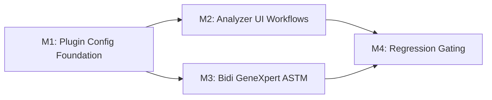

# Implementation Plan: Generic ASTM Plugin Profiles v1.2 (Simplified)

**Branch (historical M1 reference)**:
`feat/012-ogc-337-generic-astm-plugin-profiles-m1-plugin-config`  
**Current implementation state on this branch**: `fix/013-hl7-test-connection`
(consolidated analyzer workflow alignment)  
**Date**: 2026-02-27  
**Spec**: [spec.md](./spec.md)  
**Jira**: OGC-337

## Summary

Deliver v1.2 generic analyzer capabilities with a simplified architecture:

1. Profiles are filesystem templates in `projects/analyzer-profiles/` (no DB
   profile library in MVP).
2. Per-instance v1.2 behavior is stored in one JSONB table
   (`analyzer_plugin_config`) plus one queue table (`analyzer_pending_code`).
3. Existing mapping stack is preserved and extended (requires 009 decouple
   migration).
4. GeneXpert remains the primary regression gate.

## Technical Context

- **Language/Version**: Java 21, Spring MVC 6.x, React 17
- **Storage**: PostgreSQL with Liquibase
- **Testing**: JUnit + integration tests + Playwright/harness validation
- **Target**: OpenELIS monorepo + analyzer harness

## Constitution Check

- [x] configuration-driven implementation
- [x] layered architecture
- [x] Liquibase-only schema changes
- [x] test-first and regression-gated workflow
- [x] RBAC enforced (MVP: `GLOBAL_ADMIN`)

## Milestone Plan

| ID  | Scope                                                                                                                                                                                                                                      | User Stories | Depends On |
| --- | ------------------------------------------------------------------------------------------------------------------------------------------------------------------------------------------------------------------------------------------ | ------------ | ---------- |
| M1  | Plugin config foundation: 009 prerequisite migration, RBAC infra, `analyzer_plugin_config`, `analyzer_pending_code`, profile JSON v1.2 (`profileMeta` + `configDefaults`), profile apply enhancements, activation gate, preview extensions | US1-US5      | -          |
| M2  | Analyzer UI workflows for plugin-config-backed setup and mapping/simulator behavior                                                                                                                                                        | US1-US5      | M1         |
| M3  | Bidirectional GeneXpert ASTM (4 pathways), mock + real validation                                                                                                                                                                          | US7          | M1         |
| M4  | Regression gating and hardening across UI + bidirectional pathways                                                                                                                                                                         | US1-US5, US7 | M2, M3     |



## PR Strategy

1. Close PR #2969 and #2970 without merge.
2. Create replacement branch from `develop`:
   - `feat/012-ogc-337-generic-astm-plugin-profiles-m1-plugin-config`
3. Open one replacement PR for new M1 foundation, referencing both closed PRs
   for traceability.
4. Keep old branches until replacement PR is merged, then clean up.

M2/M3/M4 remediation continuity:

- M2 remediation is still required and is not dropped by the M1 replacement PR.
- Legacy M1/M2 branches remain reference inputs only; implementation continues
  on remediated milestone branches.

## Critical Foundations for New M1

### 1) Manual-apply from M1 reference branch (no cherry-pick commits)

- `SecurityConfig.java` method-security enablement
- `CustomUserDetailsService.java` role-to-authority mapping
- 009 decouple mapping set:
  - `src/main/resources/liquibase/3.4.x.x/009-decouple-test-mappings.xml`
  - `AnalyzerTestMappingPK.java`
  - `AnalyzerTestMapping.java`
  - `AnalyzerTestMappingDAOImpl.java`
  - `AnalyzerTestNameCache.java`
  - `AnalyzerLineInserter.java`
  - `ASTMAnalyzerReader.java`
  - update `base.xml`
- profile JSON `profileMeta` additions to 11 profile files

### 2) Manual-apply from M2 reference branch

- `AnalyzerControllerHelper.java` structured response helpers

### 3) New work from scratch

- `010-create-analyzer-plugin-config.xml`
- `011-create-analyzer-pending-code.xml`
- `AnalyzerPluginConfig` + `AnalyzerPendingCode` entities
- plugin-config and pending-code services
- plugin-config REST controller
- update apply flow to materialize `configDefaults`
- activation gate + preview extension updates

## Project Structure (Target)

```text
specs/012-generic-astm-plugin-profiles/
├── spec.md
├── plan.md
├── data-model.md
├── tasks.md
└── ...

projects/analyzer-profiles/
├── astm/*.json
└── hl7/*.json

src/main/resources/liquibase/3.4.x.x/
├── 009-decouple-test-mappings.xml
├── 010-create-analyzer-plugin-config.xml
└── 011-create-analyzer-pending-code.xml
```

## Naming Decision

Use `projects/analyzer-profiles/` only. Rename from
`projects/analyzer-defaults/` and remove legacy references. No compatibility
alias/fallback is required for this feature.

Scope note for the consolidated branch:

- `012` owns the shared analyzer-profile catalog rename and the ASTM/HL7 profile
  apply surface used by this feature.
- FILE profiles live under the same repository path, but FILE-specific profile
  ownership and runtime behavior are tracked in `014`.

M1 exit criterion for naming:

- Runtime, build, and test references must use `analyzer-profiles` exclusively
  before M2 starts.

## Security Decision

MVP endpoint authorization for new scope:

- `@PreAuthorize("hasRole('GLOBAL_ADMIN')")`

Tiered role model (LAB_USER/LAB_SUPERVISOR/LAB_ADMIN) is deferred.

## Testing Strategy

- M1: service + controller + integration coverage for
  plugin-config/pending-code/activation/preview and 009 path integrity
- M2: UI and API integration tests
- M3: bidirectional pathway tests (mock + real)
- M4: end-to-end regression suite
- Gate every milestone with GeneXpert test-connection non-regression

## Implementation Guardrails

1. Do not introduce DB-backed profile library in MVP.
2. Reuse existing preview-mapping endpoint; extend payload only.
3. Keep parser behavior configuration-driven; avoid analyzer-specific hardcoded
   branches.
4. Keep protocol-agnostic naming for new storage model.
5. Treat profile selection as snapshot-on-apply; no live profile inheritance.

## Deferred Scope

- Profile library DB storage/import/export/sharing (US6)
- `analyzer_profile` and `analyzer_profile_application`
- `analyzer_lab_unit` model and FR-025 behavior
- profile reapply workflow
- tiered RBAC roles for new endpoints
- community profile exchange workflow

## Next Step

Execute [tasks.md](./tasks.md) with M1 foundation first, then proceed by
milestone dependency order.
