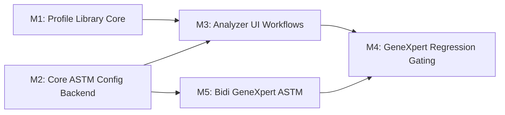

# Tasks: Generic ASTM Plugin Profiles v1.2

**Input**: Design documents from `/specs/012-generic-astm-plugin-profiles/`
**Prerequisites**: plan.md, spec.md, data-model.md, contracts/, research.md,
quickstart.md

**Tests**: MANDATORY per Constitution Principle V (TDD). Tests appear before
implementation in each milestone.

**Organization**: Tasks grouped by **Milestone** per Constitution Principle IX.
Milestones M1 and M2 are parallel; M3 depends on both; M5 depends on M2
(parallel with M3); M4 depends on M3 AND M5.

## Format: `[ID] [P?] [Milestone] Description`

- **[P]**: Can run in parallel (different files, no dependencies)
- **[Milestone]**: M1, M2, M3, M4, M5 (from plan.md milestone table)
- Include exact file paths in descriptions

## Path Conventions

- **Backend**: `src/main/java/org/openelisglobal/analyzer/`
- **Backend tests**: `src/test/java/org/openelisglobal/analyzer/`
- **Frontend**: `frontend/src/components/analyzers/`
- **Frontend tests**: `frontend/src/components/analyzers/**/*.test.jsx`
- **Playwright E2E**: `frontend/playwright/tests/`
- **Playwright fixtures**: `frontend/playwright/fixtures/`
- **Liquibase**: `src/main/resources/liquibase/3.4.x.x/`
- **i18n**: `frontend/src/languages/{en,fr}.json`

---

## Phase 1: Setup (Shared Infrastructure)

**Purpose**: Branch creation, environment verification, and shared prerequisites

- [x] T001 Verify Java 21 active (`java -version`), submodules initialized
      (`git submodule update --init --recursive`), and analyzer harness
      operational per `specs/012-generic-astm-plugin-profiles/quickstart.md`
- [x] T002 Run GeneXpert baseline regression gate: Start harness via
      `/restart-analyzer-harness --full-reset --build`, then
      `cd frontend && npm run pw:install` (first time), then
      `TEST_USER=admin TEST_PASS=adminADMIN! npm run pw:test -- playwright/tests/analyzer-test-connection.spec.ts -g "GeneXpert test-connection succeeds via ASTM mock"`
      — must pass before any feature work

**Checkpoint**: GeneXpert baseline green. Feature work can begin.

---

## Phase 2: Milestone 1 — Profile Library Core (FR-022..025)

**Branch**:
`feat/012-ogc-337-generic-astm-plugin-profiles-m1-profile-library-core`

**Goal**: Backend profile domain with import/export, SemVer lineage/latest
policy, and lab unit backend.

**User Stories**: US1 (configure analyzer from profile), US6 (profile
import/export)

**Independent Test**: Import a built-in profile, apply it to a new analyzer,
export, and re-import with version policy enforcement.

### Branch Setup

- [ ] T003 [M1] Create milestone branch
      `feat/012-ogc-337-generic-astm-plugin-profiles-m1-profile-library-core`
      from `develop`

### Liquibase Schema (FR-022, FR-025)

- [ ] T004 [M1] Create Liquibase changeset for `analyzer_profile` table in
      `src/main/resources/liquibase/3.4.x.x/010-create-analyzer-profile.xml` —
      columns per data-model.md `AnalyzerProfile` entity, unique constraint on
      (`profile_meta_id`, `profile_meta_version`)
- [ ] T005 [P] [M1] Create Liquibase changeset for
      `analyzer_profile_application` provenance table in
      `src/main/resources/liquibase/3.4.x.x/011-create-analyzer-profile-application.xml`
      — columns per data-model.md `AnalyzerProfileApplication`
- [ ] T006 [P] [M1] Create Liquibase changeset for `analyzer_lab_unit` junction
      table in
      `src/main/resources/liquibase/3.4.x.x/012-create-analyzer-lab-unit.xml` —
      composite PK (`analyzer_id`, `lab_unit_id`)

### ORM Validation Tests

- [ ] T007 [M1] Write ORM validation test for `AnalyzerProfile`,
      `AnalyzerProfileApplication`, `AnalyzerLabUnit` entities in
      `src/test/java/org/openelisglobal/analyzer/AnalyzerProfileOrmValidationTest.java`
      — must run in <5s without DB

### JPA Entities (Valueholders)

- [ ] T008 [P] [M1] Create `AnalyzerProfile` entity in
      `src/main/java/org/openelisglobal/analyzer/valueholder/AnalyzerProfile.java`
      — JPA annotations, `@Table(name = "analyzer_profile")`, extends
      `BaseObject<String>`, all fields per data-model.md
- [ ] T009 [P] [M1] Create `AnalyzerProfileApplication` entity in
      `src/main/java/org/openelisglobal/analyzer/valueholder/AnalyzerProfileApplication.java`
      — provenance snapshot, FK to analyzer and profile
- [ ] T010 [P] [M1] Create `AnalyzerLabUnit` entity in
      `src/main/java/org/openelisglobal/analyzer/valueholder/AnalyzerLabUnit.java`
      — composite PK entity for many-to-many

### Unit Tests (Service Layer) — RED phase

- [ ] T011 [P] [M1] Write unit tests for `AnalyzerProfileService` in
      `src/test/java/org/openelisglobal/analyzer/service/AnalyzerProfileServiceTest.java`
      — test cases: import with version policy (duplicate rejected, new version
      accepted), designated latest auto-resolve by SemVer, admin override of
      latest, built-in immutability, export sanitization, **auto-match logic on
      apply** (profile test codes classified as `mapped`/`suggested`/`unmapped`
      against site test catalog per FR-022 AC-92)
- [ ] T012 [P] [M1] Write unit tests for `AnalyzerLabUnitService` in
      `src/test/java/org/openelisglobal/analyzer/service/AnalyzerLabUnitServiceTest.java`
      — test cases: assign/replace lab units, list by analyzer,
      organizational-only constraint

### DAOs

- [ ] T013 [P] [M1] Create `AnalyzerProfileDAO` interface and
      `AnalyzerProfileDAOImpl` in
      `src/main/java/org/openelisglobal/analyzer/dao/AnalyzerProfileDAO.java`
      and `AnalyzerProfileDAOImpl.java` — methods: findBySource, findByMetaId,
      findLatestByMetaId, existsByMetaIdAndVersion
- [ ] T014 [P] [M1] Create `AnalyzerProfileApplicationDAO` interface and impl in
      `src/main/java/org/openelisglobal/analyzer/dao/AnalyzerProfileApplicationDAO.java`
      and impl — methods: findByAnalyzerId
- [ ] T015 [P] [M1] Create `AnalyzerLabUnitDAO` interface and impl in
      `src/main/java/org/openelisglobal/analyzer/dao/AnalyzerLabUnitDAO.java`
      and impl — methods: findByAnalyzerId, replaceForAnalyzer

### Services — GREEN phase

- [ ] T016 [M1] Implement `AnalyzerProfileService` and
      `AnalyzerProfileServiceImpl` in
      `src/main/java/org/openelisglobal/analyzer/service/AnalyzerProfileService.java`
      and impl — profile CRUD, import with BR-18/BR-19 validation, version
      policy, designated latest management, export sanitization (BR-21),
      built-in immutability (BR-20), checksum dedup, **auto-match engine**
      (compare profile test codes against site `Test` catalog: exact match →
      `mapped`, fuzzy/alias match → `suggested`, no match → `unmapped` per
      FR-022 AC-92). Make T011 tests pass.
- [ ] T017 [M1] Implement `AnalyzerLabUnitService` and impl in
      `src/main/java/org/openelisglobal/analyzer/service/AnalyzerLabUnitService.java`
      and impl — assign/replace/list lab units for analyzer. Make T012 tests
      pass.

### Controller Tests — RED phase

- [ ] T018 [P] [M1] Write controller tests for `AnalyzerProfileRestController`
      in
      `src/test/java/org/openelisglobal/analyzer/controller/AnalyzerProfileRestControllerTest.java`
      — test cases: list by source, get by id, import (201 + 409 duplicate),
      update latest designation, delete (204 + 403 built-in), RBAC enforcement
      (LAB_USER read-only, LAB_ADMIN delete)
- [ ] T019 [P] [M1] Write controller tests for profile-apply and profile-export
      endpoints in
      `src/test/java/org/openelisglobal/analyzer/controller/AnalyzerProfileApplyExportControllerTest.java`
      — test cases: apply snapshot creates provenance, export strips
      site-specific data
- [ ] T020 [P] [M1] Write controller tests for lab unit endpoints in
      `src/test/java/org/openelisglobal/analyzer/controller/AnalyzerLabUnitControllerTest.java`
      — test cases: GET list, PUT replace, organizational scope

### Controllers — GREEN phase

- [ ] T021 [M1] Implement `AnalyzerProfileRestController` in
      `src/main/java/org/openelisglobal/analyzer/controller/AnalyzerProfileRestController.java`
      — endpoints per API contract: `GET/POST /profiles`,
      `GET/PUT/DELETE /profiles/{id}`, RBAC per CR-007. Make T018 tests pass.
- [ ] T022 [M1] Implement profile-apply endpoint
      `POST /analyzers/{id}/profile-apply` and profile-export endpoint
      `GET /analyzers/{id}/profile-export` in
      `src/main/java/org/openelisglobal/analyzer/controller/AnalyzerProfileRestController.java`
      (or separate controller) — snapshot-on-apply creates
      `AnalyzerProfileApplication` record, export sanitizes per BR-21. Make T019
      tests pass.
- [ ] T023 [M1] Implement lab unit endpoints `GET/PUT /analyzers/{id}/lab-units`
      in
      `src/main/java/org/openelisglobal/analyzer/controller/AnalyzerLabUnitController.java`
      — replace semantics. Make T020 tests pass.

### Built-in Profile Bootstrap

- [ ] T024 [M1] Implement built-in profile bootstrap service that dynamically
      scans `projects/analyzer-profiles/{astm,hl7}/*.json` at startup and
      upserts each into `analyzer_profile` table with source=`BUILT_IN` and
      `is_mutable=false` — initially 6 ASTM profiles (genexpert-cepheid-astm,
      sysmex-xn-astm, mindray-ba88a-astm, horiba-pentra60-astm,
      horiba-micros60-astm, stago-start4-astm) and 5 HL7 profiles
      (genexpert-cepheid-hl7, mindray-bc2000-hl7, mindray-bc5380-hl7,
      mindray-bs360e-hl7, abbott-architect-hl7); additional profiles
      auto-discovered when JSON files are added — in
      `src/main/java/org/openelisglobal/analyzer/service/BuiltInProfileBootstrapService.java`
- [ ] T025 [M1] Write integration test verifying built-in profile bootstrap
      loads GeneXpert ASTM profile correctly in
      `src/test/java/org/openelisglobal/analyzer/service/BuiltInProfileBootstrapIntegrationTest.java`

### Integration Tests

- [ ] T026 [M1] Write integration test for full profile import/apply/export
      lifecycle in
      `src/test/java/org/openelisglobal/analyzer/service/AnalyzerProfileIntegrationTest.java`
      — import profile, apply to analyzer, verify provenance, export and verify
      sanitization, re-import with new version (accepted) and duplicate version
      (rejected)

### Formatting & Build

- [ ] T027 [M1] Run `mvn spotless:apply` and verify
      `mvn clean install -DskipTests -Dmaven.test.skip=true` passes
- [ ] T028 [M1] Run
      `mvn test -Dtest="*AnalyzerProfile*,*AnalyzerLabUnit*,*AnalyzerProfileOrm*"`
      — all tests must pass

### GeneXpert Regression Gate

- [ ] T029 [M1] Run GeneXpert regression:
      `cd frontend && npm run pw:test -- playwright/tests/analyzer-test-connection.spec.ts -g "GeneXpert test-connection succeeds via ASTM mock"`
      — must still pass

### PR

- [ ] T030 [M1] Create PR for M1 targeting `develop` with title
      `feat(012): Profile library core — import/export, versioning, lab units (M1)`

**Checkpoint**: Profile library APIs work. Built-in GeneXpert profile loads at
startup. Lab unit backend works. GeneXpert test-connection still green.

---

## Phase 3: Milestone 2 — Core ASTM Config Backend (FR-014..021) [P]

**Branch**:
`feat/012-ogc-337-generic-astm-plugin-profiles-m2-core-astm-config-backend`

**Goal**: Backend runtime config including QC rules, transforms, extraction
overrides, aggregation, flags, pending codes, and simulator extension.

**User Stories**: US2 (core mapping config), US3 (QC enforcement), US4
(simulator), US5 (auto-detect codes)

**Independent Test**: Configure QC rules, transforms, and extraction for
GeneXpert analyzer; simulate an ASTM message via `preview-mapping`; verify
pending code queue behavior.

### Branch Setup

- [ ] T031 [M2] Create milestone branch
      `feat/012-ogc-337-generic-astm-plugin-profiles-m2-core-astm-config-backend`
      from `develop`

### Liquibase Schema (FR-014..021)

- [ ] T032 [M2] Create Liquibase changeset for `astm_analyzer_config` table in
      `src/main/resources/liquibase/3.4.x.x/013-create-astm-analyzer-config.xml`
      — columns per data-model.md, unique constraint on `analyzer_id`
- [ ] T033 [P] [M2] Create Liquibase changeset for
      `astm_field_extraction_config` table in
      `src/main/resources/liquibase/3.4.x.x/014-create-astm-field-extraction-config.xml`
      — unique constraint on (`analyzer_id`, `key`), validation
      `field_index >= 1`
- [ ] T034 [P] [M2] Create Liquibase changeset for `astm_qc_rule` table in
      `src/main/resources/liquibase/3.4.x.x/015-create-astm-qc-rule.xml`
- [ ] T035 [P] [M2] Create Liquibase changeset for `astm_test_mapping_config`
      table in
      `src/main/resources/liquibase/3.4.x.x/016-create-astm-test-mapping-config.xml`
- [ ] T036 [P] [M2] Create Liquibase changeset for `astm_flag_mapping` table in
      `src/main/resources/liquibase/3.4.x.x/017-create-astm-flag-mapping.xml`
- [ ] T037 [P] [M2] Create Liquibase changeset for `astm_pending_code` table in
      `src/main/resources/liquibase/3.4.x.x/018-create-astm-pending-code.xml`

### ORM Validation Tests

- [ ] T038 [M2] Write ORM validation test for all 6 new entities in
      `src/test/java/org/openelisglobal/analyzer/AstmConfigOrmValidationTest.java`
      — must run in <5s without DB

### JPA Entities

- [ ] T039 [P] [M2] Create `AstmAnalyzerConfig` entity in
      `src/main/java/org/openelisglobal/analyzer/valueholder/AstmAnalyzerConfig.java`
      — connection role, aggregation mode, ports/IPs per data-model.md
- [ ] T040 [P] [M2] Create `AstmFieldExtractionConfig` entity in
      `src/main/java/org/openelisglobal/analyzer/valueholder/AstmFieldExtractionConfig.java`
      — key/field_index/component_index per data-model.md
- [ ] T041 [P] [M2] Create `AstmQcRule` entity in
      `src/main/java/org/openelisglobal/analyzer/valueholder/AstmQcRule.java` —
      4 rule types, target_field, operand, sort_order
- [ ] T042 [P] [M2] Create `AstmTestMappingConfig` entity in
      `src/main/java/org/openelisglobal/analyzer/valueholder/AstmTestMappingConfig.java`
      — 5 transform types, JSONB config
- [ ] T043 [P] [M2] Create `AstmFlagMapping` entity in
      `src/main/java/org/openelisglobal/analyzer/valueholder/AstmFlagMapping.java`
      — analyzer_flag to openelis_flag
- [ ] T044 [P] [M2] Create `AstmPendingCode` entity in
      `src/main/java/org/openelisglobal/analyzer/valueholder/AstmPendingCode.java`
      — status enum, seen_count, sample_payload

### Unit Tests (Service Layer) — RED phase

- [ ] T045 [P] [M2] Write unit tests for `AstmConfigService` in
      `src/test/java/org/openelisglobal/analyzer/service/AstmConfigServiceTest.java`
      — test cases: save/get config, connection role validation (SERVER requires
      port, CLIENT requires ip+port), aggregation validation (BY_SESSION
      requires window 5-300 per BR-14), **cross-analyzer port conflict
      detection** (BR-11: saving SERVER config with port already used by another
      active analyzer must fail with validation error; same port on inactive
      analyzer is allowed; CLIENT role skips port conflict check), **flag
      mapping CRUD** (FR-019: save/update/delete `AstmFlagMapping` entries via
      config update, custom flag support, duplicate analyzer_flag rejection per
      analyzer), **extraction config CRUD** (FR-017: save/update/delete
      `AstmFieldExtractionConfig` entries via extractionOverrides, ASTM
      1-indexed validation per BR-17, 9 standard field keys, default
      restoration)
- [ ] T046 [P] [M2] Write unit tests for `AstmQcRuleService` in
      `src/test/java/org/openelisglobal/analyzer/service/AstmQcRuleServiceTest.java`
      — test cases: CRUD, OR evaluation logic (any match = QC), activation gate
      (BR-12: no activate without QC rule), 4 rule types with representative
      messages
- [ ] T047 [P] [M2] Write unit tests for `AstmTestMappingConfigService` in
      `src/test/java/org/openelisglobal/analyzer/service/AstmTestMappingConfigServiceTest.java`
      — test cases: CRUD, transform type validation (BR-13), 5 transform types
      produce expected output
- [ ] T048 [P] [M2] Write unit tests for `AstmPendingCodeService` in
      `src/test/java/org/openelisglobal/analyzer/service/AstmPendingCodeServiceTest.java`
      — test cases: detect new code, increment seen_count, cap at 100 (BR-16),
      purge older than 30 days, resolve by mapping, ignore/dismiss

### DAOs

- [ ] T049 [P] [M2] Create DAOs for `AstmAnalyzerConfig`,
      `AstmFieldExtractionConfig` in
      `src/main/java/org/openelisglobal/analyzer/dao/` — findByAnalyzerId for
      each
- [ ] T050 [P] [M2] Create DAOs for `AstmQcRule`, `AstmTestMappingConfig` in
      `src/main/java/org/openelisglobal/analyzer/dao/` — findByAnalyzerId, CRUD
      support
- [ ] T051 [P] [M2] Create DAOs for `AstmFlagMapping`, `AstmPendingCode` in
      `src/main/java/org/openelisglobal/analyzer/dao/` — findByAnalyzerId,
      pending code capping query

### Services — GREEN phase

- [ ] T052 [M2] Implement `AstmConfigService` and impl in
      `src/main/java/org/openelisglobal/analyzer/service/AstmConfigService.java`
      and impl — CRUD for runtime ASTM config, connection role + aggregation
      validation. Make T045 pass.
- [ ] T053 [M2] Implement `AstmQcRuleService` and impl in
      `src/main/java/org/openelisglobal/analyzer/service/AstmQcRuleService.java`
      and impl — CRUD, OR evaluation engine, activation gate check. Make T046
      pass.
- [ ] T054 [M2] Implement `AstmTestMappingConfigService` and impl in
      `src/main/java/org/openelisglobal/analyzer/service/AstmTestMappingConfigService.java`
      and impl — CRUD, transform config validation by type. Make T047 pass.
- [ ] T055 [M2] Implement `AstmPendingCodeService` and impl in
      `src/main/java/org/openelisglobal/analyzer/service/AstmPendingCodeService.java`
      and impl — detect/increment, cap, purge, resolve, ignore. Make T048 pass.

### Activation Gate Integration

- [ ] T056 [M2] Modify existing `AnalyzerServiceImpl.updateStatus()` in
      `src/main/java/org/openelisglobal/analyzer/service/AnalyzerServiceImpl.java`
      to enforce BR-12: block transition to ACTIVE when no active QC rules exist
      for the analyzer
- [ ] T057 [M2] Write integration test for activation gate in
      `src/test/java/org/openelisglobal/analyzer/service/AnalyzerActivationGateIntegrationTest.java`
      — attempt activate without QC rules (blocked), add rule then activate
      (allowed)

### Extend preview-mapping for Simulator (FR-020) — RED phase

- [ ] T058 [M2] Write unit tests for extended preview-mapping in
      `src/test/java/org/openelisglobal/analyzer/service/AnalyzerMappingPreviewExtendedTest.java`
      — verify transform application, QC rule evaluation output, extraction
      override behavior, flag mapping resolution, unmapped code detection,
      non-persistence (BR-15)

### Extend preview-mapping for Simulator (FR-020) — GREEN phase

- [ ] T059 [M2] Extend `AnalyzerMappingPreviewServiceImpl.previewMapping()` in
      `src/main/java/org/openelisglobal/analyzer/service/AnalyzerMappingPreviewServiceImpl.java`
      to include v1.2 outputs: transform results, QC rule evaluation, extraction
      override application, flag mapping, unmapped code warnings. Update
      `MappingPreviewResult` with new fields. Make T058 tests pass.

### Controller Tests — RED phase

- [ ] T060 [P] [M2] Write controller tests for ASTM config endpoints in
      `src/test/java/org/openelisglobal/analyzer/controller/AstmConfigRestControllerTest.java`
      — GET/PUT `/analyzers/{id}/astm-config`, validation errors (400), RBAC,
      **flag mapping round-trip** (FR-019: PUT with flagMappings array persists
      and GET returns them, custom flags preserved)
- [ ] T061 [P] [M2] Write controller tests for QC rule endpoints in
      `src/test/java/org/openelisglobal/analyzer/controller/AstmQcRuleRestControllerTest.java`
      — GET/POST/PUT/DELETE `/analyzers/{id}/qc-rules`, `/qc-rules/{ruleId}`
- [ ] T062 [P] [M2] Write controller tests for test-mapping-config endpoints in
      `src/test/java/org/openelisglobal/analyzer/controller/AstmTestMappingConfigRestControllerTest.java`
      — CRUD for `/analyzers/{id}/test-mapping-configs`
- [ ] T063 [P] [M2] Write controller tests for pending code endpoints in
      `src/test/java/org/openelisglobal/analyzer/controller/AstmPendingCodeRestControllerTest.java`
      — GET list, POST map, PUT status

### Controllers — GREEN phase

- [ ] T064 [M2] Implement `AstmConfigRestController` in
      `src/main/java/org/openelisglobal/analyzer/controller/AstmConfigRestController.java`
      — endpoints per API contract: astm-config GET/PUT, qc-rules CRUD,
      test-mapping-configs CRUD, pending-codes list/map/status. Make T060-T063
      pass.

### Integration Tests

- [ ] T065 [M2] Write integration test for full QC rule + activation +
      preview-mapping flow in
      `src/test/java/org/openelisglobal/analyzer/service/AstmConfigIntegrationTest.java`
      — create analyzer, add QC rules, add transforms, configure extraction,
      simulate message via preview-mapping, verify all outputs

### Formatting & Build

- [ ] T066 [M2] Run `mvn spotless:apply` and verify
      `mvn clean install -DskipTests -Dmaven.test.skip=true` passes
- [ ] T067 [M2] Run
      `mvn test -Dtest="*AstmConfig*,*AstmQcRule*,*AstmTestMapping*,*AstmPendingCode*,*AnalyzerMappingPreviewExtended*,*AnalyzerActivationGate*,*AstmConfigOrm*"`
      — all tests must pass

### GeneXpert Regression Gate

- [ ] T068 [M2] Run GeneXpert regression:
      `cd frontend && npm run pw:test -- playwright/tests/analyzer-test-connection.spec.ts -g "GeneXpert test-connection succeeds via ASTM mock"`
      — must still pass

### PR

- [ ] T069 [M2] Create PR for M2 targeting `develop` with title
      `feat(012): Core ASTM config backend — QC rules, transforms, extraction, simulator, pending codes (M2)`

**Checkpoint**: All runtime ASTM config APIs work. QC activation gate enforced.
Preview-mapping extended with v1.2 outputs. Pending code queue capped/purged.
GeneXpert test-connection still green.

---

## Phase 4: Milestone 3 — Analyzer UI Workflows (M3)

**Branch**:
`feat/012-ogc-337-generic-astm-plugin-profiles-m3-analyzer-ui-workflows`

**Goal**: Add/Edit analyzer UI with profile selector, lab units,
mapping/simulator UX extensions.

**User Stories**: US1..US6 (all)

**Depends On**: M1 + M2 merged

**Independent Test**: Create analyzer from built-in GeneXpert profile, configure
QC rules via UI, run simulator with ASTM payload, assign lab units, verify
analyzer list filtering.

### Branch Setup

- [ ] T070 [M3] Create milestone branch
      `feat/012-ogc-337-generic-astm-plugin-profiles-m3-analyzer-ui-workflows`
      from `develop` (after M1 + M2 merged)

### Internationalization (CR-002)

- [ ] T071 [P] [M3] Add i18n keys for profile UI strings (selector labels,
      banner fields, import/export prompts, validation messages) to
      `frontend/src/languages/en.json` and `frontend/src/languages/fr.json`
- [ ] T072 [P] [M3] Add i18n keys for QC rules UI, transform config UI,
      extraction config UI, aggregation UI, flag mapping UI, simulator tab,
      pending codes UI to `frontend/src/languages/en.json` and
      `frontend/src/languages/fr.json`
- [ ] T073 [P] [M3] Add i18n keys for lab unit selector, analyzer list lab units
      column and filter to `frontend/src/languages/en.json` and
      `frontend/src/languages/fr.json`

### Frontend API Service Extensions

- [ ] T074 [P] [M3] Add profile API methods to
      `frontend/src/services/analyzerService.js` —
      `getProfiles(source?, metaId?)`, `getProfile(id)`,
      `importProfile(payload)`, `updateProfile(id, data)`, `deleteProfile(id)`,
      `applyProfile(analyzerId, profileId)`, `exportProfile(analyzerId)`
- [ ] T075 [P] [M3] Add ASTM config API methods to
      `frontend/src/services/analyzerService.js` — `getAstmConfig(analyzerId)`,
      `updateAstmConfig(analyzerId, data)`, `getQcRules(analyzerId)`,
      `createQcRule(...)`, `updateQcRule(...)`, `deleteQcRule(...)`,
      `getTestMappingConfigs(...)`, `createTestMappingConfig(...)`,
      `updateTestMappingConfig(...)`, `deleteTestMappingConfig(...)`,
      `getPendingCodes(...)`, `mapPendingCode(...)`,
      `updatePendingCodeStatus(...)`
- [ ] T076 [P] [M3] Add lab unit API methods to
      `frontend/src/services/analyzerService.js` — `getLabUnits(analyzerId)`,
      `updateLabUnits(analyzerId, labUnitIds)`

### Jest Unit Tests — RED phase

- [ ] T077 [P] [M3] Write Jest tests for profile selector component in
      `frontend/src/components/analyzers/AnalyzerForm/ProfileSelector.test.jsx`
      — test cases: render grouped options (None/Built-in/Site/Import),
      selecting profile triggers pre-fill, profile info banner renders metadata,
      import file validation
- [ ] T078 [P] [M3] Write Jest tests for QC rule builder component in
      `frontend/src/components/analyzers/FieldMapping/QcRuleBuilder.test.jsx` —
      test cases: add/edit/delete rule, 4 rule types render correct fields, OR
      semantics indication
- [ ] T079 [P] [M3] Write Jest tests for transform config component in
      `frontend/src/components/analyzers/FieldMapping/TransformConfig.test.jsx`
      — test cases: 5 transform types with type-specific forms, validation
- [ ] T080 [P] [M3] Write Jest tests for simulator tab component in
      `frontend/src/components/analyzers/FieldMapping/SimulatorTab.test.jsx` —
      test cases: paste ASTM, preview results render (parsed fields, mappings,
      transforms, QC eval, flags, warnings), non-persistence label visible
- [ ] T081 [P] [M3] Write Jest tests for lab unit selector in
      `frontend/src/components/analyzers/AnalyzerForm/LabUnitSelector.test.jsx`
      — test cases: multi-select renders, removable tags, persist on save

### UI Components — GREEN phase

- [ ] T082 [M3] Implement `ProfileSelector` component in
      `frontend/src/components/analyzers/AnalyzerForm/ProfileSelector.jsx` —
      grouped Carbon ComboBox with None/Built-in/Site Library/Import from File
      options, profile info banner (AC-87..AC-90), pre-fill handler. Make T077
      pass.
- [ ] T083 [M3] Integrate `ProfileSelector` into `AnalyzerForm` in
      `frontend/src/components/analyzers/AnalyzerForm/AnalyzerForm.jsx` — add
      profile selector step, wire pre-fill to form fields (AC-89, AC-91),
      auto-match display (AC-92, AC-93)
- [ ] T084 [M3] Implement `LabUnitSelector` component in
      `frontend/src/components/analyzers/AnalyzerForm/LabUnitSelector.jsx` —
      Carbon FilterableMultiSelect sourcing active lab units, removable tags
      (AC-100..AC-102). Make T081 pass.
- [ ] T085 [M3] Integrate `LabUnitSelector` into `AnalyzerForm` in
      `frontend/src/components/analyzers/AnalyzerForm/AnalyzerForm.jsx` — add
      lab unit field, wire to lab-units API (AC-105)
- [ ] T086 [M3] Add Lab Units column and Lab Unit filter to Analyzer List in
      `frontend/src/components/analyzers/AnalyzerList.jsx` (or relevant list
      component) — (AC-103, AC-104)
- [ ] T087 [M3] Implement `QcRuleBuilder` component in
      `frontend/src/components/analyzers/FieldMapping/QcRuleBuilder.jsx` — CRUD
      UI for QC rules, 4 rule types with appropriate input fields, activation
      gate warning. Make T078 pass.
- [ ] T088 [M3] Implement `TransformConfig` component in
      `frontend/src/components/analyzers/FieldMapping/TransformConfig.jsx` —
      per-test-code transform type selector + config editor for 5 types. Make
      T079 pass.
- [ ] T089 [M3] Implement connection role UI controls in `AnalyzerForm` and
      Advanced mapping tab — SERVER/CLIENT selector, conditional port/IP fields
      (FR-014)
- [ ] T090 [M3] Implement field extraction config UI in
      `frontend/src/components/analyzers/FieldMapping/ExtractionConfig.jsx` — 9
      overridable ASTM field positions with defaults (FR-017)
- [ ] T091 [M3] Implement aggregation mode selector in Advanced tab —
      PER_MESSAGE/BY_SPECIMEN/BY_SESSION with conditional window input (FR-018)
- [ ] T092 [M3] Implement abnormal flag mapping editor in
      `frontend/src/components/analyzers/FieldMapping/FlagMappingEditor.jsx` —
      editable table of analyzer_flag→openelis_flag with custom flag support
      (FR-019)
- [ ] T093 [M3] Extend simulator/preview tab in
      `frontend/src/components/analyzers/FieldMapping/SimulatorTab.jsx` — ASTM
      paste area, preview button calling `preview-mapping`, results display with
      transforms/QC/flags/warnings (FR-020). Make T080 pass.
- [ ] T094 [M3] Implement pending codes UI in
      `frontend/src/components/analyzers/FieldMapping/PendingCodes.jsx` — list
      pending codes, one-click map action, ignore/dismiss action (FR-021)
- [ ] T095 [M3] Add profile import modal (file upload + validation feedback) and
      export action (metadata prompt + download) to analyzer UI — (AC-94..AC-97)

### Formatting

- [ ] T096 [M3] Run `cd frontend && npm run format` and
      `npm test -- --watchAll=false` — all Jest tests must pass
- [ ] T097 [M3] Run `mvn spotless:apply` if any backend formatting was touched

### Playwright E2E Tests — GeneXpert Profile Workflow

- [ ] T098 [M3] Create Playwright page object for profile selector in
      `frontend/playwright/fixtures/analyzer-profile.ts` — methods:
      selectBuiltInProfile(name), selectNone(), verifyProfileBanner(metadata),
      importProfileFromFile(path)
- [ ] T099 [M3] Create Playwright page object for QC rule builder in
      `frontend/playwright/fixtures/analyzer-qc-rules.ts` — methods:
      addRule(type, field, operand), deleteRule(index), verifyRuleCount(n)
- [ ] T100 [M3] Create Playwright page object for simulator tab in
      `frontend/playwright/fixtures/analyzer-simulator.ts` — methods:
      pasteAstmMessage(msg), clickPreview(), verifyParsedFields(expected),
      verifyWarnings(expected), verifyNoPersistence()
- [ ] T101 [M3] Write Playwright E2E test: Create analyzer from GeneXpert
      built-in profile in
      `frontend/playwright/tests/analyzer-profile-workflow.spec.ts` — select
      GeneXpert profile, verify pre-fill (protocol, connection defaults), assign
      lab unit, save, verify analyzer appears in list with lab unit column
- [ ] T102 [M3] Write Playwright E2E test: Configure QC rules and verify
      activation gate in
      `frontend/playwright/tests/analyzer-qc-activation.spec.ts` — create
      analyzer, attempt activate without QC rules (blocked), add
      SPECIMEN_ID_PREFIX rule, activate (succeeds)
- [ ] T103 [M3] Write Playwright E2E test: Run simulator with GeneXpert ASTM
      message in `frontend/playwright/tests/analyzer-simulator-preview.spec.ts`
      — open analyzer, go to simulator tab, paste sample GeneXpert ASTM payload,
      click preview, verify parsed fields/mappings/transforms displayed, verify
      no records persisted (check via API)
- [ ] T104 [M3] Write Playwright E2E test: Lab unit filter on Analyzer List in
      `frontend/playwright/tests/analyzer-lab-unit-filter.spec.ts` — assign lab
      units to 2 analyzers, navigate to list, filter by lab unit, verify
      filtered results

### GeneXpert Regression Gate

- [ ] T105 [M3] Run GeneXpert regression:
      `cd frontend && npm run pw:test -- playwright/tests/analyzer-test-connection.spec.ts -g "GeneXpert test-connection succeeds via ASTM mock"`
      — must still pass
- [ ] T106 [M3] Run all new Playwright E2E tests:
      `cd frontend && npm run pw:test -- playwright/tests/analyzer-profile-workflow.spec.ts playwright/tests/analyzer-qc-activation.spec.ts playwright/tests/analyzer-simulator-preview.spec.ts playwright/tests/analyzer-lab-unit-filter.spec.ts`

### PR

- [ ] T107 [M3] Create PR for M3 targeting `develop` with title
      `feat(012): Analyzer UI workflows — profile selector, QC rules, transforms, simulator, lab units (M3)`

**Checkpoint**: Full analyzer setup workflow works end-to-end. Profile
selection, QC enforcement, simulator preview, lab unit assignment all validated
via Playwright E2E. GeneXpert test-connection still green.

---

## Phase 5: Milestone 5 — Bidirectional GeneXpert ASTM (M5) [P]

**Branch**:
`feat/012-ogc-337-generic-astm-plugin-profiles-m5-bidi-genexpert-astm`

**Goal**: Implement and validate all 4 GeneXpert ASTM bidirectional pathways
(results push, orders pull, orders push, results pull) using mock and real
device.

**Depends On**: M2 merged (needs ASTM config entities for connection role/port
awareness)

**Can run in parallel with**: M3

**Out of scope**: Mapping management UI, field discovery query UI. MVP is
service/API + harness validated.

### Branch Setup

- [ ] T123 [M5] Create milestone branch
      `feat/012-ogc-337-generic-astm-plugin-profiles-m5-bidi-genexpert-astm`
      from `develop` (after M2 merged)

### Profiles Directory Rename

- [ ] T124 [P] [M5] Rename `projects/analyzer-defaults/` →
      `projects/analyzer-profiles/` and update `README.md` with new title,
      paths, and profile schema v1.2 references
- [ ] T125 [P] [M5] Add `profileMeta` section to each JSON file in
      `projects/analyzer-profiles/{astm,hl7}/` — include `id` (profile meta ID),
      `version` ("1.0.0"), `displayName` per profile ID mapping table in plan.md
- [ ] T126 [P] [M5] Update `AnalyzerRestController.java` — add
      `ANALYZER_PROFILES_DIR` env var with `ANALYZER_DEFAULTS_DIR` fallback; add
      `GET /rest/analyzer/profiles` and
      `GET /rest/analyzer/profiles/{protocol}/{name}` as aliases for the
      defaults endpoints
- [ ] T127 [P] [M5] Update `projects/analyzer-harness/docker-compose.dev.yml` —
      change mount from
      `../../projects/analyzer-defaults:/data/analyzer-defaults:ro` to
      `../../projects/analyzer-profiles:/data/analyzer-profiles:ro` (keep old
      mount as symlink for backward compat)
- [ ] T128 [P] [M5] Update `pom.xml` — change `ANALYZER_DEFAULTS_DIR` to
      `ANALYZER_PROFILES_DIR` pointing to
      `${project.basedir}/projects/analyzer-profiles`
- [ ] T129 [P] [M5] Update `frontend/src/services/analyzerService.js` — add
      `getProfiles()` and `getProfile(protocol, name)` methods pointing to new
      `/rest/analyzer/profiles` endpoints
- [ ] T130 [P] [M5] Update `AnalyzerDefaultsRestControllerTest.java` — verify
      both `/defaults` and `/profiles` endpoints work; add tests for
      `profileMeta` fields in JSON responses

### Mock Server Q-Segment Support

- [ ] T131 [M5] Update `tools/analyzer-mock-server/server.py` — change
      `_process_qc()` to `_process_query_segment()` for `Q|` records; parse
      Q-segment fields (sequence, start ID, test codes, date range) instead of
      treating as QC
- [ ] T132 [M5] Update `_is_field_query()` in `server.py` — add Q-segment
      detection: if any frame starts with `Q|`, message is a query regardless of
      P/O presence
- [ ] T133 [M5] Implement `_build_query_response()` in `server.py` — based on
      Q-segment content, generate:
  - Orders-only response (H + P + O segments) for orders-pull tests
  - Full result response (H + P + O + R + L) for results-pull tests
  - Response type determined by query test codes field (`ALL` = full results,
    specific codes = orders only)
- [ ] T134 [M5] Add simulation endpoint `POST /simulate/astm/query-response` to
      mock server — accepts Q-segment query body, returns generated response for
      testing
- [ ] T135 [M5] Write mock server tests in
      `tools/analyzer-mock-server/test_q_segment.py` — test Q-segment parsing,
      query detection, response generation for both orders-only and full-results
      modes

### Harness Scripts for All 4 Pathways

- [ ] T136 [M5] Create
      `projects/analyzer-harness/scripts/test-genexpert-orders-push.sh` —
      construct ASTM H/P/O/L order message, send via bridge to mock analyzer,
      verify mock received and logged the order
- [ ] T137 [M5] Create
      `projects/analyzer-harness/scripts/test-genexpert-orders-pull.sh` — send
      ASTM Q-segment query from mock analyzer to OpenELIS (via bridge), verify
      OpenELIS responds with H/P/O/L containing pending orders for the queried
      sample
- [ ] T138 [M5] Create
      `projects/analyzer-harness/scripts/test-genexpert-results-pull.sh` — send
      ASTM Q-segment query from OpenELIS to mock analyzer (via bridge), capture
      response, verify results are imported into OpenELIS
- [ ] T139 [M5] Update existing
      `projects/analyzer-harness/scripts/test-genexpert-astm.sh` — add
      `--pathway` flag to explicitly label this as the results-push pathway; add
      post-push verification (check analyzer import queue via API)

### Backend: Q-Segment Responder (Plugin Submodule)

- [ ] T140 [M5] Write unit tests for `GenericASTMQueryDetector` in
      `plugins/analyzers/GenericASTM/src/test/java/org/openelisglobal/plugins/analyzer/genericastm/GenericASTMQueryDetectorTest.java`
      — test cases: Q-segment message returns `isAnalyzerResult() == false`;
      result message returns `true`; mixed messages handled correctly
- [ ] T141 [M5] Implement Q-segment detection in
      `plugins/analyzers/GenericASTM/src/main/java/org/openelisglobal/plugins/analyzer/genericastm/GenericASTMLineInserter.java`
      — override `isAnalyzerResult()` to return `false` when message contains
      Q-segment records (`Q|...`)
- [ ] T142 [M5] Write unit tests for `GenericASTMAnalyzerResponder` in
      `plugins/analyzers/GenericASTM/src/test/java/org/openelisglobal/plugins/analyzer/genericastm/GenericASTMAnalyzerResponderTest.java`
      — test cases: parse Q-segment to extract sample ID and test code filter;
      build H/P/O/L response from pending analyses; handle no-match case (empty
      response with H/L only)
- [ ] T143 [M5] Implement `GenericASTMAnalyzerResponder` in
      `plugins/analyzers/GenericASTM/src/main/java/org/openelisglobal/plugins/analyzer/genericastm/GenericASTMAnalyzerResponder.java`
      — parse Q-segment `Q|seq|startID^endID|testCodes|...`, look up pending
      analyses for sample via `AnalysisService`, map to analyzer test codes via
      `analyzer_test_map`, build ASTM H + P + O + L response message

### Backend: Order Send Service (Core)

- [ ] T144 [M5] Write unit tests for `AstmMessageBuilder` in
      `src/test/java/org/openelisglobal/analyzer/service/AstmMessageBuilderTest.java`
      — test cases: build valid ASTM H/P/O/L message from accession + patient +
      test orders; validate field positions per GeneXpert Rev-E spec; handle
      missing optional fields
- [ ] T145 [M5] Implement `AstmMessageBuilder` in
      `src/main/java/org/openelisglobal/analyzer/service/AstmMessageBuilder.java`
      — construct spec-compliant ASTM message with H (header), P (patient), O
      (order per test), L (terminator) records
- [ ] T146 [M5] Write unit tests for `AstmOrderSendService` in
      `src/test/java/org/openelisglobal/analyzer/service/AstmOrderSendServiceTest.java`
      — test cases: build order message for analyzer + accession; send via
      bridge HTTP POST; handle bridge errors (timeout, connection refused)
- [ ] T147 [M5] Implement `AstmOrderSendService` in
      `src/main/java/org/openelisglobal/analyzer/service/AstmOrderSendService.java`
      — build ASTM order message using `AstmMessageBuilder`, send to bridge
      endpoint with `forwardAddress`/`forwardPort` params (reuse
      `testConnectionViaBridge()` HTTP pattern)

### Backend: Results Query Service (Core)

- [ ] T148 [M5] Write unit tests for `AstmResultQueryService` in
      `src/test/java/org/openelisglobal/analyzer/service/AstmResultQueryServiceTest.java`
      — test cases: build Q-segment query for accession; send via bridge; parse
      response into ASTM lines; feed into `ASTMAnalyzerReader` ingest pipeline;
      handle empty response (no results available)
- [ ] T149 [M5] Implement `AstmResultQueryService` in
      `src/main/java/org/openelisglobal/analyzer/service/AstmResultQueryService.java`
      — construct ASTM Q-segment query (`Q|1|accession||ALL...`), send via
      bridge, capture response, feed response lines into
      `ASTMAnalyzerReader.processData()` for standard ingest

### Controller Endpoints for Bidirectional

- [ ] T150 [M5] Write controller tests for bidirectional endpoints in
      `src/test/java/org/openelisglobal/analyzer/controller/AstmBidiRestControllerTest.java`
      — test cases: `POST /analyzers/{id}/send-order` (201 success, 400 no
      accession, 502 bridge error), `POST /analyzers/{id}/query-results` (200
      with imported count, 200 with zero results, 502 bridge error), RBAC
      (LAB_SUPERVISOR required)
- [ ] T151 [M5] Implement `AstmBidiRestController` in
      `src/main/java/org/openelisglobal/analyzer/controller/AstmBidiRestController.java`
      — endpoints: `POST /analyzers/{id}/send-order` (accepts `accessionNumber`,
      delegates to `AstmOrderSendService`), `POST /analyzers/{id}/query-results`
      (accepts `accessionNumber`, delegates to `AstmResultQueryService`, returns
      import count)

### Integration Tests

- [ ] T152 [M5] Write integration test for orders-pull flow in
      `src/test/java/org/openelisglobal/analyzer/service/AstmOrdersPullIntegrationTest.java`
      — create analyzer with mappings, create sample with pending analyses,
      simulate Q-segment query via `ASTMAnalyzerReader.processData()`, verify
      response contains correct O segments
- [ ] T153 [M5] Write integration test for order-send + results-query round-trip
      in
      `src/test/java/org/openelisglobal/analyzer/service/AstmBidiIntegrationTest.java`
      — (mocked bridge) send order, verify message format; query results, verify
      ingest pipeline processes response

### Formatting & Build

- [ ] T154 [M5] Run `mvn spotless:apply` and verify
      `mvn clean install -DskipTests -Dmaven.test.skip=true` passes
- [ ] T155 [M5] Run
      `mvn test -Dtest="*AstmMessageBuilder*,*AstmOrderSend*,*AstmResultQuery*,*AstmBidi*,*GenericASTMQuery*,*GenericASTMAnalyzerResponder*"`
      — all tests must pass

### GeneXpert Regression Gate

- [ ] T156 [M5] Run GeneXpert regression:
      `cd frontend && npm run pw:test -- playwright/tests/analyzer-test-connection.spec.ts -g "GeneXpert test-connection succeeds via ASTM mock"`
      — must still pass
- [ ] T157 [M5] Run all 4 harness pathway scripts:
  - `cd projects/analyzer-harness && ./scripts/test-genexpert-astm.sh 1 bridge`
    (results push)
  - `./scripts/test-genexpert-orders-push.sh` (orders push)
  - `./scripts/test-genexpert-orders-pull.sh` (orders pull)
  - `./scripts/test-genexpert-results-pull.sh` (results pull)

### Real Device Validation

- [ ] T158 [M5] Execute real-device validation checklist from
      `specs/012-generic-astm-plugin-profiles/checklists/real-device-validation.md`
      — all 4 pathways must pass against real GeneXpert device with evidence
      captured
- [ ] T159 [M5] Document real-device validation results in
      `specs/012-generic-astm-plugin-profiles/checklists/real-device-validation-results.md`
      — include timestamps, log excerpts, bridge logs, and device-side
      confirmation

### PR

- [ ] T160 [M5] Create PR for M5 targeting `develop` with title
      `feat(012): Bidirectional GeneXpert ASTM — Q-segment responder, order sender, results query, real device validation (M5)`

**Checkpoint**: All 4 GeneXpert ASTM bidirectional pathways validated against
mock and real device. Q-segment responder works in plugin. Order send and
results query services work via bridge. Mock server supports Q-segment queries.
Harness scripts exercise all pathways. GeneXpert test-connection still green.

---

## Phase 6: Milestone 4 — GeneXpert Regression Gating (M4)

**Branch**:
`feat/012-ogc-337-generic-astm-plugin-profiles-m4-genexpert-regression-gating`

**Goal**: Harness validation, comprehensive GeneXpert workflow regression
including all 4 bidirectional pathways, non-regression hardening.

**User Stories**: US1..US6 (all — validation)

**Depends On**: M3 AND M5 merged

### Branch Setup

- [ ] T108 [M4] Create milestone branch
      `feat/012-ogc-337-generic-astm-plugin-profiles-m4-genexpert-regression-gating`
      from `develop` (after M3 AND M5 merged)

### Harness Smoke Tests

- [ ] T109 [M4] Write Playwright E2E test: Full GeneXpert onboarding from
      profile to active analyzer in
      `frontend/playwright/tests/analyzer-genexpert-full-workflow.spec.ts` —
      select GeneXpert built-in profile, configure QC rules (SPECIMEN_ID_PREFIX
      "QC"), add flag mappings, assign lab units, activate, test-connection via
      ASTM mock, push ASTM message via harness `test-genexpert-astm.sh`, verify
      results processed
- [ ] T110 [M4] Write Playwright E2E test: Pending code detection from live ASTM
      traffic in `frontend/playwright/tests/analyzer-pending-codes.spec.ts` —
      push ASTM message with unmapped code via harness, verify pending code
      appears in UI, map code to OpenELIS test, verify code leaves queue
- [ ] T111 [M4] Write Playwright E2E test: Profile import/export round-trip in
      `frontend/playwright/tests/analyzer-profile-import-export.spec.ts` —
      export GeneXpert profile from configured analyzer, re-import as site
      library profile with new version, verify version policy (accept new
      version, reject duplicate)

### Bidirectional Pathway Regression (All 4 Pathways)

- [ ] T161 [M4] Write Playwright E2E test: Bidirectional GeneXpert ASTM smoke in
      `frontend/playwright/tests/analyzer-genexpert-bidi.spec.ts` — configure
      analyzer, verify all 4 pathways work end-to-end via harness scripts:
      results push (existing), orders push (`send-order` API), orders pull (mock
      Q-segment query), results pull (`query-results` API)
- [ ] T162 [M4] Run all 4 harness pathway scripts as regression gate:
  - `cd projects/analyzer-harness && ./scripts/test-genexpert-astm.sh 1 bridge`
    (results push)
  - `./scripts/test-genexpert-orders-push.sh` (orders push)
  - `./scripts/test-genexpert-orders-pull.sh` (orders pull)
  - `./scripts/test-genexpert-results-pull.sh` (results pull) — all must pass

### Non-Regression Hardening

- [ ] T112 [M4] Run existing Playwright analyzer test suite to verify no
      regressions:
      `cd frontend && npm run pw:test -- playwright/tests/analyzer-test-connection.spec.ts playwright/tests/analyzer-navigation.spec.ts playwright/tests/analyzer-list.spec.ts playwright/tests/analyzer-form.spec.ts`
- [ ] T114 [M4] Run full backend test suite for analyzer module:
      `mvn test -Dtest="*Analyzer*,*Astm*"` — all tests pass

### Formatting & Final Checks

- [ ] T115 [M4] Run `mvn spotless:apply && cd frontend && npm run format` —
      ensure clean formatting
- [ ] T116 [M4] Run full Playwright E2E suite for this feature:
      `cd frontend && npm run pw:test -- playwright/tests/analyzer-*.spec.ts` —
      all pass

### PR

- [ ] T117 [M4] Create PR for M4 targeting `develop` with title
      `feat(012): GeneXpert regression gating — harness validation, E2E hardening (M4)`

**Checkpoint**: Complete GeneXpert workflow validated end-to-end. All analyzer
Playwright tests pass. No regressions in existing analyzer functionality.

---

## Phase 7: Polish & Cross-Cutting Concerns

**Purpose**: Improvements after all milestones merged

- [ ] T118 [P] Documentation: Update
      `specs/012-generic-astm-plugin-profiles/quickstart.md` with final
      validated commands and known gotchas
- [ ] T119 Code cleanup: Review and refactor across all 5 milestones, remove
      dead code, consolidate duplicate patterns
- [ ] T120 [P] Run `mvn spotless:apply && cd frontend && npm run format` final
      pass
- [ ] T121 Run full GeneXpert regression suite one final time (includes all 4
      bidi pathways + UI + test-connection)
- [ ] T122 Run `/speckit.analyze` for cross-artifact consistency validation

---

## Dependencies & Execution Order

### Milestone Dependencies



- **Setup (Phase 1)**: No dependencies — start immediately
- **M1 (Phase 2)**: Can start after Setup — parallel with M2
- **M2 (Phase 3) [P]**: Can start after Setup — parallel with M1
- **M3 (Phase 4)**: Depends on both M1 AND M2 merged to `develop`
- **M5 (Phase 5) [P]**: Depends on M2 merged — parallel with M3
- **M4 (Phase 6)**: Depends on M3 AND M5 merged to `develop`
- **Polish (Phase 7)**: After all milestones merged

### Within Each Milestone

1. Branch creation first
2. Liquibase schema before entities
3. ORM validation tests before entities (TDD)
4. Service unit tests before service implementation (TDD)
5. Controller tests before controllers (TDD)
6. Integration tests after services + controllers
7. Frontend Jest tests before UI components (TDD where applicable)
8. Playwright E2E tests after UI components
9. GeneXpert regression gate before PR
10. PR creation last

### Parallel Opportunities

- **M1 and M2 are parallel** — can be developed simultaneously by different
  developers
- **M3 and M5 are parallel** — M3 (UI) and M5 (bidi) both depend on M2 but are
  independent
- Within each milestone, tasks marked **[P]** can run in parallel (different
  files, no dependencies)
- Liquibase changesets T004-T006 are parallel
- Entity creation tasks (T008-T010, T039-T044) are parallel
- Unit test writing tasks are parallel
- DAO creation tasks are parallel
- Frontend API service extensions (T074-T076) are parallel
- Jest test writing tasks (T077-T081) are parallel
- Playwright page object creation (T098-T100) are parallel
- M5 profile rename tasks (T124-T130) are parallel
- M5 mock server tasks (T131-T135) are parallel with backend bidi tasks
  (T140-T153)

---

## Parallel Example: M1 + M2 + M5 + M3 Development

```text
Developer A (M1):                    Developer B (M2):
T003 Create M1 branch               T031 Create M2 branch
T004-T006 Liquibase (parallel)       T032-T037 Liquibase (parallel)
T007 ORM validation test             T038 ORM validation test
T008-T010 Entities (parallel)        T039-T044 Entities (parallel)
T011-T012 Service tests              T045-T048 Service tests
T013-T015 DAOs (parallel)            T049-T051 DAOs (parallel)
T016-T017 Services                   T052-T055 Services
T018-T020 Controller tests           T056-T063 Activation gate + controller tests
T021-T023 Controllers                T064 Controller
T024-T026 Bootstrap + integration    T058 Simulator tests (RED), T059 impl (GREEN)
T027-T030 Build/test/PR              T065-T069 Integration/build/test/PR

--> Both merge to develop -->

Developer A (M5):                    Developer B (M3):
T123 Create M5 branch               T070 Create M3 branch
T124-T130 Profile rename (parallel)  T071-T076 i18n + API service (parallel)
T131-T135 Mock server Q-segment      T077-T081 Jest tests (RED)
T140-T143 Plugin responder (TDD)     T082-T095 UI components (GREEN)
T144-T149 Core bidi services (TDD)   T096-T104 Formatting + E2E tests
T150-T153 Controller + integration   T105-T107 Regression + PR
T154-T160 Build/test/gates/PR

--> Both merge to develop -->

Developer A or B (M4):
T108 Create M4 branch
T109-T111 Harness smoke tests
T161-T162 Bidirectional pathway regression
T112-T117 Non-regression + final PR
```

---

## Implementation Strategy

### MVP Gate: Bidirectional GeneXpert ASTM

MVP is complete when all 4 GeneXpert ASTM bidirectional pathways are validated:

1. Complete Phase 1: Setup (verify baseline)
2. Complete M1 + M2 (parallel): profile library + ASTM config backend
3. Complete M5: Bidirectional GeneXpert ASTM (Q-segment responder, order sender,
   results query)
4. **VALIDATE**: All 4 pathways green against mock AND real device
5. Complete M3: UI workflows
6. Complete M4: Comprehensive regression gating (includes bidi pathways)
7. Merge all PRs

### Incremental Delivery

1. M1 → Profile library works (import/export/versioning/lab units) → Merge
2. M2 → Core ASTM config backend works (QC/transforms/simulator/pending codes) →
   Merge
3. M5 → Bidirectional GeneXpert ASTM works (all 4 pathways mock + real) → Merge
4. M3 → Full UI workflows work → Merge
5. M4 → Comprehensive GeneXpert validation (all pathways + UI) → Merge
6. Each milestone adds validated capability without breaking previous work

### GeneXpert-First Validation

Every milestone MUST prove its capabilities through the GeneXpert ASTM workflow:

- M1: GeneXpert built-in profile loads and can be applied
- M2: GeneXpert ASTM message previewed with v1.2 outputs via extended
  preview-mapping
- M5: All 4 bidirectional pathways validated against mock and real GeneXpert
  device
- M3: Full GeneXpert onboarding workflow via UI
- M4: End-to-end GeneXpert harness regression passes (includes all 4 bidi
  pathways)

### Out of Scope for MVP

- UI/flows for **mapping management** and **querying analyzer for mappings/field
  discovery**
- Dedicated bidirectional UI workflows (MVP validates via service/API + harness
  scripts)
- Profile reapply workflow for existing analyzers

---

## Notes

- [P] tasks = different files, no dependencies
- [Milestone] label maps task to specific milestone for traceability
- Tests are MANDATORY and appear BEFORE implementation (TDD)
- GeneXpert regression gate runs at end of EVERY milestone
- Commit after each task or logical group
- Stop at any checkpoint to validate milestone independently
- All Playwright E2E tests use existing page object pattern from
  `frontend/playwright/fixtures/`
- Total tasks: 161 (122 original + 40 new for M5 bidi + M4 bidi regression - 1
  duplicate T113 removed)
