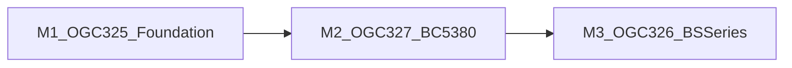

# Implementation Plan: HJRA HL7 Stream Coordination

**Branch**: `spec/013-hjra-hl7-stream-alignment` | **Date**: 2026-03-10 |
**Spec**: [spec.md](./spec.md) **Input**: Feature specification from
`/specs/013-hjra-hl7-stream-alignment/spec.md`

## Summary

This plan turns the `013` HL7 coordination specification into a practical set of
design artifacts that freeze branch sequencing, cross-repo ownership, validation
gates, and readiness rules before implementation begins. The design centers on
one core planning decision: `OGC-325` remains in scope for `013`, but its MLLP
listener ownership belongs to the `tools/openelis-analyzer-bridge` submodule, so
the first practical implementation bundle must coordinate paired bridge and
main-repository work before analyzer-specific validation can begin. After that
gate, BC-5380 is the first proving target and the BS-series branch follows as a
combined BS-200 and BS-300 slice with early BS-300 evidence validation.

## Technical Context

**Language/Version**: Java 21 LTS for the main repository and bridge submodule;
React 17 for any downstream UI touchpoints  
**Primary Dependencies**: OpenELIS main repository,
`tools/openelis-analyzer-bridge` submodule, `plugins` submodule, HAPI HL7
handling already present in main-repo HL7 codepaths, analyzer profile JSONs
under `projects/analyzer-profiles/hl7`  
**Storage**: PostgreSQL 14+ / Liquibase (inherited; no new schema changes in
this branch)  
**Testing**: JUnit 4 + Mockito, `BaseWebContextSensitiveTest`, bridge
integration testing, harness-based end-to-end evidence, Cypress or Playwright
only if downstream UI changes are introduced later  
**Target Platform**: Linux-based OpenELIS deployment plus bridge-managed
analyzer transport environment; coordination artifacts cover both the main repo
and the bridge submodule  
**Project Type**: Multi-repository planning lane for a traditional Spring MVC
web application plus a Java bridge submodule  
**Performance Goals**: No new runtime targets; inherited operational gate is one
representative end-to-end MLLP proof through `/analyzer/hl7`  
**Constraints**: No implementation on the `spec/013-hjra-hl7-stream-alignment`
branch; `OGC-325` requires paired bridge and main-repository delivery; stale
ASTM examples must not contaminate HL7 scope; missing GenericHL7 docs and
unavailable design reference must remain explicit evidence limitations; upstream
`develop` and submodule sync are required before implementation starts  
**Scale/Scope**: Three core Jira issues (`OGC-325`, `OGC-326`, `OGC-327`) plus
optional `OGC-336`; one coordination branch; three preserved future
implementation branches; one bridge submodule and one plugin submodule that must
stay aligned with main-repo work

## Constitution Check

_GATE: Must pass before Phase 0 research. Re-check after Phase 1 design._

Verify compliance with
[OpenELIS Global Constitution](../../.specify/memory/constitution.md):

- [x] **Configuration-Driven**: Analyzer variation remains profile- and
      configuration-driven; no country-specific code branches are planned
- [x] **Carbon Design System**: No new UI is introduced at this stage; any
      downstream UI work remains constrained to Carbon components and React Intl
- [x] **FHIR/IHE Compliance**: No new external-facing healthcare entity or
      interoperability surface is introduced by this planning branch; downstream
      implementation inherits existing FHIR/IHE obligations where applicable
- [x] **Layered Architecture**: The plan keeps transport in the bridge, business
      logic in OpenELIS/plugin layers, and requires downstream backend work to
      continue following the 5-layer pattern
  - **Valueholders MUST use JPA/Hibernate annotations** if any new entities are
    introduced later
  - **Transaction management MUST be in service layer only** in downstream
    main-repository implementation
- [x] **Test Coverage**: Downstream implementation is required to include bridge
      integration evidence, main-repository HL7 tests, and validation
      checkpoints before branch promotion
  - E2E tests MUST follow the Testing Roadmap and Constitution V.5 if UI flows
    or full browser workflows are added later
- [x] **Schema Management**: No schema changes are introduced in this branch;
      any later database changes remain Liquibase-only
- [x] **Internationalization**: No new user-facing strings are added in this
      planning branch; any downstream UI or messaging additions must use React
      Intl with en + fr minimum
- [x] **Security & Compliance**: The plan keeps bridge/main-repository security
      obligations visible, especially around analyzer ingestion, auditability,
      and trusted transport behavior

**Gate Result**: PASS. No constitutional violation is required by the
coordination design.

## Milestone Plan

_GATE: Features >3 days MUST define milestones per Constitution Principle IX.
Each milestone = 1 PR. Use `[P]` prefix for parallel milestones._

### Milestone Table

| ID  | Branch                                     | Scope                                                                                                                                               | User Stories | Verification                                                                                                          | Depends On |
| --- | ------------------------------------------ | --------------------------------------------------------------------------------------------------------------------------------------------------- | ------------ | --------------------------------------------------------------------------------------------------------------------- | ---------- |
| M1  | `feat/013-ogc-325-hl7-listener-foundation` | Paired bridge + main-repository readiness bundle for MLLP listener proof, ACK behavior, `/analyzer/hl7` routing, and GenericHL7 baseline completion | US1, US2     | End-to-end representative MLLP proof through bridge and OpenELIS; paired PR readiness accepted                        | -          |
| M2  | `feat/013-ogc-327-bc5380-hl7`              | First analyzer validation target using BC-5380 profile seed and the proven listener path                                                            | US2, US3     | BC-5380 validation proof accepted on the post-`OGC-325` path                                                          | M1         |
| M3  | `feat/013-ogc-326-bs-series-hl7`           | Combined BS-series delivery branch committed to BS-200 and BS-300, with early BS-300 evidence validation inside the branch                          | US2, US3     | BS-200 target validated and BS-300 early-equivalence check explicitly passed or rejected with documented scope impact | M2         |

**Cross-Cutting Fix**: `fix/013-hl7-test-connection` (PR #3195 / current
consolidation branch). This branch carries the shared implementation for
CommunicationMode (ANALYZER_INITIATED, LIS_INITIATED, BOTH), unified
bridge-routed test-connection with TCP-only probe, Liquibase changes, and the
removal of direct OE→analyzer socket query code. Treat it as current branch
state for downstream planning; update the wording again when it is merged to
`develop`.

**Note on branch naming**: These branches intentionally omit the `-mN-`
milestone numbering from the constitution's
`feat/{NNN}[-{jira}]-{name}-m{N}-{desc}` pattern because each branch maps 1:1 to
a single Jira issue, not to a sub-milestone of one issue. This is consistent
with the constitution's allowance for single-milestone branches.

**Legend**:

- **[P]**: Parallel milestone - can run independently once its dependency
  threshold is met
- **Sequential** (no prefix): Must complete before dependent milestones
- **Branch**: Preserve the future implementation branch names already accepted
  for the HL7 lane

### Milestone Dependency Graph



### PR Strategy

- **Spec PR**: `spec/013-hjra-hl7-stream-alignment` → `develop` (coordination
  artifacts only)
- **Milestone PR 1**: `feat/013-ogc-325-hl7-listener-foundation` → `develop` in
  the main repo, paired with a corresponding bridge-submodule PR for the MLLP
  transport side
- **Milestone PR 2**: `feat/013-ogc-327-bc5380-hl7` → `develop` after M1
  acceptance
- **Milestone PR 3**: `feat/013-ogc-326-bs-series-hl7` → `develop` after M2
  acceptance

**Deferred / Optional**: `feat/013-ogc-336-genexpert-hl7` may be created later
if reviewers explicitly elevate OGC-336 into the active HL7 lane. It is not a
committed milestone.

**PR Model Decision**: For `OGC-325`, transport and main-repository ingestion
are not treated as separable done states. The branch is considered ready only
when the bridge PR and the main-repository PR can be reviewed as one readiness
bundle.

## Project Structure

### Documentation (this feature)

```text
specs/013-hjra-hl7-stream-alignment/
├── spec.md
├── plan.md
├── research.md
├── data-model.md
├── quickstart.md
├── tasks.md
├── contracts/
│   ├── hl7-branch-contract.md
│   ├── hl7-readiness-gates.md
│   └── paired-pr-handoff.md
├── checklists/
│   └── requirements.md
├── launch-checklists/
│   ├── gate1-ogc325-evidence.md
│   └── pre-m1-readiness.md
└── milestone-outlines/
    ├── m1-ogc325-tasks.md
    ├── m2-ogc327-bc5380-tasks.md
    └── m3-ogc326-bsseries-tasks.md
```

### Source Code (repository root)

```text
src/main/java/org/openelisglobal/
├── analyzerimport/action/AnalyzerImportController.java
├── analyzerimport/analyzerreaders/HL7AnalyzerReader.java
├── analyzerimport/analyzerreaders/MappingAwareHL7AnalyzerLineInserter.java
└── analyzer/service/HL7MessageServiceImpl.java

projects/analyzer-profiles/hl7/
├── mindray-bc5380.json
├── mindray-bs360e.json
├── genexpert-hl7.json   # optional OGC-336 lane
└── [...]

projects/analyzer-harness/
├── README.md
├── docker-compose.analyzer-test.yml
└── [additional scripts and configs]

tools/openelis-analyzer-bridge/
└── [bridge-submodule-owned MLLP implementation work; branch/PR pairing required]

plugins/
└── [plugin submodule that must be kept aligned with GenericHL7-related fixes]
```

**Structure Decision**: This feature is not a greenfield implementation inside a
single source tree. It is a coordination design spanning the main OpenELIS
repository, the bridge submodule at `tools/openelis-analyzer-bridge`, and the
plugin/analyzer profile inputs that inform downstream implementation branches.

## Complexity Tracking

No constitutional violations are required. The only architectural complexity is
intentional: the HL7 stream spans a bridge submodule plus the main repository,
and the plan makes that cross-repo ownership explicit rather than hiding it
inside one repository boundary.

## Testing Strategy

**Reference**:
[OpenELIS Testing Roadmap](../../.specify/guides/testing-roadmap.md)

**MANDATORY**: This planning branch does not implement runtime code, but it must
define the minimum evidence contract for downstream implementation branches.

### Coverage Goals

- **Backend**: >80% code coverage in downstream OpenELIS implementation branches
- **Bridge**: maintain or extend existing bridge test coverage for MLLP
  listener, routing, and end-to-end forwarding behavior
- **Critical Paths**: 100% evidence for the listener readiness gate, BC-5380
  proving path, and BS-300 early validation decision

### Test Types

- [x] **Unit Tests**: Required downstream for HL7 service logic and bridge-side
      message handling where new logic is introduced
- [x] **Controller Tests**: Required downstream for `/analyzer/hl7`
      request/response behavior in the main repository
- [x] **Integration Tests**: Required downstream for the bridge-to-OpenELIS path
      used to satisfy the `OGC-325` readiness gate
- [x] **Bridge End-to-End Proof**: Required for `OGC-325` readiness,
      demonstrating MLLP traffic, acknowledgment behavior, routing, and one
      representative ingestion path
- [x] **Profile Validation Tests**: Required for BC-5380 first and then
      BS-series follow-on validation
- [x] **E2E with analyzer mock**: Downstream implementation MUST use the
      analyzer mock (e.g. `tools/analyzer-mock-server` or harness
      `astm-simulator` / HL7-capable mock) to test the created implementation
      end-to-end. The mock MUST load a profile (template) and MUST mock a
      specific analyzer type so that the full path—mock → transport →
      `/analyzer/hl7` → ingestion—is exercised with a known message format (e.g.
      BC-5380 profile for M2, BS-series profile for M3). Evidence gates accept
      proof that uses the mock configured with the appropriate HL7 profile. The
      mock MUST also listen on the analyzer's configured port for inbound MLLP
      connections and respond with proper HL7 ACK, matching real analyzer
      behavior (test-connection, future LIS-initiated communication).
- [x] **Test-Connection Parity**: HL7 test-connection exercises TCP connectivity
      validation adapted for communication mode semantics. Bridge health is
      checked for all modes; TCP to analyzer is always attempted when IP/port
      configured.
- [ ] **Frontend Unit Tests**: Only required if downstream HL7 work introduces
      UI changes
- [ ] **Browser E2E Tests**: Only required if downstream HL7 work introduces
      user-facing workflow changes beyond existing analyzer ingestion patterns
- [ ] **ORM Validation Tests**: Only required if downstream HL7 work introduces
      new JPA entities or mappings

### Test Data Management

- **Bridge Proof**: Use representative HL7 messages that exercise MLLP framing,
  acknowledgments, routing, and one successful handoff to `/analyzer/hl7`
- **Main Repository Proof**: Use real HL7 message payloads and analyzer profile
  seeds from `projects/analyzer-profiles/hl7`, not invented placeholder
  identifiers
- **E2E mock usage**: The analyzer mock (e.g. in `tools/analyzer-mock-server`,
  or the harness simulator) MUST be used with a loaded profile so it emits
  messages that match a specific analyzer type. For M2 (BC-5380), configure the
  mock to load the BC-5380 HL7 profile/template; for M3 (BS-series), use a
  BS-series-compatible profile. The mock’s profile load and analyzer-type
  selection make the E2E run reproducible and evidence-valid (same message
  format as the target analyzer).
- **BS-Series Validation**: Dedicated `mindray-bs200.json` and
  `mindray-bs300.json` profiles exist. Strict 013 mock generation uses
  `tools/analyzer-mock-server/hl7_generator.py` with JSON templates loaded by
  `template_loader.py` from `tools/analyzer-mock-server/templates/`. Each
  BS-series mock template (`mindray_bs200.json`, `mindray_bs300.json`) defines
  the same OBX code/unit/seedValue fields as the corresponding analyzer profile,
  ensuring E2E messages match the expected ingestion shape.
- **Harness Usage**: Use `projects/analyzer-harness/` for environment alignment.
  Use `scripts/test-hl7-profiles.sh` as the canonical strict-013 proof command:
  it enforces fixture/link guards and executes BC-5380, BS-200, and BS-300 via
  `mock -> MLLP bridge -> /analyzer/hl7`.

### Checkpoint Validations

- [x] **After Phase 0 (Research)**: Cross-repo ownership, first bundle
      definition, and missing-source limitations are documented without
      unresolved clarifications
- [x] **After Phase 1 (Design)**: Data model, branch contract, readiness gates,
      and implementation quickstart are documented
- [x] **Before M1 Starts**: `develop` and required submodules are synced; paired
      PR expectations are agreed
- [x] **Before M2 Starts**: `OGC-325` readiness gate passed with end-to-end
      bridge + ACK + `/analyzer/hl7` ingestion proof
- [x] **Before M3 Starts**: BC-5380 proving path accepted; BS-series branch
      scope confirmed as combined BS-200 + BS-300 with early BS-300 validation
      obligation
