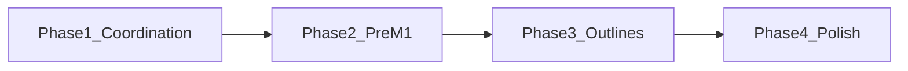

# Tasks: HJRA HL7 Stream Coordination

**Input**: Design documents from `specs/013-hjra-hl7-stream-alignment/`  
**Prerequisites**: plan.md, spec.md, research.md, data-model.md, contracts/,
quickstart.md

**Scope**: This feature is planning-only (FR-016). Tasks are coordination
completion and implementation-prep. No runtime implementation on the
`spec/013-hjra-hl7-stream-alignment` branch.

**Organization**: Tasks are grouped by milestone-prep phase per Constitution
Principle IX. M1, M2, M3 implementation work occurs on their respective branches
(`feat/013-ogc-325-...`, etc.), not on this branch.

## Format: `[ID] [P?] [Phase] Description`

- **[P]**: Can run in parallel (different files, no dependencies)
- **Phase**: M0 (coordination), Pre-M1, Pre-M2, Pre-M3
- Include exact file paths in descriptions

## Path Conventions

- **Spec/plan artifacts**: `specs/013-hjra-hl7-stream-alignment/`
- **Checklists**: `specs/013-hjra-hl7-stream-alignment/checklists/`
- **Contracts**: `specs/013-hjra-hl7-stream-alignment/contracts/`
- **Roadmaps**: `specs/roadmaps/`

---

## Phase 1: Coordination Completion (M0)

**Purpose**: Validate and finalize coordination artifacts so the stream is ready
to launch implementation branches.

**Independent Test**: A reviewer can confirm all FRs are satisfied by the
artifacts and no CRITICAL/HIGH analysis findings remain.

### Validation Tasks

- [x] T001 [M0] Validate `specs/013-hjra-hl7-stream-alignment/spec.md` satisfies
      FR-001 through FR-016; document any gaps in
      `specs/013-hjra-hl7-stream-alignment/checklists/requirements.md`
- [x] T002 [P] [M0] Validate `specs/013-hjra-hl7-stream-alignment/plan.md`
      milestone table, dependency graph, and PR strategy align with spec.md
- [x] T003 [P] [M0] Validate
      `specs/013-hjra-hl7-stream-alignment/contracts/hl7-branch-contract.md` and
      `hl7-readiness-gates.md` align with spec and plan
- [x] T004 [P] [M0] Validate `specs/013-hjra-hl7-stream-alignment/quickstart.md`
      steps match readiness gates and branch contract
- [x] T005 [M0] Run `/speckit.analyze` and resolve any CRITICAL or HIGH findings
      before marking coordination complete

### Prep Artifacts

- [x] T006 [M0] Create evidence-collection checklist for Gate 1 (OGC-325) in
      `specs/013-hjra-hl7-stream-alignment/launch-checklists/gate1-ogc325-evidence.md`
      with items: MLLP listener accepts traffic, ACK demonstrated, routing to
      `/analyzer/hl7`, representative ingestion path, paired PR readiness,
      mock-with-profile E2E proof
- [x] T007 [M0] Document paired PR expectations and handoff process for bridge +
      main-repo teams in
      `specs/013-hjra-hl7-stream-alignment/contracts/paired-pr-handoff.md`
- [x] T008 [M0] Create M1 task outline in
      `specs/013-hjra-hl7-stream-alignment/milestone-outlines/m1-ogc325-tasks.md`
      for reference when `feat/013-ogc-325-hl7-listener-foundation` is opened
      (branch creation, bridge MLLP work, main-repo `/analyzer/hl7` readiness,
      mock-with-profile E2E, paired PR)

**Checkpoint**: Coordination artifacts validated; Gate 1 evidence checklist and
paired-PR handoff documented; M1 task outline available for branch launch.

### Test-Connection Parity (Cross-Cutting Fix — fix/013-hl7-test-connection, PR #3195)

- [x] T015 [M0] Replace testHl7Connection() stub with unified
      testTcpAnalyzerConnection() in AnalyzerRestController.java
- [x] T016 [P] [M0] Add HL7-specific tests + CommunicationMode tests in
      AnalyzerRestControllerTest.java (4 new tests)
- [x] T017 [P] [M0] Fix hardcoded "Connection Failed" → i18n key
      analyzer.form.testConnection.error (en + fr)
- [x] T018 [M0] Add CommunicationMode enum, Analyzer field, Liquibase migration,
      frontend dropdown, profile communication.mode blocks, seed script updates

---

## Phase 2: Pre-M1 Readiness

**Purpose**: Ensure the stream can launch M1 when teams are ready. No
implementation on this branch.

**Independent Test**: `develop` and submodules are synced; required submodule
versions are documented; reviewers have accepted coordination artifacts.

### Readiness Tasks

- [ ] T009 [Pre-M1] Verify `develop` and submodules
      (`tools/openelis-analyzer-bridge`, `plugins`) are synced; document
      required versions or pins in
      `specs/013-hjra-hl7-stream-alignment/launch-checklists/pre-m1-readiness.md`
- [ ] T010 [Pre-M1] Document bridge and main-repository team agreement on paired
      PR model and evidence expectations in
      `specs/013-hjra-hl7-stream-alignment/launch-checklists/pre-m1-readiness.md`
      per `contracts/hl7-readiness-gates.md` Gate 1

**Checkpoint (when complete)**: Pre-M1 readiness satisfied; M1 branch can be
created when teams align.

---

## Phase 3: M2 and M3 Task Outlines (Reference Only)

**Purpose**: Create reference outlines for M2 and M3 branches. These are
documentation tasks on the 013 branch; actual implementation runs on the
respective branches.

### M2 Outline

- [x] T011 [Pre-M2] Create M2 task outline in
      `specs/013-hjra-hl7-stream-alignment/milestone-outlines/m2-ogc327-bc5380-tasks.md`
      for reference when `feat/013-ogc-327-bc5380-hl7` is opened: branch
      creation, BC-5380 profile validation, mock configured with BC-5380 HL7
      profile for E2E, Gate 2 evidence collection, PR

### M3 Outline

- [x] T012 [Pre-M3] Create M3 task outline in
      `specs/013-hjra-hl7-stream-alignment/milestone-outlines/m3-ogc326-bsseries-tasks.md`
      for reference when `feat/013-ogc-326-bs-series-hl7` is opened: branch
      creation, BS-200 validation, early BS-300 validation, mock configured with
      BS-series HL7 profile for E2E, Gate 3 evidence collection, PR

**Checkpoint**: M2 and M3 task outlines available for downstream branch
launches.

---

## Phase 4: Polish & Cross-Cutting

**Purpose**: Final coordination polish before spec PR.

### Polish Tasks

- [x] T013 [P] [Polish] Run `quickstart.md` validation: confirm a reviewer can
      follow steps 1–8 without ambiguity
- [ ] T014 [Polish] Create spec PR targeting `develop` with coordination
      artifacts only (no implementation); ensure branch name
      `spec/013-hjra-hl7-stream-alignment` and PR description reference OGC-325,
      OGC-326, OGC-327, BC-5380-first, BS-series scope

**Checkpoint (when complete)**: Spec PR ready for review; coordination complete.

---

## Dependencies & Execution Order

### Phase Dependencies

- **Phase 1**: No dependencies; can start immediately
- **Phase 2**: Depends on Phase 1 completion
- **Phase 3**: Depends on Phase 2 (M2/M3 outlines reference pre-M1 readiness)
- **Phase 4**: Depends on Phase 3; final polish before spec PR

### Parallel Opportunities

- T002, T003, T004 can run in parallel (validation tasks)
- T013 can run in parallel with other Phase 4 work

---

## Implementation Strategy

### MVP (Coordination Complete)

1. Complete Phase 1: Coordination Completion
2. Complete Phase 2: Pre-M1 Readiness
3. **STOP and VALIDATE**: Spec PR created; M1 can launch when teams align

### Incremental Delivery

1. Phase 1 + Phase 2 → Coordination complete, M1 launchable
2. Phase 3 → M2/M3 outlines available for future branch launches
3. Phase 4 → Spec PR ready for merge

---

## Notes

- No implementation tasks on this branch (FR-016)
- M1, M2, M3 implementation tasks execute on `feat/013-ogc-325-...`,
  `feat/013-ogc-327-...`, `feat/013-ogc-326-...` respectively
- E2E evidence MUST use analyzer mock with loaded profile and specific analyzer
  type per `contracts/hl7-readiness-gates.md`
- Each milestone outline (T008, T011, T012) serves as reference for
  `/speckit.implement` when the corresponding branch is opened
- CR-001 through CR-009 are validated when M1, M2, M3 implementation branches
  open; no CR validation tasks on this coordination branch
