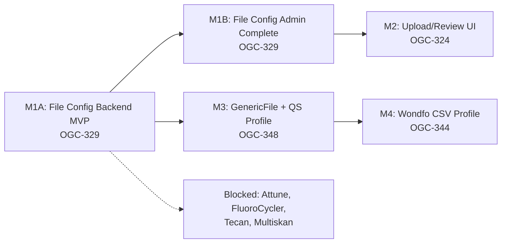

# Implementation Plan: File Stream Alignment — GenericFile Coordination

**Branch**: `spec/014-hjra-file-stream-alignment` | **Date**: 2026-03-10 |
**Spec**: [spec.md](spec.md)  
**Input**: Feature specification from
`specs/014-hjra-file-stream-alignment/spec.md`  
**Roadmap**:
[parallel_analyzer_lanes_af342372.plan.md](../roadmaps/parallel_analyzer_lanes_af342372.plan.md)

## Summary

Coordinate the **GenericFile lane** for Madagascar analyzer integration. This
plan implements a `GenericFile` plugin as a peer to `GenericASTM` and
`GenericHL7`, and validates it against the first two ready-to-implement
analyzers (QuantStudio Excel and Wondfo CSV) via instrument profiles. It also
covers the foundation pair (OGC-329 file config + OGC-324 upload UI) and the
deferred blocked analyzers.

To deliver result import sooner, OGC-329 is split into:

- **M1A**: backend/runtime contract MVP (`fileFormat` persistence +
  service/watcher behavior)
- **M1B**: admin UX completion (config panel + i18n + E2E config flow)

Key architectural decisions resolved:

- `ProtocolVersion` stays message-format-only; file-import analyzers use a
  `fileFormat` field on `FileImportConfiguration`
- App-side readers (`FileAnalyzerReader`, `ExcelAnalyzerReader`) normalize file
  bytes by format; the **GenericFile plugin** owns analyzer-specific
  interpretation via profiles
- QuantStudio and Wondfo are the first two **GenericFile profiles** in
  `projects/analyzer-profiles/file/`, not WAR-local parsers

## Technical Context

**Language/Version**: Java 21 LTS (backend), React 17 (frontend)  
**Primary Dependencies**: Spring Framework 6.2.2 (Traditional MVC), Hibernate
6.x, Apache Commons CSV, Apache POI (Excel), Carbon Design System v1.15  
**Storage**: PostgreSQL 14+ via Liquibase-managed schema  
**Testing**: JUnit 4 + Mockito (backend unit), BaseWebContextSensitiveTest
(integration), Jest + RTL (frontend), Cypress (E2E)  
**Target Platform**: Docker (Tomcat 10 WAR), Ubuntu 20.04+ host  
**Project Type**: Web application (Java backend + React frontend)  
**Performance Goals**: File parse + preview in <30s, watcher import within one
polling cycle (default 60s)  
**Constraints**: Backward compatibility with existing `FileAnalyzerReader` and
`FileImportConfiguration` consumers. No ASTM coupling in the file path.  
**Scale/Scope**: 2 ready analyzers (QuantStudio, Wondfo), 4 blocked (Attune,
FluoroCycler, Tecan, Multiskan), 2 foundation issues (329, 324)

## Constitution Check

_GATE: Must pass before Phase 0 research. Re-check after Phase 1 design._

- [x] **Configuration-Driven**: Analyzer parsers are plugins, not hardcoded
      branches. File format is a config field, not a code branch.
- [x] **Carbon Design System**: All new UI (file config panel, upload screen,
      preview) uses @carbon/react exclusively.
- [x] **FHIR/IHE Compliance**: Not applicable for file import internals.
      Analyzer results feed into the existing FHIR sync path after import.
- [x] **Layered Architecture**: Backend follows 5-layer pattern.
  - FileImportConfiguration (Valueholder) → FileImportConfigurationDAO →
    FileImportService → FileImportRestController
  - Transactions in service layer only. No `@Transactional` on controllers.
  - Services eagerly fetch all data needed for response within transaction.
- [x] **Test Coverage**: Unit + integration + E2E planned. >80% backend, >70%
      frontend.
  - E2E via Cypress with data-testid selectors, cy.session() for login.
- [x] **Schema Management**: All DB changes via Liquibase in
      `src/main/resources/liquibase/3.4.14.x/` (isolated 014 version).
- [x] **Internationalization**: All UI strings via React Intl. en + fr minimum.
- [x] **Security & Compliance**: File path validation (no traversal), SHA-256
      audit hashing, RBAC for upload permissions.

## Milestone Plan

_GATE: Features >3 days MUST define milestones per Constitution Principle IX._

This coordination spec spans multiple Jira issues. Each issue is its own
milestone/PR, following the branch recommendations from the spec. Within large
issues (OGC-329, OGC-324), sub-milestones may be needed.

### Milestone Table

| ID     | Branch Suffix                                 | Scope                                                                                                                                                             | User Stories                  | Verification                                                                                       | Depends On |
| ------ | --------------------------------------------- | ----------------------------------------------------------------------------------------------------------------------------------------------------------------- | ----------------------------- | -------------------------------------------------------------------------------------------------- | ---------- |
| M1A    | `feat/014-ogc-329-file-config-backend-mvp`    | Backend-only MVP: `fileFormat` schema/entity, service dispatch, watcher filtering, config REST contract updates                                                   | US1 (runtime config contract) | ORM + service/watcher unit tests + config CRUD integration test                                    | -          |
| M1B    | `feat/014-ogc-329-file-config-admin-complete` | Admin completion: config panel file format UX, constants decoupling, i18n, E2E config flow                                                                        | US1 (admin config UX)         | Jest + Cypress admin panel flow                                                                    | M1A        |
| [P] M2 | `feat/014-ogc-324-upload-review-ui`           | Upload screen, preview slot system, default table preview, validation summary, submit-to-queue                                                                    | US2 (upload flow)             | Unit tests for preview parsing, E2E for upload-preview-submit flow                                 | M1B        |
| [P] M3 | `feat/014-ogc-348-quantstudio-import`         | **GenericFile plugin core** (plugins submodule), app-side `ExcelAnalyzerReader`, QuantStudio profile JSON, `PluginRegistryService` FILE support, full integration | US2 (QuantStudio profile)     | GenericFile plugin unit tests, ExcelAnalyzerReader unit tests, integration with real QS5/QS7 files | M1A        |
| M4     | `feat/014-ogc-344-wondfo-csv-import`          | Wondfo CSV profile JSON, comparison operator handling in GenericFile, watcher-triggered import validation                                                         | US3 (Wondfo profile)          | Wondfo profile unit tests, watcher integration test with real history.csv                          | M3         |

**Legend**:

- **[P]**: Parallel milestone
- M1A is the minimum backend contract to unlock GenericFile result import work
- M1B completes the original M1 admin UX scope
- M2 and M3 can run concurrently once their dependencies are met
- M3 includes the GenericFile plugin core (plugins submodule); this has a
  submodule checkout dependency
- M4 is sequential after M3 (GenericFile must exist before adding a second
  profile)
- Blocked analyzers (OGC-350, 351, 417, 418) are NOT milestoned — they become
  GenericFile profile milestones when real export files arrive

### Milestone Dependency Graph



### PR Strategy

- **Spec PR**: `spec/014-hjra-file-stream-alignment` → `develop` (this branch —
  spec/plan/tasks only)
- **Milestone PRs**: Each `feat/014-ogc-*` branch → `develop`

## Project Structure

### Documentation (this feature)

```text
specs/014-hjra-file-stream-alignment/
├── spec.md              # Coordination specification
├── plan.md              # This file
├── research.md          # Architecture decisions (parser, packaging, legacy coexistence)
├── data-model.md        # Entity changes
├── checklists/
│   └── requirements.md  # Spec quality checklist
├── contracts/
│   └── file-import-api.yaml  # REST API contract additions
└── tasks.md             # Task breakdown (created by /speckit.tasks)
```

### Source Code

Three ownership areas: app (this repo), plugin (plugins submodule), profiles
(this repo).

```text
# ─────────────────────────────────────────
# OWNERSHIP 1: App — this repo
# ─────────────────────────────────────────

# Backend
src/main/java/org/openelisglobal/
├── analyzer/
│   ├── valueholder/
│   │   ├── FileImportConfiguration.java    # MODIFY: add fileFormat field
│   │   └── Analyzer.java                   # NO CHANGE: ProtocolVersion stays as-is
│   ├── dao/
│   │   └── FileImportConfigurationDAO.java # NO CHANGE (existing)
│   ├── service/
│   │   ├── FileImportService.java          # MODIFY: add parseAndPreview, submitResults
│   │   ├── FileImportServiceImpl.java      # MODIFY: format-dispatching reader selection, GenericFile plugin handoff
│   │   └── FileImportWatchService.java     # MODIFY: respect fileFormat in watcher
│   └── controller/
│       └── FileImportRestController.java   # MODIFY: new upload/preview endpoints
├── analyzerimport/analyzerreaders/
│   ├── FileAnalyzerReader.java             # NO CHANGE: existing CSV/TSV reader
│   ├── ExcelAnalyzerReader.java            # NEW (M3): .xls/.xlsx via Apache POI → List<Map<String,String>>
│   └── AnalyzerXLSLineReader.java          # NO CHANGE: legacy path only
├── analyzer/service/
│   └── PluginRegistryService.java          # MODIFY (M3): add GENERIC_FILE_CLASS constant, FILE protocol detection
└── plugin/
    └── AnalyzerImporterPlugin.java         # NO CHANGE: interface stays as-is

# Liquibase
src/main/resources/liquibase/3.4.14.x/
├── 014-file-format-config.xml              # NEW (M1A): add file_format column
├── 024-analyzer-file-upload.xml            # NEW (M2): audit table
└── 024-analyzer-run.xml                    # NEW (M2): import batch table

# Frontend
frontend/src/
├── components/analyzers/
│   ├── constants.js                        # MODIFY (M1B): remove FILE→ASTM default
│   ├── FileImportConfiguration/            # MODIFY (M1B): add fileFormat dropdown
│   └── AnalyzerFileUpload/                 # NEW (M2): upload screen
├── services/
│   └── fileImportService.js                # MODIFY (M2): upload/preview API calls
└── languages/
    ├── en.json                             # MODIFY: new i18n keys
    └── fr.json                             # MODIFY: new i18n keys

# App-side tests
src/test/java/org/openelisglobal/analyzer/
├── service/FileImportServiceTest.java      # Unit: format dispatch, parseAndPreview, submitResults
├── service/FileImportServiceIntegrationTest.java  # Integration: full parse→preview→submit flow
└── controller/FileImportRestControllerTest.java   # Integration: REST endpoints
src/test/java/org/openelisglobal/analyzerimport/analyzerreaders/
└── ExcelAnalyzerReaderTest.java            # Unit: .xls/.xlsx parsing (M3)
frontend/src/components/analyzers/__tests__/
└── FileImportConfiguration.test.jsx        # Jest: fileFormat dropdown
frontend/cypress/e2e/
├── fileImportConfig.cy.js                  # E2E: admin config panel
├── fileImportUpload.cy.js                  # E2E: upload flow
├── fileImportQuantStudio.cy.js             # E2E: QuantStudio upload with GenericFile analyzer
└── fileImportWondfo.cy.js                  # E2E: Wondfo upload with GenericFile analyzer

# ─────────────────────────────────────────
# OWNERSHIP 2: Plugin — plugins submodule
# (submodule at plugins/ — NOT currently checked out in this worktree)
# Coordinate with plugins repo for M3 work
# ─────────────────────────────────────────

plugins/analyzers/GenericFile/
├── src/main/java/org/openelisglobal/plugins/analyzer/genericfile/
│   ├── GenericFileAnalyzer.java            # NEW (M3): implements AnalyzerImporterPlugin, isGenericPlugin()=true
│   └── GenericFileLineInserter.java        # NEW (M3): profile-driven column mapping → AnalyzerResults
├── src/main/resources/
│   └── plugin.xml                          # NEW (M3): plugin descriptor (extension_point + path)
└── src/test/java/...
    ├── GenericFileAnalyzerTest.java         # Unit: plugin registration, isTargetAnalyzer
    └── GenericFileLineInserterTest.java     # Unit: profile-driven mapping with QS/Wondfo fixtures

# ─────────────────────────────────────────
# OWNERSHIP 3: Profiles — this repo
# ─────────────────────────────────────────

projects/analyzer-profiles/file/
├── quantstudio.json                        # NEW (M3): QuantStudio QS5/QS7 profile
└── wondfo-csv.json                         # NEW (M4): Wondfo Finecare FS-205 CSV profile

# Test fixtures (shared across app and plugin tests)
src/test/resources/testdata/
├── quantstudio/
│   ├── qs5-sample.xls                      # Real QS5 fixture (M3)
│   └── qs7-sample.xls                      # Real QS7 fixture (M3)
└── wondfo/
    └── history.csv                         # Real Wondfo validation dataset (M4)
```

**Structure Decision**: Three-way ownership split. The app normalizes bytes by
format (readers); the GenericFile plugin owns analyzer-specific mapping via
profiles; profiles are JSON files in this repo. No analyzer-specific parsing
logic in the WAR (`src/main/java/.../analyzer/parsers/` does NOT exist).

## Architecture Decisions (from research.md)

| #   | Decision                                                                                                                                                                       | Rationale                                                                                                                                             |
| --- | ------------------------------------------------------------------------------------------------------------------------------------------------------------------------------ | ----------------------------------------------------------------------------------------------------------------------------------------------------- |
| R1  | Format-dispatching reader: `FileAnalyzerReader` (CSV/TSV) + `ExcelAnalyzerReader` (Excel). Both produce `List<Map<String,String>>` — format-normalized, not analyzer-specific. | Clean separation; avoid god class. Excel rows aren't "lines". Normalization in app; interpretation in plugin.                                         |
| R2  | GenericFile plugin in `plugins/analyzers/GenericFile/` (plugins submodule). QuantStudio and Wondfo are profiles, not WAR-local parsers.                                        | Roadmap mandates plugin-owned parser boundary. Mirrors GenericASTM/GenericHL7. Profile-driven means any future file analyzer becomes a JSON addition. |
| R3  | New upload endpoint for FILE protocol only. Legacy `/importAnalyzer` untouched.                                                                                                | Avoid scope creep. Two paths serve different analyzer types.                                                                                          |
| R4  | `fileFormat` field on `FileImportConfiguration`, not `Analyzer`.                                                                                                               | File transport concerns (format, directories, watcher) belong together. `Analyzer` is shared across protocols.                                        |
| R5  | Apache POI for app-side `ExcelAnalyzerReader`. `poi` 5.4.0 is a direct dep; add `poi-ooxml` for .xlsx.                                                                         | Standard Java Excel library for app-level normalization. One new sibling artifact.                                                                    |
| R6  | GenericFile mirrors GenericASTM/GenericHL7: same `AnalyzerImporterPlugin` interface, `PluginRegistryService` auto-discovery, `AnalyzerPluginConfig` for profile defaults.      | Consistency across all generic plugin lanes. Enables unified admin flow for all three protocols. See research.md R6 for full mapping table.           |

## Testing Strategy

**Reference**: [OpenELIS Testing Roadmap](.specify/guides/testing-roadmap.md)

### Coverage Goals

- **Backend**: >80% code coverage (JaCoCo) for new file-import code
- **Frontend**: >70% code coverage (Jest) for new components
- **Critical Paths**: 100% coverage for file parsing, format validation, audit
  trail

### Test Types

- [x] **Unit Tests**: `ExcelAnalyzerReader` output validation,
      `FileImportService` format dispatch, GenericFile plugin mapping logic
      (column mapping, comparison operators) — tested in the plugins submodule.

  - App side: Template
    `.specify/templates/testing/JUnit4ServiceTest.java.template`,
    `@RunWith(MockitoJUnitRunner.class)`.
  - Plugin side: Standard JUnit 4 + Mockito in
    `plugins/analyzers/GenericFile/src/test/`.
  - Real file fixtures (QS5.xls, QS7.xls, history.csv) as test resources in
    `src/test/resources/testdata/`.

- [x] **ORM Validation Tests**: Validate FileImportConfiguration entity with new
      `fileFormat` field loads correctly.

  - Must execute in <5 seconds, no database required.

- [x] **Integration Tests**: Full flow — upload file → parse → preview → submit
      → results in analyzer_results table.

  - Use `BaseWebContextSensitiveTest` + `MockMvc`.
  - Real file fixtures uploaded via multipart request.

- [x] **Frontend Unit Tests**: FileImportConfiguration form (fileFormat
      dropdown), upload component, preview table.

  - Template: `.specify/templates/testing/JestComponent.test.jsx.template`
  - Wrap in `<IntlProvider>` + `<BrowserRouter>`.

- [x] **E2E Tests**: Admin creates file-import analyzer → tech uploads file →
      preview renders → submit succeeds.
  - Cypress with `data-testid` selectors, `cy.session()` for login.
  - API-based test data setup, not UI interactions.

### Test Data Management

- **Backend**: Real instrument export files as test fixtures in
  `src/test/resources/testdata/`. Builders for entity construction.
- **Frontend E2E**: API-based setup via `cy.request()`. Fixture loader for
  baseline data.

### Checkpoint Validations

- [x] **After M1A (Backend MVP)**: ORM validation + service/watcher unit tests +
      config CRUD integration test must pass
- [x] **After M1B (Admin completion)**: File config Jest + admin-panel Cypress
      flow must pass
- [x] **After M2 (Upload UI)**: Frontend Jest tests + upload E2E with
      GenericFile fixture analyzer must pass
- [x] **After M3 (GenericFile + QuantStudio profile)**: GenericFile plugin unit
      tests + `ExcelAnalyzerReader` unit tests + integration test with real
      QS5/QS7 files + E2E upload with QuantStudio-profiled analyzer must pass
- [x] **After M4 (Wondfo CSV profile)**: Wondfo profile unit tests + watcher
      integration test with real `history.csv` + E2E upload with Wondfo-profiled
      analyzer must pass

## Implementation Readiness Checklist

_This section must be verified before implementation begins on any milestone._

- [ ] GenericFile is the implementation target — all parties agree no WAR-local
      per-analyzer parsers will be created
- [ ] Plugin-owned parser boundary is understood: app normalizes bytes;
      GenericFile plugin maps to results via profiles
- [ ] QuantStudio and Wondfo are profiles/validation cases for GenericFile — not
      standalone architectural deliverables
- [ ] Three-way ownership (app / plugin / profiles) is clear to all implementers
- [ ] Plugins submodule checkout plan is agreed for M3 work
- [ ] `PluginRegistryService` updates for FILE protocol are scoped to M3
- [ ] E2E fixtures create FILE analyzers using the GenericFile `AnalyzerType` —
      not per-instrument types
- [ ] Spec PR (`spec/014-hjra-file-stream-alignment`) is merged before any
      `feat/014-*` branch begins implementation
