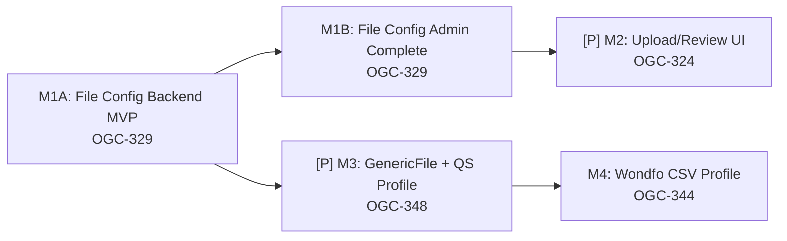

# Tasks: File Stream Alignment — GenericFile Coordination

**Input**: Design documents from `specs/014-hjra-file-stream-alignment/`
**Prerequisites**: plan.md, spec.md, research.md, data-model.md, contracts/

**Tests**: MANDATORY per Constitution Principle V. Tests appear before
implementation in each milestone and MUST fail before implementation begins.

**Organization**: Tasks grouped by **Milestone** per Constitution Principle IX.
Each milestone = 1 PR.

## Format: `[ID] [P?] [Mx] Description`

- **[P]**: Can run in parallel (different files, no dependencies)
- **[Mx]**: Which milestone this task belongs to (M1A, M1B, M2, M3, M4)
- Exact file paths included in descriptions

---

## Milestone 1A: File Config Backend MVP — OGC-329 (US1, Priority: P1)

**Branch**: `feat/014-ogc-329-file-config-backend-mvp` **Goal**: Add
backend/runtime `fileFormat` contract to `FileImportConfiguration`, service
dispatch, watcher filtering, and REST persistence behavior. No UI changes in
this milestone. **Verification**: ORM validation + service unit tests + watcher
unit tests + config CRUD integration test.

### Branch Setup

- [x] T001 [M1A] Create branch `feat/014-ogc-329-file-config-backend-mvp` from
      `develop`

### Schema

- [x] T002 [M1A] Create Liquibase changeset
      `src/main/resources/liquibase/3.4.14.x/001-add-file-format-to-file-import-config.xml`
      — add `file_format VARCHAR(20) NOT NULL DEFAULT 'CSV'` to
      `file_import_configuration` table

### Tests (write first, must fail)

- [x] T003 [P] [M1A] ORM validation test: verify `FileImportConfiguration` with
      `fileFormat` field loads in
      `src/test/java/org/openelisglobal/analyzer/valueholder/FileImportConfigurationMappingTest.java`
- [x] T004 [P] [M1A] Unit test: `FileImportService.getReaderForFormat()`
      dispatches CSV→FileAnalyzerReader, EXCEL→ExcelAnalyzerReader in
      `src/test/java/org/openelisglobal/analyzer/service/FileImportServiceTest.java`
- [x] T005 [P] [M1A] Unit test: `FileImportWatchService` skips files that don't
      match configured `fileFormat` extension in
      `src/test/java/org/openelisglobal/analyzer/service/FileImportWatchServiceTest.java`
- [x] T006 [P] [M1A] Integration test: config CRUD via REST — create, read,
      update config with `fileFormat` in
      `src/test/java/org/openelisglobal/analyzer/controller/FileImportRestControllerTest.java`

### Backend Implementation

- [x] T009 [M1A] Add `fileFormat` field (String, NOT NULL, default `CSV`) to
      `FileImportConfiguration.java` in
      `src/main/java/org/openelisglobal/analyzer/valueholder/FileImportConfiguration.java`
- [x] T010 [M1A] Update `FileImportService` / `FileImportServiceImpl` for
      format-dispatching reader selection in
      `src/main/java/org/openelisglobal/analyzer/service/FileImportServiceImpl.java`
- [x] T011 [M1A] Update `FileImportWatchService` to respect `fileFormat` when
      filtering files in
      `src/main/java/org/openelisglobal/analyzer/service/FileImportWatchService.java`
- [x] T011a [M1A] Verify existing archive/error file-move logic in
      `FileImportServiceImpl.archiveFile()` / `moveToErrorDirectory()` works
      with the new `fileFormat` field (FR-009). Add unit test assertion if not
      already covered.
- [x] T012 [M1A] Update `FileImportRestController` — ensure config CRUD
      endpoints include `fileFormat` in
      `src/main/java/org/openelisglobal/analyzer/controller/FileImportRestController.java`

### Formatting & PR

- [x] T020 [M1A] Run `mvn spotless:apply`
- [ ] T021 [M1A] Create PR `feat/014-ogc-329-file-config-backend-mvp` →
      `develop`

**Checkpoint**: `fileFormat` persists in backend, service/watcher respect
format, REST config CRUD carries format. All backend tests green.

---

## Milestone 1B: File Config Admin Completion — OGC-329 (US1, Priority: P1)

**Branch**: `feat/014-ogc-329-file-config-admin-complete` **Depends On**: M1A
merged **Goal**: Complete admin UX for file format configuration and E2E
validation. **Verification**: Jest tests + Playwright admin panel flow +
frontend formatting.

### Branch Setup

- [ ] T021a [M1B] Create branch `feat/014-ogc-329-file-config-admin-complete`
      from `develop` (after M1A merged)

### Frontend Tests (write first, must fail)

- [x] T007 [P] [M1B] Jest test: `FileImportConfiguration` form renders
      `fileFormat` dropdown with CSV/TSV/EXCEL options in
      `frontend/src/components/analyzers/FileImportConfiguration/__tests__/FileImportConfiguration.test.jsx`
- [x] T008 [P] [M1B] Jest test: when `fileFormat=EXCEL`, delimiter and hasHeader
      fields are hidden in
      `frontend/src/components/analyzers/FileImportConfiguration/__tests__/FileImportConfiguration.test.jsx`
- [x] T008a [P] [M1B] Jest test: when no file-import plugins are deployed,
      plugin dropdown shows empty-state message "No file import plugins
      installed" (US1.AS3) in
      `frontend/src/components/analyzers/FileImportConfiguration/__tests__/FileImportConfiguration.test.jsx`

### Frontend Implementation

- [x] T013 [M1B] Remove `FILE: "ASTM_LIS2_A2"` from `PLUGIN_PROTOCOL_DEFAULTS`
      in `frontend/src/components/analyzers/constants.js`
- [x] T014 [M1B] Add `fileFormat` dropdown (CSV/TSV/EXCEL) to
      `FileImportConfiguration` panel; hide delimiter/hasHeader when EXCEL
      selected in
      `frontend/src/components/analyzers/FileImportConfiguration/FileImportConfiguration.jsx`
- [x] T015 [P] [M1B] Add i18n keys for file format labels
      (`fileImport.format.csv`, `.tsv`, `.excel`) in
      `frontend/src/languages/en.json` and `frontend/src/languages/fr.json`

### E2E Fixtures & Test

- [x] T016 [M1B] Create fixture SQL
      `frontend/playwright/fixtures/file-import-setup.sql` that sets up a
      complete GenericFile-backed analyzer profile:
  1. Cleanup DELETEs first (idempotent, keyed by name pattern `'E2E-FILE-%'`) —
     delete `file_import_configuration`, `analyzer_plugin_config`, `analyzer`,
     `analyzer_type` rows in FK order
  2. Insert an `AnalyzerType` row representing the GenericFile plugin:
     `name='E2E-FILE-GenericFile'`, `protocol='FILE'`, `is_active=true`,
     `is_generic_plugin=true`,
     `plugin_class_name='org.openelisglobal.plugins.analyzer.genericfile.GenericFileAnalyzer'`
  3. Insert an `Analyzer` row linked to that `AnalyzerType` via
     `analyzer_type_id`: `name='E2E-FILE-CSV-Analyzer'`, `status='ACTIVE'`,
     `is_active='Y'`
  4. Insert a `FileImportConfiguration` row for that analyzer:
     `file_format='CSV'`,
     `import_directory='/data/analyzer-imports/e2e-csv/incoming'`,
     `archive_directory='/data/analyzer-imports/e2e-csv/processed'`,
     `error_directory='/data/analyzer-imports/e2e-csv/errors'`, `delimiter=','`,
     `has_header=true`, `active=true`, `file_pattern='*.csv'`
  5. Insert an `AnalyzerPluginConfig` row for that analyzer with a minimal CSV
     column-mapping profile as the JSONB `config`
  6. Verification SELECT at the end (like `patient-merge-setup.sql` does)
- [x] T017 [M1B] Create Playwright fixture helper
      `frontend/playwright/fixtures/file-import-setup.ts` — exports
      `loadFileImportFixtures()`, `checkFileImportFixturesExist()`,
      `cleanFileImportTestData()` that run
      `docker exec -i openelisglobal-database psql` for SQL execution and
      fixture checks; tests call these in `beforeAll`/`beforeEach` as needed
- [x] T018 [M1B] (Obsolete — merged into T017 for Playwright)
- [x] T018a [M1B] (Obsolete — no Cypress e2e.js import for Playwright)
- [x] T019 [M1B] Create fixture JSON
      `frontend/playwright/fixtures/FileImport.json` — test data constants
      (analyzer name `'E2E-FILE-CSV-Analyzer'`, expected directory paths, format
      values) referenced by E2E tests
- [ ] T019a [M1B] Playwright E2E in
      `frontend/playwright/tests/fileImportConfig.spec.ts`:
  1. `beforeAll`: call `loadFileImportFixtures()` to ensure analyzer profile
     exists
  2. Navigate to admin analyzer config page, find the `E2E-FILE-CSV-Analyzer`
  3. Verify `fileFormat` dropdown shows CSV selected
  4. Change `fileFormat` to TSV, save, reload, verify persisted
  5. Verify delimiter/hasHeader fields hidden when EXCEL selected

### Formatting & PR

- [x] T021b [M1B] Run `cd frontend && npm run format`
- [ ] T021c [M1B] Create PR `feat/014-ogc-329-file-config-admin-complete` →
      `develop`

**Checkpoint**: Admin UI supports file format selection, FILE→ASTM coupling
removed, i18n complete, and admin config E2E passes.

---

## Milestone 2: Upload/Review UI — OGC-324 (US2, Priority: P1) [P]

**Branch**: `feat/014-ogc-324-upload-review-ui` **Depends On**: M1B merged
**Goal**: Upload screen with file parsing, preview table, validation summary,
submit-to-queue. New `AnalyzerFileUpload` + `AnalyzerRun` entities for audit.
**Verification**: Unit tests for preview parsing, frontend Jest tests, E2E for
upload-preview-submit flow.

### Branch Setup

- [ ] T022 [M2] Create branch `feat/014-ogc-324-upload-review-ui` from `develop`
      (after M1B merged)

### Schema

- [ ] T023 [P] [M2] Create Liquibase changeset for `analyzer_file_upload` table
      in
      `src/main/resources/liquibase/3.4.14.x/002-create-analyzer-file-upload.xml`
- [ ] T024 [P] [M2] Create Liquibase changeset for `analyzer_run` table with
      `custom_preview_data JSONB` in
      `src/main/resources/liquibase/3.4.14.x/003-create-analyzer-run.xml`

### Tests (write first, must fail)

- [ ] T025 [P] [M2] ORM validation test: verify `AnalyzerFileUpload` and
      `AnalyzerRun` entities load in
      `src/test/java/org/openelisglobal/analyzer/valueholder/AnalyzerFileUploadMappingTest.java`
- [ ] T026 [P] [M2] Unit test: `FileImportService.parseAndPreview()` returns
      `AnalyzerRunPreview` with record counts and validation messages in
      `src/test/java/org/openelisglobal/analyzer/service/FileImportServiceTest.java`
- [ ] T027 [P] [M2] Unit test: SHA-256 duplicate detection — second upload of
      same file returns warning in
      `src/test/java/org/openelisglobal/analyzer/service/FileImportServiceTest.java`
- [ ] T028 [P] [M2] Unit test: `FileImportService.submitResults()` transitions
      `AnalyzerFileUpload` status PENDING→PROCESSING→COMPLETED in
      `src/test/java/org/openelisglobal/analyzer/service/FileImportServiceTest.java`
- [ ] T029 [P] [M2] Integration test: `POST /rest/analyzers/{id}/upload/preview`
      with multipart CSV returns preview JSON; verify `AnalyzerFileUpload` audit
      record is created with all FR-010 fields (hash, timestamp, user ID,
      filename, status) in
      `src/test/java/org/openelisglobal/analyzer/controller/FileImportRestControllerTest.java`
- [ ] T030 [P] [M2] Jest test: `AnalyzerFileUpload` component renders file
      picker, upload button, preview table in
      `frontend/src/components/analyzers/AnalyzerFileUpload/__tests__/AnalyzerFileUpload.test.jsx`
- [ ] T031 [P] [M2] Jest test: preview table shows VALID/WARNING/ERROR row
      styling in
      `frontend/src/components/analyzers/AnalyzerFileUpload/__tests__/AnalyzerFileUpload.test.jsx`

### Backend Implementation

- [ ] T032 [P] [M2] Create `AnalyzerFileUpload` entity in
      `src/main/java/org/openelisglobal/analyzer/valueholder/AnalyzerFileUpload.java`
- [ ] T033 [P] [M2] Create `AnalyzerRun` entity in
      `src/main/java/org/openelisglobal/analyzer/valueholder/AnalyzerRun.java`
- [ ] T034 [P] [M2] Create `AnalyzerFileUploadDAO` interface + impl in
      `src/main/java/org/openelisglobal/analyzer/dao/AnalyzerFileUploadDAO.java`
      and `AnalyzerFileUploadDAOImpl.java`
- [ ] T035 [M2] Implement `parseAndPreview()` in `FileImportServiceImpl` — read
      file, dispatch to reader, build preview with validation in
      `src/main/java/org/openelisglobal/analyzer/service/FileImportServiceImpl.java`
- [ ] T036 [M2] Implement `submitResults()` in `FileImportServiceImpl` — queue
      validated records, update `AnalyzerFileUpload` status in
      `src/main/java/org/openelisglobal/analyzer/service/FileImportServiceImpl.java`
- [ ] T037 [M2] Add upload endpoints to `FileImportRestController`:
      `POST .../upload/preview` (multipart) and `POST .../upload/submit` in
      `src/main/java/org/openelisglobal/analyzer/controller/FileImportRestController.java`

### Frontend Implementation

- [ ] T038 [M2] Create `AnalyzerFileUpload` component with file picker, analyzer
      selector, upload button in
      `frontend/src/components/analyzers/AnalyzerFileUpload/AnalyzerFileUpload.jsx`
- [ ] T039 [M2] Create preview table sub-component with row status indicators
      (VALID/WARNING/ERROR) in
      `frontend/src/components/analyzers/AnalyzerFileUpload/PreviewTable.jsx`
- [ ] T040 [M2] Implement submit flow — submit button, confirmation, redirect to
      Analyzer Results in
      `frontend/src/components/analyzers/AnalyzerFileUpload/AnalyzerFileUpload.jsx`
- [ ] T041 [M2] Add upload/preview/submit API calls in
      `frontend/src/services/fileImportService.js`
- [ ] T042 [P] [M2] Add i18n keys for upload screen strings in
      `frontend/src/languages/en.json` and `frontend/src/languages/fr.json`

### E2E Fixtures & Test

- [ ] T043 [M2] Add a simple CSV test file
      `frontend/playwright/fixtures/test-upload.csv` (3-5 rows with header:
      `SampleID,TestCode,Result,Unit`; use realistic accession numbers that will
      exist in the test DB or handle ACCESSION_NOT_FOUND in the test)
- [ ] T044 [M2] Update fixture SQL
      `frontend/playwright/fixtures/file-import-setup.sql` — extend with an
      upload-specific profile (or reuse the M1B `E2E-FILE-CSV-Analyzer` profile
      if the same config works for upload). If a new profile is needed, add
      `AnalyzerType` `name='E2E-FILE-Upload-CSV'`, `Analyzer`,
      `FileImportConfiguration` with `file_format='CSV'`
- [ ] T045 [M2] Playwright E2E in
      `frontend/playwright/tests/fileImportUpload.spec.ts`:
  1. `beforeAll`: call `loadFileImportFixtures()` to ensure the upload analyzer
     profile exists
  2. Navigate to Results → Upload Analyzer File
  3. Select the E2E-Upload-CSV analyzer from the dropdown
  4. Upload `frontend/playwright/fixtures/test-upload.csv` via the file picker
  5. Verify preview table renders with expected row count and column headers
  6. Verify at least one row shows VALID status
  7. Click Submit, wait for API response (`cy.intercept` on submit endpoint)
  8. Verify redirect to Analyzer Results page

### Formatting & PR

- [ ] T046 [M2] Run `mvn spotless:apply` and `cd frontend && npm run format`
- [ ] T047 [M2] Create PR `feat/014-ogc-324-upload-review-ui` → `develop`

**Checkpoint**: Tech can upload a file, see parsed preview with validation, and
submit results to queue. Audit trail recorded. All tests green.

---

## Milestone 3: GenericFile Plugin + QuantStudio Profile — OGC-348 (Priority: P1) [P]

**Branch**: `feat/014-ogc-348-quantstudio-import` **Depends On**: M1A merged
(parallel with M1B / M2 readiness) **Goal**: Implement the GenericFile plugin
core in the plugins submodule. Add the QuantStudio profile as the first
validation. Add the app-side `ExcelAnalyzerReader`. Update
`PluginRegistryService` to recognize FILE protocol. Validate end-to-end with
real QS5/QS7 files. **Verification**: GenericFile plugin unit tests,
`ExcelAnalyzerReader` unit tests, integration test with real QS5/QS7 .xls
fixtures, E2E upload with QuantStudio-profiled GenericFile analyzer.

### Branch Setup

- [ ] T048 [M3] Create branch `feat/014-ogc-348-quantstudio-import` from
      `develop` (after M1A merged)

### Pre-Work: Plugins Submodule

- [x] T049 [M3] Confirm plugins submodule state: run
      `git submodule update --init plugins` and verify `plugins/analyzers/`
      directory is present
- [x] T049a [M3] Add `poi-ooxml` 5.4.0 to `pom.xml` (sibling of existing `poi`
      dependency, required for .xlsx XSSF support in `ExcelAnalyzerReader`)

### Tests (write first, must fail)

**App-side reader tests:**

- [ ] T050 [P] [M3] Add real QS5 and QS7 .xls/.xlsx test fixtures to
      `src/test/resources/testdata/quantstudio/`
- [x] T051 [P] [M3] Unit test: `ExcelAnalyzerReader.read()` parses .xls fixture
      into `List<Map<String, String>>` in
      `src/test/java/org/openelisglobal/analyzerimport/analyzerreaders/ExcelAnalyzerReaderTest.java`
- [x] T052 [P] [M3] Unit test: `ExcelAnalyzerReader.read()` parses .xlsx fixture
      into `List<Map<String, String>>` in
      `src/test/java/org/openelisglobal/analyzerimport/analyzerreaders/ExcelAnalyzerReaderTest.java`

**Plugin-side tests (in plugins submodule):**

- [x] T053 [P] [M3] Unit test: `GenericFileAnalyzer.isTargetAnalyzer()` returns
      true when `analyzerId` matches configured instance in
      `plugins/analyzers/GenericFile/src/test/.../GenericFileAnalyzerTest.java`
- [x] T054 [P] [M3] Unit test: `GenericFileLineInserter` maps QuantStudio QS5
      column layout to correct `AnalyzerResults` fields via loaded profile in
      `plugins/analyzers/GenericFile/src/test/.../GenericFileLineInserterTest.java`
- [x] T055 [P] [M3] Unit test: `GenericFileLineInserter` maps QuantStudio QS7
      column layout (different ordering) correctly in
      `plugins/analyzers/GenericFile/src/test/.../GenericFileLineInserterTest.java`

**Integration test:**

- [ ] T055a [M3] Integration test: upload QS7 .xls →
      `FileImportService.parseAndPreview()` dispatches through
      `ExcelAnalyzerReader` → GenericFile plugin → returns preview with correct
      sample IDs and CT values in
      `src/test/java/org/openelisglobal/analyzer/service/FileImportServiceIntegrationTest.java`

### App-Side Implementation

- [x] T056 [M3] Create `ExcelAnalyzerReader` — reads .xls (HSSF) and .xlsx
      (XSSF) via Apache POI, outputs `List<Map<String,String>>` in
      `src/main/java/org/openelisglobal/analyzerimport/analyzerreaders/ExcelAnalyzerReader.java`
- [x] T057 [M3] Wire `ExcelAnalyzerReader` into `FileImportServiceImpl` format
      dispatch (EXCEL → ExcelAnalyzerReader) in
      `src/main/java/org/openelisglobal/analyzer/service/FileImportServiceImpl.java`
- [x] T058 [M3] Update `PluginRegistryService` — add
      `GENERIC_FILE_CLASS = "org.openelisglobal.plugins.analyzer.genericfile.GenericFileAnalyzer"`
      constant and a FILE branch in `getDefaultIdentifierPattern()` in
      `src/main/java/org/openelisglobal/analyzer/service/PluginRegistryService.java`

### Plugin-Side Implementation (plugins submodule)

- [x] T059 [M3] Create `GenericFileAnalyzer.java` in
      `plugins/analyzers/GenericFile/src/main/java/org/openelisglobal/plugins/analyzer/genericfile/`:
  - Implements `AnalyzerImporterPlugin`
  - `isGenericPlugin()` → `true`
  - `isTargetAnalyzer(List<String> lines)` → config-driven via
    `FileImportConfiguration.analyzerId`; falls back to file extension match
  - `getAnalyzerLineInserter()` → returns `GenericFileLineInserter`
  - `getAnalyzerResponder()` → `null` (file import is not bidirectional)
  - `connect()` calls
    `PluginAnalyzerService.getInstance().registerAnalyzer(this)`
- [x] T060 [M3] Create `GenericFileLineInserter.java` — reads per-analyzer
      profile from `AnalyzerPluginConfig`, maps structured records to
      `AnalyzerResults` via profile column mapping and `default_test_mappings`
      in
      `plugins/analyzers/GenericFile/src/main/java/org/openelisglobal/plugins/analyzer/genericfile/GenericFileLineInserter.java`
- [x] T061 [M3] Create `plugin.xml` descriptor in
      `plugins/analyzers/GenericFile/src/main/resources/plugin.xml` declaring
      the `analyzerImporter` extension point with GenericFile class path

### QuantStudio Profile

- [x] T062 [M3] Create `projects/analyzer-profiles/file/quantstudio.json` with:
  - `profileMeta.id`: `quantstudio`
  - `protocol`: `{ "name": "FILE", "format": "EXCEL" }`
  - `supported_extensions`: `[".xls", ".xlsx"]`
  - `column_mapping` for QS5 and QS7 layouts (Sample Name → sampleId, CT →
    result, VL → testCode, etc.)
  - `default_test_mappings` for HIV-1 VL (LOINC 20447-9)
  - `configDefaults` for `fileFormat`, `hasHeader`, `sheetIndex`

### E2E Fixtures & Test

- [ ] T063 [M3] Update fixture SQL
      `frontend/playwright/fixtures/file-import-setup.sql` to add a
      QuantStudio-specific analyzer — reusing the GenericFile `AnalyzerType`
      inserted in M1B, add:
  1. A new `Analyzer` row: `name='E2E-FILE-QuantStudio-Analyzer'`,
     `status='ACTIVE'`, `is_active='Y'`, linked to the `E2E-FILE-GenericFile`
     `AnalyzerType`
  2. `FileImportConfiguration` for it: `file_format='EXCEL'`,
     `file_pattern='*.xls'`,
     `import_directory='/data/analyzer-imports/e2e-qs/incoming'`
  3. `AnalyzerPluginConfig` for it: JSONB config loaded from QuantStudio profile
     defaults
- [ ] T064 [M3] Copy a real (or sanitized) QS7 .xls fixture to
      `frontend/playwright/fixtures/quantstudio-qs7.xls` for E2E upload
- [ ] T065 [M3] Playwright E2E in
      `frontend/playwright/tests/fileImportQuantStudio.spec.ts`:
  1. `beforeAll`: `loadFileImportFixtures()` to ensure
     E2E-FILE-QuantStudio-Analyzer exists
  2. Navigate to upload page, select `E2E-FILE-QuantStudio-Analyzer`
  3. Upload `frontend/playwright/fixtures/quantstudio-qs7.xls`
  4. Verify preview table shows parsed rows with Sample Name, CT, VL columns
  5. Submit and verify results queued

### Formatting & PR

- [x] T066 [M3] Run `mvn spotless:apply`
- [ ] T067 [M3] Create PR `feat/014-ogc-348-quantstudio-import` → `develop`

**Checkpoint**: GenericFile plugin core is live. QuantStudio profile is the
first validated FILE analyzer. `ExcelAnalyzerReader` handles .xls/.xlsx.
`PluginRegistryService` auto-discovers GenericFile. E2E upload works with real
QS7 file through a GenericFile-backed analyzer. All tests green.

---

## Milestone 4: Wondfo CSV Profile — OGC-344 (Priority: P2)

**Branch**: `feat/014-ogc-344-wondfo-csv-import` **Depends On**: M3 merged
(GenericFile plugin must exist before adding a second profile) **Goal**: Add the
Wondfo CSV profile to GenericFile. Extend GenericFile's
`GenericFileLineInserter` to handle comparison operators (`<2`, `>100`).
Validate watcher-triggered import end-to-end with real `history.csv`.
**Verification**: Wondfo profile unit tests, watcher integration test with real
`history.csv`, E2E upload with Wondfo-profiled GenericFile analyzer.

### Branch Setup

- [ ] T068 [M4] Create branch `feat/014-ogc-344-wondfo-csv-import` from
      `develop` (after M3 merged)

### Tests (write first, must fail)

**Plugin-side tests (in plugins submodule):**

- [ ] T069 [P] [M4] Add real Wondfo `history.csv` validation dataset (4 records)
      to `src/test/resources/testdata/wondfo/`
- [ ] T070 [P] [M4] Unit test: `GenericFileLineInserter` maps Wondfo 40-column
      layout to correct `AnalyzerResults` fields via Wondfo profile in
      `plugins/analyzers/GenericFile/src/test/.../GenericFileLineInserterTest.java`
- [ ] T071 [P] [M4] Unit test: `GenericFileLineInserter` handles comparison
      operators (`<2`, `>100`) — preserves operator in result value when profile
      declares `comparison_operator_handling: true` in
      `plugins/analyzers/GenericFile/src/test/.../GenericFileLineInserterTest.java`
- [ ] T072 [P] [M4] Unit test: `GenericFileLineInserter` handles malformed rows
      gracefully (partial row, missing columns) per profile's
      `missing_column_behavior` config in
      `plugins/analyzers/GenericFile/src/test/.../GenericFileLineInserterTest.java`

**Watcher integration test:**

- [ ] T073 [M4] Integration test: place `history.csv` in watcher incoming
      directory → `FileImportWatchService` detects, routes to GenericFile plugin
      via `FileImportConfiguration`, archives file in
      `src/test/java/org/openelisglobal/analyzer/service/FileImportWatchServiceIntegrationTest.java`

### Wondfo CSV Profile

- [ ] T074 [M4] Create `projects/analyzer-profiles/file/wondfo-csv.json` with:
  - `profileMeta.id`: `wondfo-csv`
  - `protocol`: `{ "name": "FILE", "format": "CSV" }`
  - `supported_extensions`: `[".csv"]`
  - `file_pattern`: `"history*.csv"`
  - `column_mapping` for 40-column Wondfo layout (columns 1–40 mapped to
    sampleId, testCode, result, unit, etc.)
  - `comparison_operator_handling`: `true` — instructs `GenericFileLineInserter`
    to preserve `<` / `>` prefixes
  - `default_test_mappings` for Wondfo Finecare assay codes
  - `configDefaults` for `fileFormat=CSV`, `delimiter=","`, `hasHeader=true`

### Plugin-Side: Comparison Operator Support

- [ ] T075 [M4] Extend `GenericFileLineInserter` in the plugins submodule to
      handle comparison operator preservation when
      `comparison_operator_handling=true` in the loaded profile in
      `plugins/analyzers/GenericFile/src/main/java/.../GenericFileLineInserter.java`

### E2E Fixtures & Test

- [ ] T076 [M4] Update fixture SQL
      `frontend/playwright/fixtures/file-import-setup.sql` to add a
      Wondfo-specific analyzer — reusing the GenericFile `AnalyzerType`, add:
  1. A new `Analyzer` row: `name='E2E-FILE-Wondfo-Analyzer'`, `status='ACTIVE'`,
     `is_active='Y'`, linked to `E2E-FILE-GenericFile` `AnalyzerType`
  2. `FileImportConfiguration`: `file_format='CSV'`,
     `file_pattern='history*.csv'`, `delimiter=','`, `has_header=true`,
     `import_directory='/data/analyzer-imports/e2e-wondfo/incoming'`
  3. `AnalyzerPluginConfig`: JSONB config loaded from Wondfo CSV profile
     defaults
- [ ] T077 [M4] Copy the Wondfo validation CSV (4 records) to
      `frontend/playwright/fixtures/wondfo-history.csv` for E2E upload
- [ ] T078 [M4] Playwright E2E in
      `frontend/playwright/tests/fileImportWondfo.spec.ts`:
  1. `beforeAll`: `loadFileImportFixtures()` to ensure E2E-FILE-Wondfo-Analyzer
     exists
  2. Navigate to upload page, select `E2E-FILE-Wondfo-Analyzer`
  3. Upload `frontend/playwright/fixtures/wondfo-history.csv`
  4. Verify preview table shows 4 parsed rows
  5. Verify a row with comparison operator (e.g., `<2`) shows correctly in
     preview
  6. Submit and verify results queued

### Formatting & PR

- [ ] T079 [M4] Run `mvn spotless:apply`
- [ ] T080 [M4] Create PR `feat/014-ogc-344-wondfo-csv-import` → `develop`

**Checkpoint**: Wondfo CSV profile is live as the second GenericFile-backed
analyzer. Comparison operators preserved. Watcher detects, routes, and archives.
E2E upload works with real history.csv through GenericFile plugin. All tests
green.

---

## Phase: Polish & Cross-Cutting

- [ ] T081 [P] Update `specs/014-hjra-file-stream-alignment/quickstart.md` with
      final verification steps
- [ ] T082 [P] Validate all i18n keys present in both `en.json` and `fr.json`
- [ ] T083 Run `specs/014-hjra-file-stream-alignment/checklists/requirements.md`
      validation against implemented code

---

## Dependencies & Execution Order

### Milestone Dependencies



- **M1A**: No dependencies — start immediately
- **M1B**: Depends on M1A merged (finishes original M1 UX scope)
- **M2**: Depends on M1B merged
- **M3**: Depends on M1A merged
- **M4**: Depends on M3 merged (GenericFile must exist before adding a second
  profile)
- **Polish**: After all milestones complete

### Within Each Milestone

1. Branch creation first
2. Schema/dependency changes
3. Tests written and verified to FAIL (TDD Red phase)
4. Implementation until tests pass (TDD Green phase)
5. Formatting
6. PR creation last

### Parallel Opportunities

**After M1A merges**, two active lanes:

```
Lane A (M1B): Admin config completion (UI + i18n + config E2E)
Lane B (M3): GenericFile plugin core + ExcelAnalyzerReader + QuantStudio profile
```

**Within M1A** — tests T003-T006 can all run in parallel (different backend
files). **Within M1B** — tests T007, T008, T008a can run in parallel (same
suite, separate assertions). **Within M2** — tests T025-T031 can all run in
parallel. Entities T032-T034 in parallel. Schema changesets T023-T024 in
parallel. **Within M3** — app-side reader tests T051-T052 parallel with
plugin-side tests T053-T055. Profile creation T062 parallel with implementation
tasks. **Within M4** — profile unit tests T070-T072 can all run in parallel.

---

## Implementation Strategy

### MVP: M1A + M3 (fastest result import)

1. Complete M1A (backend file format contract)
2. Complete M3 (GenericFile plugin + QuantStudio profile defaults)
3. **STOP and VALIDATE**: Result import works end-to-end from profile defaults
4. Complete M1B to finish admin UX for OGC-329

### Incremental Delivery

1. M1A → Backend foundation usable → Merge
2. M3 → GenericFile plugin + QuantStudio profile → Merge
3. M1B + M2 in parallel → Admin completion + Upload UI → Merge both
4. M4 → Wondfo CSV profile validates watcher path → Merge
5. Polish → Final validation

### Summary

| Metric                                                 | Count                |
| ------------------------------------------------------ | -------------------- |
| Total tasks                                            | 92                   |
| M1A tasks (T001–T021 subset: backend only + T011a)     | 13                   |
| M1B tasks (T007, T008, T008a, T013–T019a, T021a–T021c) | 15                   |
| M2 tasks (T022–T047)                                   | 26                   |
| M3 tasks (T048–T067)                                   | 20                   |
| M4 tasks (T068–T080)                                   | 13                   |
| Polish tasks (T081–T083)                               | 3                    |
| Parallel opportunities                                 | 25+ tasks marked [P] |
| MVP scope                                              | M1A + M3             |

**Architecture note**: M3 is the most complex milestone — it includes the
GenericFile plugin (plugins submodule) AND the first profile AND the app-side
Excel reader AND `PluginRegistryService` updates. Plan accordingly; M3 is a
multi-day effort.
