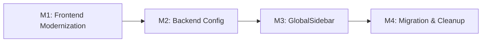
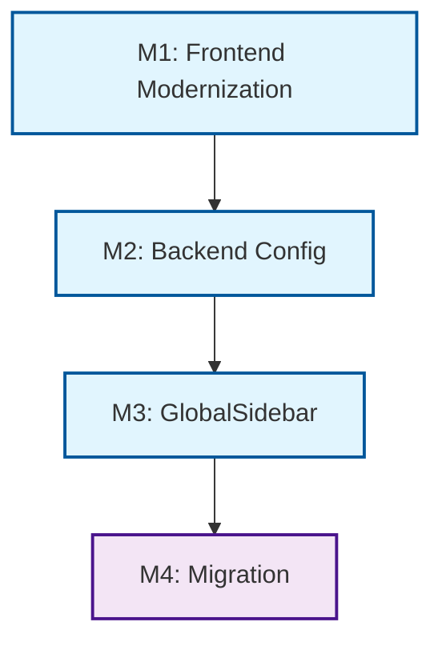

# Implementation Plan: Unified Application Navigation

**Branch**: `spec/016-unified-app-navigation` | **Date**: 2026-04-06 | **Spec**:
[spec.md](./spec.md) **Input**: Feature specification from
`/specs/016-unified-app-navigation/spec.md`

## Summary

Replace the fragmented sidebar navigation (hardcoded JSX in Admin.js,
Reports.js, Validation.js) with a unified, configuration-driven GlobalSidebar
component. Menus are defined in JSON config files, seeded into the database via
a new `MenuConfigurationHandler`, and served through an enhanced `/rest/menu`
API with role filtering. A prerequisite frontend modernization (React 18 +
latest Carbon v11) is required first. Menu rows track provenance
(`config_source` column) so admin overrides persist across distribution config
reloads.

## Technical Context

**Language/Version**: Java 21, React 18 (upgrading from 17.0.2) **Primary
Dependencies**: Spring Framework 6.2.2, @carbon/react latest v11 (upgrading from
1.15.0), @carbon/icons-react latest v11, Hibernate 5.6.15, HAPI FHIR R4 6.6.2
**Storage**: PostgreSQL 14+ (existing `menu` table extended with new columns)
**Testing**: JUnit 4 + Mockito (backend), Jest + React Testing Library
(frontend), Playwright (E2E) **Target Platform**: Docker container (Tomcat 10
WAR), Ubuntu 20.04+ host **Project Type**: Web application (Java backend + React
frontend) **Performance Goals**: Menu loading < 200ms **Constraints**: Must
maintain backward compatibility during migration; cannot break existing
bookmarks/deep links; must support WCAG 2.1 AA accessibility **Scale/Scope**:
~45 hardcoded SideNavItems in Admin.js alone; 12 existing
DomainConfigurationHandlers as pattern reference; 5 existing admin menu
management UI components

## Constitution Check

_GATE: Must pass before Phase 0 research. Re-check after Phase 1 design._

Verify compliance with
[OpenELIS Global Constitution](../../.specify/memory/constitution.md):

- [x] **Configuration-Driven**: No country-specific code branches planned. Menus
      defined in JSON config files with distribution overrides via existing
      `ConfigurationInitializationService` pattern.
- [x] **Carbon Design System**: UI uses @carbon/react exclusively (upgrading to
      latest v11). GlobalSidebar uses SideNav, SideNavItems, SideNavLink,
      SideNavMenu from @carbon/react.
- [x] **FHIR/IHE Compliance**: Menu entity extended with `fhir_uuid` column for
      external integration capability.
- [x] **Layered Architecture**: Backend follows 5-layer pattern:
  - Valueholder: `Menu` entity with JPA annotations (existing + new fields)
  - DAO: `MenuDAO` with HQL queries
  - Service: `MenuService` with `@Transactional` and provenance logic
  - Controller: `MenuController` REST endpoints with role filtering
- [x] **Test Coverage**: Unit + integration + E2E tests planned. Backend >80%
      (JaCoCo), Frontend >70% (Jest). Playwright for new E2E tests per Testing
      Roadmap.
- [x] **Schema Management**: Database changes via Liquibase changesets only (new
      columns: iconName, requiredRole, fhirUuid, config_source).
- [x] **Internationalization**: All menu display strings use React Intl
      `displayKey` references. No hardcoded text.
- [x] **Security & Compliance**: Role-based menu filtering enforced server-side
      in MenuController. Admin overrides tracked via `config_source` column.

## Milestone Plan

_GATE: Features >3 days MUST define milestones per Constitution Principle IX.
Each milestone = 1 PR. Use `[P]` prefix for parallel milestones._

### Milestone Table

| ID  | Branch Suffix      | Scope                                            | User Stories  | Verification                                          | Depends On |
| --- | ------------------ | ------------------------------------------------ | ------------- | ----------------------------------------------------- | ---------- |
| M1  | m1-frontend-modern | React 18 + Carbon v11 upgrade, remove v10        | US4           | App starts, all pages render, unit tests pass         | -          |
| M2  | m2-backend-config  | Liquibase migration, Menu entity, ConfigHandler  | US3           | Config loads, provenance works, role filtering works  | M1         |
| M3  | m3-global-sidebar  | GlobalSidebar component, IconRegistry, SWR fetch | US1, US2      | Sidebar renders from API, icons display, roles filter | M2         |
| M4  | m4-migration       | Replace all 3 SideNavs, admin UI updates         | US1, US2, US4 | All acceptance tests pass, no regressions             | M3         |

**Legend**:

- **Sequential** (no prefix): Must complete before dependent milestones
- **Branch**: `feat/016-unified-app-navigation-m{N}-{desc}`

### Milestone Dependency Graph



### PR Strategy

- **Spec PR**: `spec/016-unified-app-navigation` → `develop` (specification
  documents only)
- **Milestone PRs**: `feat/016-unified-app-navigation-m{N}-{desc}` → `develop`

## Project Structure

### Documentation (this feature)

```text
specs/016-unified-app-navigation/
├── plan.md              # This file (/speckit.plan command output)
├── research.md          # Phase 0 output (/speckit.plan command)
├── data-model.md        # Phase 1 output (/speckit.plan command)
├── quickstart.md        # Phase 1 output (/speckit.plan command)
├── contracts/           # Phase 1 output (/speckit.plan command)
└── spec.md              # Feature specification
```

### Source Code (repository root)

```text
# Web application structure
src/main/java/org/openelisglobal/
├── configuration/service/MenuConfigurationHandler.java    # NEW: DomainConfigurationHandler for JSON
└── menu/
    ├── valueholder/Menu.java                    # Entity (extend with new fields)
    ├── dao/MenuDAO.java                         # DAO interface
    ├── dao/MenuDAOImpl.java                     # DAO implementation
    ├── service/MenuService.java                 # Service interface
    ├── service/MenuServiceImpl.java             # Service (add provenance logic)
    ├── controller/MenuController.java           # Controller (add role filtering)
    └── util/
        ├── MenuItem.java                        # Menu tree wrapper
        └── MenuUtil.java                        # Menu tree builder + filtering

src/main/resources/
├── configuration/menus/menus.json           # NEW: Base menu configuration
└── liquibase/                              # Liquibase migrations (included via base-changelog.xml)

frontend/src/components/
├── navigation/
│   ├── GlobalSidebar.js                     # NEW: Unified sidebar component
│   └── MenuIconRegistry.js                  # NEW: Icon string → component mapping
├── admin/Admin.js                           # MODIFY: Remove hardcoded SideNav
├── coldStorage/Reports.js                   # MODIFY: Remove hardcoded SideNav
└── validation/Validation.js                 # MODIFY: Remove hardcoded SideNav

src/test/java/org/openelisglobal/
├── configuration/service/MenuConfigurationHandlerTest.java # NEW
└── menu/service/MenuServiceTest.java              # NEW/EXTEND

frontend/src/components/navigation/
└── GlobalSidebar.test.js                     # NEW

e2e/playwright/tests/
└── navigation.spec.ts                        # NEW: E2E navigation tests
```

**Structure Decision**: Web application with Java backend (`src/main/java/`) and
React frontend (`frontend/src/`). New files concentrated in `menu/` package
(backend) and `navigation/` directory (frontend).

## Testing Strategy

**Reference**:
[OpenELIS Testing Roadmap](../../.specify/guides/testing-roadmap.md)

### Coverage Goals

- **Backend**: >80% code coverage (measured via JaCoCo)
- **Frontend**: >70% code coverage (measured via Jest)
- **Critical Paths**: 100% coverage (role-based menu filtering, config
  provenance)

### Test Types

- [x] **Unit Tests**: Service layer business logic (JUnit 4 + Mockito)

  - Template: `.specify/templates/testing/JUnit4ServiceTest.java.template`
  - **Reference**:
    [Testing Roadmap - Unit Tests](../../.specify/guides/testing-roadmap.md#unit-tests-junit-4--mockito)
  - **Coverage Goal**: >80% (measured via JaCoCo)
  - **SDD Checkpoint**: After Phase 2 (Services), all unit tests MUST pass
  - **Test Slicing**: Use `@RunWith(MockitoJUnitRunner.class)` for isolated unit
    tests
  - **Mocking**: Use `@Mock` (NOT `@MockBean`) for isolated unit tests
  - **Scope**: MenuConfigurationHandler JSON parsing, MenuService provenance
    logic, role filtering

- [x] **DAO Tests**: Persistence layer testing (Traditional Spring MVC)

  - Template: `.specify/templates/testing/DataJpaTestDao.java.template`
  - **Reference**:
    [Testing Roadmap - Backend Testing](../../.specify/guides/testing-roadmap.md#backend-testing)
  - **Pattern**: Use `BaseWebContextSensitiveTest` and real DAO beans
  - **Scope**: Menu entity CRUD with new columns, config_source filtering
    queries

- [x] **Controller Tests**: REST API endpoints (Traditional Spring MVC)

  - Template:
    `.specify/templates/testing/BaseWebContextSensitiveTestController.java.template`
  - **Reference**:
    [Testing Roadmap - Backend Testing](../../.specify/guides/testing-roadmap.md#backend-testing)
  - **Pattern**: Use `BaseWebContextSensitiveTest` + `MockMvc` with the
    repository's existing Spring MVC test setup (NOT `@WebMvcTest` /
    `@MockBean`-driven test slices)
  - **Scope**: `/rest/menu` GET with role filtering, POST with config_source
    tracking

- [x] **ORM Validation Tests**: Entity mapping validation (Constitution V.4)

  - **Reference**:
    [Testing Roadmap - ORM Validation Tests](../../.specify/guides/testing-roadmap.md#orm-validation-tests-constitution-v4)
  - **SDD Checkpoint**: After Phase 1 (Entities), ORM validation tests MUST pass
  - **Requirements**: MUST execute in <5 seconds, MUST NOT require database
    connection
  - **Scope**: Menu entity with new fields (iconName, requiredRole, fhirUuid,
    configSource)

- [x] **Frontend Unit Tests**: React component logic (Jest + React Testing
      Library)

  - Template: `.specify/templates/testing/VitestComponent.test.jsx.template`
  - **Reference**:
    [Testing Roadmap - Jest + React Testing Library](../../.specify/guides/testing-roadmap.md#jest--react-testing-library-unit-tests)
  - **Coverage Goal**: >70% (measured via Jest)
  - **SDD Checkpoint**: After Phase 4 (Frontend), all unit tests MUST pass
  - **Scope**: GlobalSidebar rendering, MenuIconRegistry mapping, role filtering

- [x] **E2E Tests**: Critical user workflows (Playwright)
  - **Reference**:
    [Testing Roadmap - Playwright E2E Testing](../../.specify/guides/testing-roadmap.md#playwright-e2e-testing)
  - **Scope**: Admin sees all menus, regular user sees filtered menus, nav state
    persistence, admin override persistence
  - **Note**: Playwright-first per Testing Roadmap (Cypress is
    legacy/deprecating)

### Test Data Management

- **Backend**:

  - **Unit Tests**: Use builders/factories for test data (NOT hardcoded values)
  - **DAO/Integration**: Use `BaseWebContextSensitiveTest` with `@Transactional`
    rollback

- **Frontend**:
  - **E2E Tests (Playwright)**:
    - [x] Use API-based setup for test menu configurations
    - [x] Create test menu JSON fixtures for each role
    - [x] Use Playwright login helpers for session management

### Checkpoint Validations

- [x] **After Phase 1 (Entities)**: ORM validation tests for Menu entity with
      new fields must pass
- [x] **After Phase 2 (Services)**: Backend unit tests for
      MenuConfigurationHandler and MenuService must pass
- [x] **After Phase 3 (Controllers)**: Integration tests for `/rest/menu` with
      role filtering must pass
- [x] **After Phase 4 (Frontend)**: Frontend unit tests (Jest) AND E2E tests
      (Playwright) must pass in `specs/016-unified-app-navigation/spec.md`.

## Ground Truth Findings

Based on repository analysis:

- Current: React 17.0.2, @carbon/react 1.15.0, legacy carbon-components 10.58.12
- Admin.js has ~45 hardcoded SideNavLink/SideNavMenu items
- Menu entity exists but lacks: iconName, requiredRole, fhirUuid, config_source
- No existing MenuConfigurationHandler (12 other handlers exist as examples)
- Existing `/rest/menu` endpoint uses MenuItem wrapper around Menu entity
- Admin menu management UI exists and uses POST endpoints

## Milestone Plan

Given the scope exceeds 3 days (estimated 10-12 days), we implement this in 4
milestones:

### M1: Frontend Stack Modernization (3 days)

**Milestone ID:** M1  
**Branch suffix:** `-m1-frontend-modernization`

**Scope:**

- Upgrade React 17 → React 18
- Upgrade @carbon/react 1.15.0 → latest v11 (currently 1.104.1)
- Upgrade @carbon/icons-react 11.17.0 → latest v11
- Remove legacy carbon-components 10.58.12
- Fix breaking changes in existing components (known issue: react-scripts 5.0.1
  may need updates)

**User Stories:**

- As a developer, I want the application running on React 18 and latest Carbon,
  so we can leverage modern features and avoid technical debt
- As a developer, I want all existing components to work after the upgrade, so
  we don't break existing functionality

**Verification Criteria:**

- Application starts successfully with React 18
- All existing pages render without errors (verify Admin.js with 45+
  SideNavItems)
- All existing Carbon components display correctly with v11
- No console errors from carbon-components removal
- Unit tests pass (75%+ coverage maintained)
- E2E smoke tests pass for critical paths

**Dependencies:** None

---

### M2: Backend Configuration Foundation (3 days)

**Milestone ID:** M2  
**Branch suffix:** `-m2-backend-config`

**Scope:**

- Create Liquibase migration for menu table:
  - Add `iconName` (VARCHAR)
  - Add `requiredRole` (VARCHAR)
  - Add `fhirUuid` (UUID, nullable)
  - Add `config_source` (VARCHAR, default 'distribution')
- Extend Menu entity with new fields (not MenuValueholder - entity is named
  Menu)
- Create MenuConfigurationHandler following existing pattern (see
  RolesConfigurationHandler)
  - Support JSON format (unlike CSV-based handlers)
  - Load from `configuration/menus/*.json`
  - Set loadOrder appropriately (check other handlers for reference)
- Update MenuService to:
  - Support layered config with provenance tracking
  - Only overwrite rows where config_source = 'distribution'
- Modify MenuController to:
  - Include role filtering in `/rest/menu` endpoint
  - Return new fields in MenuItem response

**User Stories:**

- As a country configurator, I want to define menus in JSON files, so I can
  customize navigation without code changes
- As an admin, I want to override menu configurations via UI, so I can make
  runtime adjustments that persist across config updates

**Verification Criteria:**

- Liquibase migration runs successfully on existing databases
- JSON menu files load from both classpath and filesystem
- Config reloads only overwrite `distribution`-sourced rows
- Admin overrides (config_source = 'admin') persist across reloads
- Role filtering works correctly in `/rest/menu` endpoint
- All existing menu tests pass
- New unit tests for MenuConfigurationHandler

**Dependencies:** M1 (to ensure frontend can consume updated API)

---

### M3: Frontend GlobalSidebar Component (3 days)

**Milestone ID:** M3  
**Branch suffix:** `-m3-global-sidebar`

**Scope:**

- Create MenuIconRegistry.js with explicit icon imports:
  - Import all icons used in Admin.js (Microscope, CharacterWholeNumber,
    TableOfContents, etc.)
  - Export registry mapping function
- Implement GlobalSidebar React component:
  - Use @carbon/react SideNav, SideNavItems, SideNavLink, SideNavMenu
  - Fetch from `/rest/menu` endpoint with SWR caching
  - Implement client-side role filtering as fallback
  - Support collapsible sections (SideNavMenu)
- Create initial menu configuration JSON:
  - Convert Admin.js structure to JSON format
  - Include all 45+ menu items with correct hierarchy
- Add navigation state persistence (localStorage)
- Update App.js routing to support GlobalSidebar

**User Stories:**

- As a user, I want to see navigation options relevant to my role, so the
  interface stays clean
- As a developer, I want a single navigation component to maintain, so I can
  ensure consistency

**Verification Criteria:**

- GlobalSidebar renders menu structure from API
- All 45+ Admin menu items display correctly
- Icons display correctly for all menu items
- Role filtering matches user permissions
- Navigation state persists across page refreshes
- Component follows Carbon Design System patterns
- E2E tests for navigation flows pass
- Performance: Initial render < 200ms

**Dependencies:** M2 (backend API ready)

---

### M4: Migration & Cleanup (3 days) [P]

**Milestone ID:** M4  
**Branch suffix:** `-m4-migration`

**Scope:**

- Replace hardcoded SideNav in Admin.js (~45 items) with GlobalSidebar
- Replace SideNav in Reports.js with GlobalSidebar
- Replace SideNav in Validation.js with GlobalSidebar
- Remove hardcoded icon imports from Admin.js
- Update Admin menu management UI components:
  - GlobalMenuManagement, BillingMenuManagement, etc.
  - Show config_source column in management UI
  - Add "Reset to default" functionality for admin overrides
- Create menu configurations for Reports and Validation sections
- Final integration testing and performance optimization

**User Stories:**

- As a global administrator, I want all navigation in a single sidebar, so I can
  navigate efficiently
- As a developer, I want to remove duplicate navigation code, so the codebase is
  cleaner

**Verification Criteria:**

- All three sections use GlobalSidebar component
- No visual regressions in navigation (pixel-perfect comparison)
- All existing bookmarks/deep links work (verify routes unchanged)
- Admin menu management UI shows config_source column
- "Reset to default" removes admin overrides
- Performance: Menu loading < 200ms (measured with Lighthouse)
- Full WCAG 2.1 AA compliance maintained
- All 6 acceptance tests from spec pass
- Bundle size analysis shows no significant increase

**Dependencies:** M3 (GlobalSidebar component ready)

## Dependency Graph



## Testing Strategy

**Reference**: [Testing Roadmap](../../../.specify/guides/testing-roadmap.md) -
Constitution Principle V

### Coverage Goals

Per Testing Roadmap § "Test Pyramid and Coverage Goals":

- Backend: >80% unit test coverage (JaCoCo) for new code
- Frontend: >70% unit test coverage (Jest) for components
- E2E: 100% coverage of navigation flows (Playwright-first per Testing Roadmap)

### Test Types

#### 1. Unit Tests

Following Testing Roadmap patterns:

- **Backend**: Use isolated Mockito-based tests for service and helper logic
  - MenuService role filtering logic
  - Menu config transformation/validation helpers
  - Permission-mapping utility logic
- **Frontend**: Jest + React Testing Library
  - GlobalSidebar component rendering
  - MenuIconRegistry icon mapping
  - Role filtering HOC

#### 2. Integration / Spring-context Tests

- **Backend**: Use `BaseWebContextSensitiveTest` for Spring-context and
  persistence-backed tests
  - MenuConfigurationHandler loading logic
  - Menu entity CRUD operations
  - API role-based filtering
  - Configuration reload with provenance tracking
  - End-to-end menu loading pipeline
  - Database migration verification

#### 3. E2E Tests (Playwright)

Per Testing Roadmap § "Playwright E2E Testing" (new tests should use
Playwright):

- Global admin sees all menu items
- Regular user sees permitted sections only
- Navigation state persistence
- Admin override persistence across reloads
- Accessibility compliance (WCAG 2.1 AA)

### Test Data Management

Per Testing Roadmap § "Test Data Management":

- Create test menu configurations for each role
- Mock FHIR UUID generation for tests
- Use existing test database fixtures
- Ensure clean state isolation between tests

### Checkpoint Validations

#### After M1: Frontend Stack Modernization

```bash
# Verify React version
node -e "console.log('React:', require('./package.json').dependencies.react)"

# Verify Carbon versions
npm list @carbon/react @carbon/icons-react

# Verify no carbon-components
npm list carbon-components  # Should show "empty"

# Run smoke tests
npm run test:e2e:smoke

# Check for console errors
npm run start  # Verify no errors in browser console
```

#### After M2: Backend Configuration Foundation

```bash
# Verify database schema
psql -d openelis -c "\d menu"  # Check new columns exist

# Test config loading
curl -X GET "http://localhost:8080/openelis-global/rest/menu" | jq .

# Verify role filtering with real authenticated users
curl -X GET "http://localhost:8080/openelis-global/rest/menu" \
  -u "$OPENELIS_REGULAR_USERNAME:$OPENELIS_REGULAR_PASSWORD" | jq .
curl -X GET "http://localhost:8080/openelis-global/rest/menu" \
  -u "$OPENELIS_ADMIN_USERNAME:$OPENELIS_ADMIN_PASSWORD" | jq .

# Run backend tests
mvn test -Dtest=MenuServiceTest
mvn test -Dtest=MenuConfigurationHandlerTest
```

#### After M3: GlobalSidebar Component

```bash
# Verify component renders
npm run test -- --testPathPattern=GlobalSidebar

# Check bundle size impact
npm run build && npx bundlesize

# Performance test
npm run test:e2e -- --grep "navigation loading"

# Verify icon registry
node -e "require('./src/components/navigation/MenuIconRegistry.js')"
```

#### After M4: Migration & Cleanup

```bash
# Full E2E test suite
npm run test:e2e

# Accessibility audit
npm run test:a11y

# Visual regression test
npm run test:visual

# Load test
npm run test:performance

# Verify all routes work
curl -s http://localhost:3000/admin | grep -q "GlobalSidebar"
curl -s http://localhost:3000/reports | grep -q "GlobalSidebar"
curl -s http://localhost:3000/validation | grep -q "GlobalSidebar"
```

## Risk Mitigation

1. **React 18 Breaking Changes**

   - Risk: Existing components may not be compatible
   - Mitigation: Upgrade in M1 with thorough testing before proceeding

2. **Configuration Complexity**

   - Risk: Layered config with provenance adds complexity
   - Mitigation: Reuse existing ConfigurationInitializationService patterns

3. **Performance Impact**

   - Risk: New navigation may be slower
   - Mitigation: Implement caching and measure loading times

4. **Migration Risk**
   - Risk: Big-bang cutover may break existing navigation
   - Mitigation: Comprehensive E2E tests before M4 deployment

## Success Metrics

- All acceptance criteria from spec met
- Zero breaking changes for existing users
- Menu loading time < 200ms (SLA met)
- 100% role-based access control compliance
- Full WCAG 2.1 AA accessibility compliance
- Code coverage targets achieved

## Rollback Plan

Each milestone can be rolled back independently:

- M1: Revert package.json changes
- M2: Rollback Liquibase changes and code
- M3: Disable GlobalSidebar feature flag
- M4: Revert to original SideNav components

## Next Steps

1. Create branch `feat/016-unified-app-navigation-m1-frontend-modernization`
2. Begin M1 implementation with React 18 upgrade
3. Update progress in this plan as milestones complete
