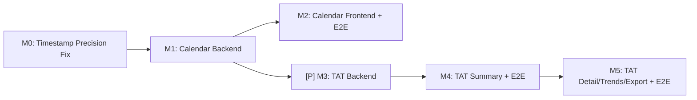

# Implementation Plan: Turn Around Time (TAT) Reporting

**Branch**: `310-turnaround-time` | **Date**: 2026-04-02 | **Spec**:
[spec.md](spec.md) **Input**: Feature specification from
`/specs/310-turnaround-time/spec.md`

## Summary

Build a Calendar Management admin page (OGC-306) and a TAT Report page (OGC-307)
for the OGC-310 epic. Calendar Management provides holiday and weekend
configuration consumed by the TAT module's Working Time calculations. The TAT
Report provides aggregate statistics (summary tab), individual result drill-down
(detail list tab), time-series trends (trends tab), and CSV/PDF export across 7
configurable workflow segments.

The implementation follows the 5-layer architecture pattern, uses Carbon Design
System for all UI, and validates every user story with video-recording
Playwright E2E tests.

## Technical Context

**Language/Version**: Java 21 LTS (backend), JavaScript/React 17 (frontend)
**Primary Dependencies**: Spring Framework 6.2.2 (Traditional MVC),
@carbon/react, @carbon/charts-react, React Intl, Playwright **Storage**:
PostgreSQL 14+ via JPA/Hibernate, clinlims schema **Testing**: JUnit 4 + Mockito
(backend), Jest + RTL (frontend), Playwright (E2E with video) **Target
Platform**: Linux server (Docker), modern browsers **Project Type**: Web
application (Java backend + React frontend) **Performance Goals**: Report
generation <5s for 1K results, detail page <2s, CSV export <30s for 50K rows
**Constraints**: Carbon-only UI, React Intl i18n (en+fr), Liquibase schema,
@Transactional in services only **Scale/Scope**: Typical lab: 100-10,000 results
per report query, up to 50 holidays/year, 2 admin pages + 1 report page with 3
tabs

## Constitution Check

_GATE: Must pass before Phase 0 research. Re-check after Phase 1 design._

- [x] **Configuration-Driven**: Weekend days and holidays are per-installation
      configuration, no country-specific code branches
- [x] **Carbon Design System**: All UI uses @carbon/react (DataTable, Tabs,
      DatePicker, Checkbox, Dropdown, Pagination, InlineNotification). Carbon
      Charts for histogram/trends.
- [x] **FHIR/IHE Compliance**: Not applicable — TAT reporting is internal
      analytics, not externally-facing. No FHIR resources needed.
- [x] **Layered Architecture**: Backend follows Valueholder > DAO > Service >
      Controller. @Transactional on service methods only, never controllers.
  - Valueholders use JPA/Hibernate annotations (PublicHoliday, WeekendConfig)
  - Services own all transaction boundaries
- [x] **Test Coverage**: Full test pyramid planned:
  - Unit tests: JUnit 4 + Mockito for services (TAT calculation engine, holiday
    CRUD)
  - DAO tests: BaseWebContextSensitiveTest for persistence
  - Controller tests: MockMvc for REST endpoints
  - Frontend: Jest + RTL for components
  - E2E: Playwright with video recording for all 5 user stories
- [x] **Schema Management**: Liquibase changesets for `public_holiday` and
      `weekend_config` tables + seed data + permission modules
- [x] **Internationalization**: React Intl for all UI strings. New keys in
      `en.json` only (Transifex for fr+others).
- [x] **Security & Compliance**: Module-based RBAC (`CalendarManagement`,
      `TATReport` modules), audit fields on holiday records (sys_user_id +
      lastupdated), input validation on all API endpoints.

## Milestone Plan

_GATE: Feature effort >3 days — milestones required per Constitution Principle
IX._

### Milestone Table

| ID     | Branch Suffix            | Scope                                                                                                                                                                                                                                                                                                  | User Stories             | Verification                                                                                                                                                                                | Depends On |
| ------ | ------------------------ | ------------------------------------------------------------------------------------------------------------------------------------------------------------------------------------------------------------------------------------------------------------------------------------------------------ | ------------------------ | ------------------------------------------------------------------------------------------------------------------------------------------------------------------------------------------- | ---------- |
| M0     | m0-timestamp-precision   | Fix Analysis.hbm.xml to map `startedDate`, `completedDate`, `releasedDate` as `java.sql.Timestamp` instead of `java.sql.Date`. Update `Analysis.java` field types. Fix `PatientDashBoardProvider` TAT calculation. Update caller sites. DB columns are already TIMESTAMP — no schema migration needed. | Prerequisite for all TAT | Existing tests still pass. New unit test verifies hour-level precision round-trip for all three fields. Integration test: write analysis with time, read back, confirm time preserved.      | -          |
| M1     | m1-calendar-backend      | Liquibase schema, Valueholders, DAOs, Services, Controllers for holidays + weekends. Permission modules (`CalendarManagement`, `TATReport` in `system_module` + `system_module_url` + `system_role_module`).                                                                                           | US1 (backend)            | Unit tests: holiday CRUD, weekend config, recurring logic. Integration tests: REST API endpoints. ORM validation.                                                                           | M0         |
| M2     | m2-calendar-frontend-e2e | Calendar Management admin page (Carbon), i18n, CSV import/export, read-only mode. Playwright E2E with video.                                                                                                                                                                                           | US1 (complete)           | Jest component tests. **Playwright video: US1 full workflow** (add/edit/delete holiday, weekend toggle, CSV import/export, read-only mode).                                                 | M1         |
| [P] M3 | m3-tat-backend           | TAT calculation service (all 7 segments, Calendar + Working Time modes), Summary/Detail/Trend/Export API endpoints.                                                                                                                                                                                    | US2-5 (backend)          | Unit tests: TAT calculation for all 7 segments in both modes with known test data (hour-level precision). Integration tests: all API endpoints with pagination, sorting, filtering.         | M1         |
| M4     | m4-tat-summary-e2e       | TAT Report page shell, filter bar, Summary tab (stat cards, histogram, breakdown table), Working Time toggle + info/warning bars. i18n. Playwright E2E with video.                                                                                                                                     | US2 (complete)           | Jest component tests. **Playwright video: US2 full workflow** (navigate, apply filters, view stats/histogram/breakdown, toggle Working Time, drill-down to detail).                         | M3         |
| M5     | m5-tat-detail-trends-e2e | Detail List tab (pagination, sorting, column config, STAT styling, lab number links). Trends tab (time series, multi-series, volume overlay). Export (CSV + PDF). Playwright E2E with video.                                                                                                           | US3, US4, US5 (complete) | Jest component tests. **Playwright videos: US3** (detail list pagination, sorting, columns, STAT rows), **US4** (trend chart, aggregation, comparison, volume), **US5** (CSV + PDF export). | M4         |

### Milestone Dependency Graph



**Parallelism**: M2 (Calendar Frontend) and M3 (TAT Backend) can be developed
simultaneously after M1 completes. Both only depend on M1. M0 is a small
prerequisite that unblocks everything.

### PR Strategy

- **Spec PR**: `spec/310-OGC-310-turnaround-time` > `develop` (this spec + plan,
  no code)
- **M0**: `fix/310-OGC-310-turnaround-time-m0-timestamp-precision` > `develop`
- **M1**: `feat/310-OGC-306-turnaround-time-m1-calendar-backend` > `develop`
- **M2**: `feat/310-OGC-306-turnaround-time-m2-calendar-frontend-e2e` >
  `develop`
- **M3**: `feat/310-OGC-307-turnaround-time-m3-tat-backend` > `develop`
- **M4**: `feat/310-OGC-307-turnaround-time-m4-tat-summary-e2e` > `develop`
- **M5**: `feat/310-OGC-307-turnaround-time-m5-tat-detail-trends-e2e` >
  `develop`

## Project Structure

### Documentation (this feature)

```text
specs/310-turnaround-time/
├── spec.md
├── plan.md                    # This file
├── research.md
├── data-model.md
├── quickstart.md
├── contracts/
│   └── api-contracts.md
└── checklists/
    └── requirements.md
```

### Source Code (repository root)

```text
# Backend (Java)
src/main/java/org/openelisglobal/calendar/
├── valueholder/
│   ├── PublicHoliday.java
│   └── WeekendConfig.java
├── dao/
│   ├── PublicHolidayDAO.java
│   └── WeekendConfigDAO.java
├── service/
│   ├── PublicHolidayService.java
│   ├── PublicHolidayServiceImpl.java
│   ├── WeekendConfigService.java
│   └── WeekendConfigServiceImpl.java
└── controller/
    └── rest/
        └── CalendarManagementRestController.java

src/main/java/org/openelisglobal/reports/
└── tat/
    ├── service/
    │   ├── TATCalculationService.java
    │   ├── TATCalculationServiceImpl.java
    │   ├── TATReportService.java
    │   └── TATReportServiceImpl.java
    ├── bean/
    │   ├── TATSummaryResponse.java
    │   ├── TATDetailResponse.java
    │   ├── TATTrendResponse.java
    │   └── TATResult.java
    └── controller/
        └── rest/
            └── TATReportRestController.java

# Liquibase
src/main/resources/liquibase/2.8.x.x/
├── public_holiday.xml
└── tat_permissions.xml

# Backend Tests
src/test/java/org/openelisglobal/calendar/
├── service/PublicHolidayServiceTest.java
├── service/WeekendConfigServiceTest.java
└── controller/CalendarManagementRestControllerTest.java

src/test/java/org/openelisglobal/reports/tat/
├── service/TATCalculationServiceTest.java
├── service/TATReportServiceTest.java
└── controller/TATReportRestControllerTest.java

# Frontend
frontend/src/components/admin/calendarManagement/
├── CalendarManagement.js
├── HolidayTable.js
├── WeekendConfig.js
├── CsvImportPreview.js
└── index.js

frontend/src/components/reports/tat/
├── TATReport.js
├── TATFilterBar.js
├── TATSummaryTab.js
├── TATStatCards.js
├── TATHistogram.js
├── TATBreakdownTable.js
├── TATDetailListTab.js
├── TATTrendsTab.js
├── TATExport.js
└── index.js

# Frontend Tests (Jest)
frontend/src/components/admin/calendarManagement/__tests__/
└── CalendarManagement.test.js

frontend/src/components/reports/tat/__tests__/
├── TATSummaryTab.test.js
├── TATDetailListTab.test.js
└── TATTrendsTab.test.js

# Playwright E2E
frontend/playwright/tests/demo/core/
├── ogc-306-calendar-management.spec.ts      # US1 video demo
├── ogc-307-tat-summary.spec.ts              # US2 video demo
├── ogc-307-tat-detail-list.spec.ts          # US3 video demo
├── ogc-307-tat-trends.spec.ts               # US4 video demo
└── ogc-307-tat-export.spec.ts               # US5 video demo

frontend/playwright/fixtures/
├── calendar-management.ts                    # Page object
└── tat-report.ts                            # Page object
```

**Structure Decision**: Web application with Java backend and React frontend,
following existing OpenELIS project structure. New packages under
`org.openelisglobal.calendar` (Calendar Mgmt) and
`org.openelisglobal.reports.tat` (TAT Report). Frontend components under
`admin/calendarManagement/` and `reports/tat/`.

## Testing Strategy

**Reference**:
[OpenELIS Testing Roadmap](../../.specify/guides/testing-roadmap.md)

### Coverage Goals

- **Backend**: >80% code coverage (JaCoCo) — critical: TAT calculation engine
  100%
- **Frontend**: >70% code coverage (Jest)
- **Critical Paths**: 100% coverage on TAT calculation logic (all 7 segments x 2
  modes), permission checks, holiday CRUD validation

### Test Types

- [x] **Unit Tests**: Service layer business logic (JUnit 4 + Mockito)

  - **Reference**:
    [Testing Roadmap - Unit Tests](../../.specify/guides/testing-roadmap.md#unit-tests-junit-4--mockito)
  - **Coverage Goal**: >80%
  - **Key tests**:
    - `TATCalculationServiceTest` — all 7 segments, Calendar + Working Time
      modes, edge cases (missing timestamps, zero TAT, all-excluded days)
    - `PublicHolidayServiceTest` — CRUD, recurring logic, duplicate date
      prevention
    - `WeekendConfigServiceTest` — day toggle, default values
  - **SDD Checkpoint**: After M1/M3 services complete, all unit tests MUST pass

- [x] **DAO Tests**: Persistence layer (BaseWebContextSensitiveTest)

  - **Reference**:
    [Testing Roadmap - Backend Testing](../../.specify/guides/testing-roadmap.md#backend-testing)
  - **Key tests**: PublicHoliday CRUD persistence, WeekendConfig seed data,
    query by year with recurring expansion

- [x] **Controller Tests**: REST API endpoints (BaseWebContextSensitiveTest +
      MockMvc)

  - **Reference**:
    [Testing Roadmap - Backend Testing](../../.specify/guides/testing-roadmap.md#backend-testing)
  - **Key tests**: All calendar endpoints (CRUD, import, export, weekends), all
    TAT endpoints (summary, detail, trend, export) with filter combinations
  - **SDD Checkpoint**: After M1/M3 controllers complete, integration tests MUST
    pass

- [x] **ORM Validation Tests**: Entity mapping validation

  - **Reference**:
    [Testing Roadmap - ORM Validation Tests](../../.specify/guides/testing-roadmap.md#orm-validation-tests-constitution-v4)
  - **Key tests**: PublicHoliday and WeekendConfig JPA mapping validation
  - **SDD Checkpoint**: After M1 entities created, ORM tests MUST pass in <5s
    without DB

- [x] **Frontend Unit Tests**: React component logic (Jest + React Testing
      Library)

  - **Reference**:
    [Testing Roadmap - Jest + React Testing Library](../../.specify/guides/testing-roadmap.md#jest--react-testing-library-unit-tests)
  - **Coverage Goal**: >70%
  - **Key tests**: CalendarManagement CRUD interactions, TATFilterBar filter
    state, TATStatCards rendering, TATHistogram data transformation,
    TATBreakdownTable drill-down
  - **SDD Checkpoint**: After M2/M4/M5 frontend complete, all Jest tests MUST
    pass

- [x] **E2E Tests**: User story validation (Playwright with video recording)

  - **Reference**:
    [Playwright Best Practices](../../.specify/guides/playwright-best-practices.md)
  - **Framework**: Playwright (NOT Cypress — per Testing Roadmap direction)
  - **Bucket**: `demo/core/` (maps to `core-demo` and `core-demo-video`
    projects)
  - **Video recording**: All tests run via `npm run pw:test:core-demo-video`
    with `PLAYWRIGHT_VIDEO=on` and `PLAYWRIGHT_SLOWMO=500`
  - **Pattern requirements**:
    - Use `test.step()` for organized multi-step workflows
    - Use `showTitleCard()` and `videoPause()` helpers for demo presentation
    - Use page objects (`calendar-management.ts`, `tat-report.ts`) for reusable
      locators
    - Use `getByRole()`, `getByLabel()`, `data-testid` selectors (never raw CSS
      for state assertions)
    - Click Carbon `<label>` elements, never `{ force: true }` on hidden inputs
    - At least one `expect()` per `test.step()`
    - Assert on visible UI state, not `response.ok()`
  - **Test plan by user story**:

    | User Story           | Playwright Test File                  | Steps Demonstrated                                                                                                                                                                                                 |
    | -------------------- | ------------------------------------- | ------------------------------------------------------------------------------------------------------------------------------------------------------------------------------------------------------------------ |
    | US1: Calendar Mgmt   | `ogc-306-calendar-management.spec.ts` | Navigate to admin page, add holiday (inline), edit holiday, delete with confirmation, toggle weekend days, import CSV with preview, export CSV, verify read-only mode                                              |
    | US2: TAT Summary     | `ogc-307-tat-summary.spec.ts`         | Navigate to report, apply date range + lab unit filter, verify stat cards, view histogram with percentile markers, view breakdown table, drill-down to detail, toggle Working Time mode, verify info bar + warning |
    | US3: TAT Detail List | `ogc-307-tat-detail-list.spec.ts`     | Switch to Detail List tab, verify pagination, sort by TAT descending, toggle column visibility, verify STAT row red border, click lab number link                                                                  |
    | US4: TAT Trends      | `ogc-307-tat-trends.spec.ts`          | Switch to Trends tab, change aggregation (daily/weekly), enable multi-series comparison, toggle volume overlay                                                                                                     |
    | US5: TAT Export      | `ogc-307-tat-export.spec.ts`          | Click Export > CSV (verify download), click Export > PDF (verify download)                                                                                                                                         |

### Test Data Management

- **Backend**:

  - **Unit Tests**: Builder pattern for test data, deterministic timestamps for
    TAT calculation verification
  - **DAO/Integration**: Liquibase seed data for holidays (Rwanda holidays as
    baseline), @Transactional rollback for test isolation

- **Frontend**:
  - **E2E Tests (Playwright)**:
    - [x] Use API-based setup via `page.request` for creating test holidays and
          verifying order data exists
    - [x] Auth via existing `setup` project with `storageState` (no per-test
          login)
    - [x] Assert on visible UI elements, not backend response bodies
    - [x] DO NOT stub backend endpoints — these are real E2E tests

### Checkpoint Validations

- [x] **After M1 (Calendar Backend)**: ORM validation tests + unit tests +
      integration tests for all calendar API endpoints MUST pass
- [x] **After M2 (Calendar Frontend)**: Jest component tests + Playwright US1
      video demo MUST pass
- [x] **After M3 (TAT Backend)**: Unit tests for all 7 segments x 2 modes +
      integration tests for all TAT API endpoints MUST pass
- [x] **After M4 (TAT Summary Frontend)**: Jest tests + Playwright US2 video
      demo MUST pass
- [x] **After M5 (TAT Detail/Trends/Export)**: Jest tests + Playwright US3, US4,
      US5 video demos MUST pass. Full E2E suite green.
