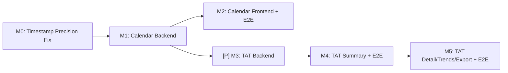

# Tasks: Turn Around Time (TAT) Reporting

**Input**: Design documents from `/specs/310-turnaround-time/`
**Prerequisites**: plan.md, spec.md, data-model.md, contracts/api-contracts.md,
research.md **Tests**: MANDATORY per Constitution Principle V — tests appear
before implementation (TDD) **Organization**: By **Milestone** per Constitution
Principle IX (6 milestones: M0 prerequisite + 5 feature milestones, 1 PR each)

## Format: `[ID] [P?] [Story] Description`

- **[P]**: Can run in parallel (different files, no dependencies)
- **[Story]**: Which user story this task belongs to (e.g., US1, US2)
- **[M]**: Which milestone this task belongs to

## Milestone Dependency Graph



---

## Milestone 0: Analysis Timestamp Precision Fix (Prerequisite)

**Branch**: `fix/310-OGC-310-turnaround-time-m0-timestamp-precision` **Scope**:
Fix Hibernate HBM mapping for `Analysis.startedDate`, `completedDate`,
`releasedDate` from `java.sql.Date` to `java.sql.Timestamp`. Update Java field
types. Fix existing TAT calculation in `PatientDashBoardProvider`. No schema
migration — DB columns are already `TIMESTAMP WITHOUT TIME ZONE`.
**Verification**: All existing tests still pass. New tests verify hour-level
precision round-trip. **Evidence**: `Analysis.hbm.xml:56-64` maps as
`java.sql.Date`; `OpenELIS-Global.sql:311-313` declares columns as
`TIMESTAMP WITHOUT TIME ZONE`; `PatientDashBoardProvider.java:157-168` uses
`.toLocalDate().atStartOfDay()` losing all time info.

### Branch Setup

- [ ] T000a Create milestone branch
      `fix/310-OGC-310-turnaround-time-m0-timestamp-precision` from `develop`

### TDD: Tests First

- [ ] T000b Write unit test verifying hour-level precision for Analysis
      timestamp fields in
      `src/test/java/org/openelisglobal/analysis/AnalysisTimestampPrecisionTest.java`
      — create Analysis, set `startedDate` to a `Timestamp` with time 14:30:00,
      persist via DAO, read back, assert time component is preserved (not
      midnight). Do same for `completedDate` and `releasedDate`. This test MUST
      FAIL before the HBM fix is applied. JUnit 4, extend
      `BaseWebContextSensitiveTest`.
- [ ] T000c Write unit test for fixed TAT hour calculation in
      `src/test/java/org/openelisglobal/common/rest/provider/PatientDashBoardProviderTATTest.java`
      — given startedDate = Monday 09:00 and releasedDate = Monday 15:00, assert
      TAT = 6 hours (not 0 or 24). This test MUST FAIL before the provider fix.

### HBM Mapping Fix

- [ ] T000d Change `Analysis.hbm.xml` at
      `src/main/resources/hibernate/hbm/Analysis.hbm.xml` lines 56-64 — change
      `type="java.sql.Date"` to `type="java.sql.Timestamp"` for `startedDate`
      (line 56), `completedDate` (line 59), `releasedDate` (line 62). Keep
      `printedDate` as `java.sql.Date` (not used for TAT).

### Java Field Type Fix

- [ ] T000e Update `Analysis.java` at
      `src/main/java/org/openelisglobal/analysis/valueholder/Analysis.java` —
      change field types: `private Date startedDate` (line 53) to
      `private Timestamp startedDate`, `private Date completedDate` (line 55) to
      `private Timestamp completedDate`, `private Date releasedDate` (line 58)
      to `private Timestamp releasedDate`. Update getter return types and setter
      parameter types to `Timestamp`. Add `import java.sql.Timestamp;` if not
      present.

### Caller Site Updates

- [ ] T000f Update setter call sites that create `java.sql.Date` values for
      these fields — change to `java.sql.Timestamp`:
  - `ResultValidationController.java:391` —
    `new java.sql.Date(Calendar.getInstance().getTimeInMillis())` to
    `new java.sql.Timestamp(System.currentTimeMillis())`
  - `AccessionValidationRestController.java:398` — same change
  - `AccessionValidationRangeController.java:386` — same change
  - `FhirReferralServiceImpl.java:294` — `DateUtil.getNowAsSqlDate()` to
    `new java.sql.Timestamp(System.currentTimeMillis())`
  - `CytologySampleServiceImpl.java:229` — same pattern
  - `PathologySampleServiceImpl.java` — same pattern for `setReleasedDate` calls
  - `ImmunohistochemistrySampleServiceImpl.java` — same pattern
  - `AnalysisServiceImpl.java:314` — `DateUtil.getNowAsSqlDate()` to
    `new java.sql.Timestamp(System.currentTimeMillis())` for `setStartedDate`
  - `SamplePatientEntryServiceImpl.java:536` — update `setStartedDate` call
  - `SampleEditServiceImpl.java:384,457` — update `setStartedDate` calls
  - `TbSampleServiceImpl.java:379` — update `setStartedDate` call
  - `TestCalculatedUtil.java:434` — update `setStartedDate` call
  - `ReflexAction.java:90` — update `setStartedDate` call
  - `ResultUtil.java:514,523` — `setCompletedDate` calls (these use
    `convertStringDateToSqlDate` — update to use
    `convertStringDateTimeToSqlDate` or `new Timestamp`)
  - `AnalyzerResultsAcceptServiceImpl.java:693` — `setCompletedDateForDisplay`
    (string path — verify it now parses time)
  - Test files: `AnalysisServiceTest.java:392-394`,
    `AnalyzerResultsServiceTest.java:143` — update `Date.valueOf` to
    `Timestamp.valueOf`
- [ ] T000g Update `DateUtil.java` — add `getNowAsTimestamp()` method:
      `return new java.sql.Timestamp(System.currentTimeMillis())` for use in the
      setter calls above. Keep `getNowAsSqlDate()` for non-Analysis uses.

### Fix Existing TAT Calculation

- [ ] T000h Fix `PatientDashBoardProvider.java` at
      `src/main/java/org/openelisglobal/common/rest/provider/PatientDashBoardProvider.java`
      lines 157-168 — replace `.toLocalDate().atStartOfDay()` pattern with
      direct `Timestamp`-aware calculation: convert `getStartedDate()` and
      `getReleasedDate()` to `LocalDateTime` via `.toLocalDateTime()` (now
      possible since they're Timestamps), then use
      `Duration.between(startDateTime, endDateTime).toHours()`. Same fix for
      average calculation methods at lines 88-91, 113-116, 136-139.

### Verification & PR

- [ ] T000i Run full Maven test suite: `mvn test -DskipTests=false` — ALL
      existing tests must still pass. Run the new precision tests from T000b and
      T000c — they must now PASS.
- [ ] T000j Run `mvn spotless:apply` to ensure formatting compliance.
- [ ] T000k Create PR `fix/310-OGC-310-turnaround-time-m0-timestamp-precision` >
      `develop`. Title:
      `fix(analysis): restore hour-level precision for Analysis timestamp fields`.
      Description: HBM mapping incorrectly used java.sql.Date for TIMESTAMP
      columns, causing time truncation to midnight. Fixes TAT calculation
      accuracy for the OGC-310 TAT reporting feature.

**Checkpoint**: All existing tests pass. New precision tests pass. The 96-hour
TAT widget now correctly measures hours, not just day multiples.

---

## Milestone 1: Calendar Management Backend (US1 backend)

**Branch**: `feat/310-OGC-306-turnaround-time-m1-calendar-backend` **Scope**:
Liquibase schema, Valueholders, DAOs, Services, Controllers for holidays +
weekends. Permission modules. **Verification**: ORM validation tests + unit
tests + integration tests for all calendar API endpoints MUST pass.
**Evidence**: data-model.md (PublicHoliday, WeekendConfig entities),
contracts/api-contracts.md (Calendar Management Endpoints), research.md
(Liquibase pattern from `reflex_rule.xml`)

### Branch Setup

- [ ] T001 [US1] Create milestone branch
      `feat/310-OGC-306-turnaround-time-m1-calendar-backend` from `develop`
      (after M0 merged)

### Schema (Liquibase)

- [ ] T002 [P] [US1] Create Liquibase changeset for `public_holiday` table in
      `src/main/resources/liquibase/3.5.x.x/public_holiday.xml` — columns: id
      (SERIAL PK via sequence), holiday_date (DATE NOT NULL), holiday_name
      (VARCHAR(100) NOT NULL), is_recurring (BOOLEAN DEFAULT FALSE), is_active
      (BOOLEAN DEFAULT TRUE), lastupdated (TIMESTAMP), sys_user_id (VARCHAR(36)
      system_user). Use `clinlims` schema. Follow pattern from
      `src/main/resources/liquibase/2.8.x.x/reflex_rule.xml` (preConditions with
      `onFail="MARK_RAN"`, createSequence, createTable).
- [ ] T003 [P] [US1] Create Liquibase changeset for `weekend_config` table in
      `src/main/resources/liquibase/3.5.x.x/weekend_config.xml` — columns: id
      (SERIAL PK via sequence), day_of_week (INTEGER NOT NULL UNIQUE),
      is_weekend (BOOLEAN DEFAULT FALSE), lastupdated (TIMESTAMP), sys_user_id
      NOT NULL). Include seed data: 7 rows (0-6), Saturday(6)=true,
      Sunday(0)=true, others=false.
- [ ] T004 [P] [US1] Create Liquibase changeset for permission modules in
      `src/main/resources/liquibase/3.5.x.x/tat_permissions.xml` — insert
      `CalendarManagement` and `TATReport` modules into `system_module` table
      (PascalCase per codebase convention), plus `system_module_url` entries for
      all REST and frontend paths, assign to admin and reports roles in
      `system_role_module`. Follow existing permission module patterns.
- [ ] T005 [US1] Register all new changesets in
      `src/main/resources/liquibase/base-changelog.xml`

### Valueholders (JPA Entities)

- [ ] T006 [P] [US1] Create `PublicHoliday.java` valueholder in
      `src/main/java/org/openelisglobal/calendar/valueholder/PublicHoliday.java`
      — extend `BaseObject<String>` (from
      `src/.../common/valueholder/BaseObject.java`), JPA annotations for all
      fields per data-model.md. Validation: `@NotNull` on holiday_date and
      holiday_name, `@Size(max=100)` on holiday_name.
- [ ] T007 [P] [US1] Create `WeekendConfig.java` valueholder in
      `src/main/java/org/openelisglobal/calendar/valueholder/WeekendConfig.java`
      — extend `BaseObject<String>`, JPA annotations. Validation:
      `@Min(0) @Max(6)` on dayOfWeek.

### TDD: Tests First

- [ ] T008 [P] [US1] Write ORM validation tests for PublicHoliday and
      WeekendConfig in
      `src/test/java/org/openelisglobal/calendar/valueholder/CalendarEntitiesOrmTest.java`
      — verify JPA mappings load without DB, must run in <5s. Reference:
      testing-roadmap.md ORM Validation Tests section.
- [ ] T009 [P] [US1] Write unit tests for PublicHolidayService in
      `src/test/java/org/openelisglobal/calendar/service/PublicHolidayServiceTest.java`
      — test: create holiday, update holiday, delete holiday, recurring
      expansion across years, duplicate date detection (service-layer per
      FR-CM-006), inactive holiday filtering. Use JUnit 4 + Mockito
      (`@RunWith(MockitoJUnitRunner.class)`, `@Mock` for DAO).
- [ ] T010 [P] [US1] Write unit tests for WeekendConfigService in
      `src/test/java/org/openelisglobal/calendar/service/WeekendConfigServiceTest.java`
      — test: get weekend days, update weekend days, default Sat+Sun, validation
      of day_of_week range 0-6. JUnit 4 + Mockito.
- [ ] T011 [US1] Write integration tests for CalendarManagementRestController in
      `src/test/java/org/openelisglobal/calendar/controller/CalendarManagementRestControllerTest.java`
      — extend `BaseWebContextSensitiveTest` (from
      `src/test/java/org/openelisglobal/BaseWebContextSensitiveTest.java`), use
      MockMvc. Test all endpoints: GET/POST/PUT/DELETE holidays, GET/PUT
      weekends, POST import, GET export. Test permission enforcement (401
      without module access). Test 409 Conflict on duplicate dates.

### DAOs

- [ ] T012 [P] [US1] Create `PublicHolidayDAO.java` interface in
      `src/main/java/org/openelisglobal/calendar/dao/PublicHolidayDAO.java` —
      extend `BaseDAO<PublicHoliday, String>` (from
      `src/.../common/dao/BaseDAO.java`). Add method:
      `List<PublicHoliday> getHolidaysForYear(int year, boolean includeInactive)`
      to handle recurring expansion.
- [ ] T013 [P] [US1] Create `WeekendConfigDAO.java` interface in
      `src/main/java/org/openelisglobal/calendar/dao/WeekendConfigDAO.java` —
      extend `BaseDAO<WeekendConfig, String>`. Add method:
      `List<WeekendConfig> getWeekendDays()`.

### Services

- [ ] T014 [US1] Create `PublicHolidayService.java` interface and
      `PublicHolidayServiceImpl.java` in
      `src/main/java/org/openelisglobal/calendar/service/` — extend
      `AuditableBaseObjectServiceImpl<PublicHoliday, String>` (from
      `src/.../common/service/AuditableBaseObjectServiceImpl.java`). `@Service`,
      `@Transactional` on mutating methods. Implement: CRUD, recurring expansion
      logic (query all recurring holidays + non-recurring for target year),
      duplicate detection at service layer (reject if same month/day in target
      year including recurring occurrences per FR-CM-006), CSV import with
      validation (return imported/skipped/errors), CSV export.
- [ ] T015 [US1] Create `WeekendConfigService.java` interface and
      `WeekendConfigServiceImpl.java` in
      `src/main/java/org/openelisglobal/calendar/service/` — `@Service`,
      `@Transactional`. Implement: get weekend day IDs, update weekend days
      (accept array of integers 0-6, update all 7 rows).

### REST Controller

- [ ] T016 [US1] Create `CalendarManagementRestController.java` in
      `src/main/java/org/openelisglobal/calendar/controller/rest/CalendarManagementRestController.java`
      — `@RestController @RequestMapping("/rest")`. Implement all endpoints from
      contracts/api-contracts.md Calendar Management section:
      `GET/POST/PUT/DELETE /rest/calendar/holidays`,
      `POST /rest/calendar/holidays/import`,
      `GET /rest/calendar/holidays/export`, `GET/PUT /rest/calendar/weekends`.
      Use `getSysUserId(request)` for audit fields. `@InitBinder` with allowed
      fields.

### Checkpoint & PR

- [ ] T017 [US1] Run all M1 tests:
      `mvn test -pl . -Dtest="*CalendarEntitiesOrm*,*PublicHolidayService*,*WeekendConfigService*"`
      and `mvn verify -pl . -Dit.test="*CalendarManagementRestController*"` —
      ALL must pass.
- [ ] T018 [US1] Create PR
      `feat/310-OGC-306-turnaround-time-m1-calendar-backend` > `develop`. Title:
      `feat(calendar): OGC-306 M1 — Calendar Management backend (schema, API, tests)`.

---

## Milestone 2: Calendar Management Frontend + E2E (US1 complete)

**Branch**: `feat/310-OGC-306-turnaround-time-m2-calendar-frontend-e2e`
**Scope**: Calendar Management admin page (Carbon), i18n, CSV import/export UI,
read-only mode, Playwright E2E with video. **Verification**: Jest component
tests + Playwright video demo for US1 full workflow. **Depends On**: M1 merged
**Evidence**: spec.md US1 acceptance scenarios, calendar-management-mockup.jsx
(Jira OGC-306 attachment), Admin.js SideNav pattern, OrganizationManagement.js
DataTable pattern

### Branch Setup

- [ ] T019 [US1] Create milestone branch
      `feat/310-OGC-306-turnaround-time-m2-calendar-frontend-e2e` from `develop`
      (after M1 merged)

### i18n Keys

- [ ] T020 [US1] Add i18n message keys to `frontend/src/languages/en.json` —
      keys for: `admin.calendarManagement.title`,
      `admin.calendarManagement.description`,
      `admin.calendarManagement.addHoliday`,
      `admin.calendarManagement.editHoliday`,
      `admin.calendarManagement.deleteConfirm`,
      `admin.calendarManagement.holidayName`, `admin.calendarManagement.date`,
      `admin.calendarManagement.recurring`, `admin.calendarManagement.annual`,
      `admin.calendarManagement.oneTime`, `admin.calendarManagement.active`,
      `admin.calendarManagement.inactive`, `admin.calendarManagement.weekend`,
      `admin.calendarManagement.weekendDays`,
      `admin.calendarManagement.weekendSaved`,
      `admin.calendarManagement.importCsv`,
      `admin.calendarManagement.exportCsv`,
      `admin.calendarManagement.importPreview`, `admin.calendarManagement.year`,
      `admin.calendarManagement.noHolidays`,
      `admin.calendarManagement.duplicateDate`,
      `admin.calendarManagement.imported`, `admin.calendarManagement.skipped`,
      `admin.calendarManagement.holidayCount` (MF-5: "{count} holidays
      configured for {year}"), `admin.calendarManagement.saveError`,
      `admin.calendarManagement.loadError` (MF-3: error states). (Only en.json —
      fr via Transifex per CR-002.)

### TDD: Jest Tests First

- [ ] T021 [P] [US1] Write Jest tests for CalendarManagement component in
      `frontend/src/components/admin/calendarManagement/__tests__/CalendarManagement.test.js`
      — test: renders holiday table, add holiday inline, edit holiday inline,
      delete with confirmation, year filter changes, weekend checkboxes toggle,
      read-only mode (no action buttons), empty state, inactive holidays
      visually dimmed (MF-14: AC-CAL-11 coverage), footer shows holiday count
      (MF-5), loading skeleton during data fetch (MF-2), error notification on
      API failure (MF-3). Use React Testing Library. Mock
      `getFromOpenElisServer` and `postToOpenElisServerJsonResponse`.
- [ ] T022 [P] [US1] Write Jest tests for CsvImportPreview component in
      `frontend/src/components/admin/calendarManagement/__tests__/CsvImportPreview.test.js`
      — test: renders preview table, shows validation errors, import/cancel
      buttons.

### Frontend Components

- [ ] T023 [US1] Create `CalendarManagement.js` main component in
      `frontend/src/components/admin/calendarManagement/CalendarManagement.js` —
      Carbon DataTable with inline add/edit rows per mockup (MF-18: inline, NOT
      modal — intentional design choice over requirements doc). Columns: Date
      (with day-of-week), Holiday Name, Recurring (Annual/One-time Tag), Status
      (Active/Inactive Tag — inactive rows visually dimmed per AC-CAL-11),
      Actions (Edit/Delete IconButtons). Year filter Dropdown. "Add Holiday"
      Button. Footer showing "{count} holidays configured for {year}" (MF-5).
      Add `data-testid` attributes on key elements for Playwright page objects
      (MF-13): `holiday-table`, `add-holiday-button`, `holiday-inline-row`,
      `save-holiday-button`, `cancel-holiday-button`, `year-dropdown`,
      `import-csv-button`, `export-csv-button`, `holiday-count-footer`. Show
      `DataTableSkeleton` during initial load (MF-2). Show `InlineNotification`
      kind="error" on API failure (MF-3). Use `useIntl()` and
      `<FormattedMessage>` for all strings. Call
      `getFromOpenElisServer("/rest/calendar/holidays?year=...")`. Follow
      pattern from
      `frontend/src/components/admin/OrganizationManagement/OrganizationManagement.js`.
- [ ] T024 [US1] Create `WeekendConfig.js` component in
      `frontend/src/components/admin/calendarManagement/WeekendConfig.js` — Row
      of Carbon Checkboxes for Mon-Sun. Sat+Sun checked by default. On change:
      PUT `/rest/calendar/weekends` immediately, show Carbon InlineNotification
      toast on success. Orange "(weekend)" indicator on holidays that fall on
      weekend days per FR-CM-010.
- [ ] T025 [US1] Create `CsvImportPreview.js` component in
      `frontend/src/components/admin/calendarManagement/CsvImportPreview.js` —
      Carbon Modal with DataTable preview of parsed CSV rows. Show validation
      errors inline. Import/Cancel buttons. POST
      `/rest/calendar/holidays/import` on confirm.
- [ ] T026 [US1] Create `index.js` barrel export in
      `frontend/src/components/admin/calendarManagement/index.js`

### Routing & Menu Integration

- [ ] T027 [US1] Add "Calendar Management" SideNavLink to
      `frontend/src/components/admin/Admin.js` — add `<SideNavLink>` with
      `renderIcon={CalendarDays}` (or `Calendar` from @carbon/react/icons),
      `onClick={handleNavigation(\`\${path}/calendarManagement\`)}`, `<FormattedMessage id="admin.calendarManagement.title" />`. Add `<Route
      path={\`\${path}/calendarManagement\`} component={CalendarManagement}
      />`to Switch. Import CalendarManagement from`./calendarManagement`.
- [ ] T028 [US1] Verify route protection: Admin route in `frontend/src/App.js`
      already requires `role={Roles.GLOBAL_ADMIN}` — no change needed. Calendar
      Management inherits admin protection. Read-only mode logic: check if user
      has write access to `CalendarManagement` module, conditionally hide
      Add/Edit/Delete/Import/Export buttons.

### Playwright E2E with Video (US1)

- [ ] T029a [US1] Create E2E test data seeding: either a SQL fixture
      `src/test/resources/tat-demo-data.sql` with sample holidays, OR an
      API-based setup function in `frontend/playwright/helpers/seed-calendar.ts`
      that uses `page.request.post("/rest/calendar/holidays", ...)` to create
      test holidays before each test run. (CF-5: test data seeding gap.)
- [ ] T029b [US1] `/plan-record-playwright` — Plan Playwright test for US1
      calendar management workflow. Define steps: navigate Admin > Calendar
      Management, verify page loads with seeded holidays, add holiday inline,
      edit holiday, delete holiday with confirmation, toggle weekend checkboxes,
      verify inactive holiday is dimmed (MF-14: AC-CAL-11), import CSV, export
      CSV, verify read-only mode. Map to spec.md US1 acceptance scenarios 1-10.
- [ ] T030 [US1] Create page object
      `frontend/playwright/fixtures/calendar-management.ts` — locators: holiday
      table (`[data-testid="holiday-table"]`), add button, inline edit row,
      save/cancel buttons, weekend checkboxes, year dropdown, import/export
      buttons. Methods: `goto()`, `addHoliday(date, name, recurring)`,
      `editHoliday(id, fields)`, `deleteHoliday(id)`,
      `setWeekendDay(day, checked)`, `selectYear(year)`, `getHolidayCount()`.
- [ ] T031 [US1] `/write-playwright-test` — Create
      `frontend/playwright/tests/demo/core/ogc-306-calendar-management.spec.ts`
      — use `test.step()` for each acceptance scenario, `showTitleCard()` +
      `videoPause()` for demo presentation. Use page object from T030. Assert on
      visible UI state (not response.ok()). Click Carbon labels not hidden
      inputs. At least one `expect()` per step. Set `test.setTimeout()`
      appropriately. Follow patterns from
      `frontend/playwright/tests/demo/core/ogc-62-shipment-workflow.spec.ts`.
- [ ] T032 [US1] `/audit-playwright` — Run `npm run pw:guard` to verify test is
      in correct bucket (`demo/core/`). Run
      `npm run pw:test:core-demo -- -g "calendar"` to verify test passes without
      video. Run `npm run pw:test:core-demo-video -- -g "calendar"` to verify
      video recording works.
- [ ] T033 [US1] If test failures: `/debug-playwright` — diagnose using trace
      viewer, fix selectors or timing, re-run.

### Checkpoint & PR

- [ ] T034 [US1] Run all M2 tests: Jest
      (`cd frontend && npx jest --testPathPattern calendarManagement`),
      Playwright
      (`cd frontend && npm run pw:test:core-demo-video -- -g "calendar"`). ALL
      must pass.
- [ ] T035 [US1] Create PR
      `feat/310-OGC-306-turnaround-time-m2-calendar-frontend-e2e` > `develop`.
      Title:
      `feat(calendar): OGC-306 M2 — Calendar Management frontend + Playwright E2E video`.

---

## [P] Milestone 3: TAT Report Backend (US2-5 backend)

**Branch**: `feat/310-OGC-307-turnaround-time-m3-tat-backend` **Scope**: TAT
calculation service (all 7 segments, Calendar + Working Time modes),
Summary/Detail/Trend/Export API endpoints. **Verification**: Unit tests for all
7 segments x 2 modes + integration tests for all TAT API endpoints. **Depends
On**: M1 merged (needs holiday/weekend data for Working Time) **Can run in
parallel with**: M2 **Evidence**: spec.md FR-TAT-001 through FR-TAT-025,
contracts/api-contracts.md TAT Report Endpoints, data-model.md (TATResult,
TATSummary computed entities, Sample/Analysis timestamp fields), research.md
(timestamp field mappings)

### Branch Setup

- [ ] T036 [US2] Create milestone branch
      `feat/310-OGC-307-turnaround-time-m3-tat-backend` from `develop` (after M1
      merged, parallel with M2)

### TDD: Tests First

- [ ] T037 [P] [US2] Write unit tests for TATCalculationService in
      `src/test/java/org/openelisglobal/reports/tat/service/TATCalculationServiceTest.java`
      — JUnit 4 + Mockito. Test all 7 segments with known timestamps and
      expected hour values: (1) Order to Collection, (2) Collection to Receipt,
      (3) Receipt to Testing Started, (4) Receipt to Result Entry, (5) Receipt
      to Validation, (6) Result Entry to Validation, (7) Overall TAT. Test
      Calendar Time mode (simple subtraction). Test Working Time mode with known
      weekends + holidays (verify excluded days). Test edge cases: missing
      timestamps return null, zero TAT when start=end on excluded day,
      all-excluded-days returns 0. Test 24-hour working day assumption
      (FR-TAT-024). Mock AnalysisDAO, SampleDAO, PublicHolidayService,
      WeekendConfigService.
- [ ] T038 [P] [US2] Write unit tests for TATReportService in
      `src/test/java/org/openelisglobal/reports/tat/service/TATReportServiceTest.java`
      — test: summary aggregation (mean, median, p90, min, max, stddev),
      histogram bin calculation, breakdown by dimension (lab unit, test,
      priority, sample type, ordering site), pagination logic, sort logic, trend
      aggregation (daily/weekly/monthly). Mock TATCalculationService.
- [ ] T039 [US2] Write integration tests for TATReportRestController in
      `src/test/java/org/openelisglobal/reports/tat/controller/TATReportRestControllerTest.java`
      — extend `BaseWebContextSensitiveTest`, MockMvc. Test all 4 endpoints: GET
      summary (with various filter combinations), GET detail (with pagination
      0-based, sorting, breakdownFilter), GET trend (with interval and
      compareBy), GET export (CSV + PDF format param). Test permission
      enforcement (401 without `TATReport` module). Test patient name omission
      without patient-data permission.

### Beans (Response DTOs)

- [ ] T040 [P] [US2] Create `TATResult.java` in
      `src/main/java/org/openelisglobal/reports/tat/bean/TATResult.java` —
      fields per data-model.md TATResult: labNumber, testName, labUnit,
      priority, sampleType, orderingSite, all 6 timestamps (nullable),
      calendarTatHours (BigDecimal nullable), workingTatHours (BigDecimal
      nullable).
- [ ] T041 [P] [US2] Create `TATSummaryResponse.java` in
      `src/main/java/org/openelisglobal/reports/tat/bean/TATSummaryResponse.java`
      — fields: calculationMode, excludedDaysCount, totalCount, mean, median,
      percentile90, min, max, stdDeviation, histogram (List of TATHistogramBin),
      breakdown (List of TATBreakdownRow).
- [ ] T042 [P] [US2] Create `TATDetailResponse.java` in
      `src/main/java/org/openelisglobal/reports/tat/bean/TATDetailResponse.java`
      — fields: totalCount, page (0-based), pageSize, calculationMode, results
      (List of TATResult).
- [ ] T043 [P] [US2] Create `TATTrendResponse.java` in
      `src/main/java/org/openelisglobal/reports/tat/bean/TATTrendResponse.java`
      — fields: calculationMode, series (List of TATTrendSeries, each with
      label + dataPoints list of TATTrendPoint with
      period/mean/median/percentile90/count).
- [ ] T044 [P] [US2] Create supporting beans: `TATHistogramBin.java`,
      `TATBreakdownRow.java`, `TATTrendSeries.java`, `TATTrendPoint.java` in
      `src/main/java/org/openelisglobal/reports/tat/bean/`.
- [ ] T045 [P] [US2] Create `TATSegment.java` enum in
      `src/main/java/org/openelisglobal/reports/tat/bean/TATSegment.java` —
      values: ORDER_TO_COLLECTION, COLLECTION_TO_RECEIPT, RECEIPT_TO_TESTING,
      RECEIPT_TO_RESULT, RECEIPT_TO_VALIDATION, RESULT_TO_VALIDATION, OVERALL.
      Each value stores its from/to milestone field names for calculation.
- [ ] T046 [P] [US2] Create `TATCalculationMode.java` enum in
      `src/main/java/org/openelisglobal/reports/tat/bean/TATCalculationMode.java`
      — values: CALENDAR, WORKING_TIME.

### Services

- [ ] T047 [US2] Create `TATCalculationService.java` interface and
      `TATCalculationServiceImpl.java` in
      `src/main/java/org/openelisglobal/reports/tat/service/` — `@Service`,
      `@Transactional(readOnly=true)`. Core methods:
      `BigDecimal calculateCalendarTat(Timestamp start, Timestamp end)` — simple
      hour diff.
      `BigDecimal calculateWorkingTat(Timestamp start, Timestamp end, List<LocalDate> excludedDates)`
      — sum hours on non-excluded days using 24-hour working day.
      `List<LocalDate> getExcludedDates(LocalDate from, LocalDate to)` — combine
      weekend days (from WeekendConfigService) and active holidays (from
      PublicHolidayService, with recurring expansion) for the date range.
      `List<TATResult> calculateTATForSegment(TATSegment segment, TATCalculationMode mode, filter params)`
      — query samples/analyses, calculate TAT per result.
- [ ] T048 [US2] Create `TATReportService.java` interface and
      `TATReportServiceImpl.java` in
      `src/main/java/org/openelisglobal/reports/tat/service/` — `@Service`,
      `@Transactional(readOnly=true)`. Methods:
      `TATSummaryResponse getSummary(filters)` — aggregate TATResults into
      stats + histogram + breakdown.
      `TATDetailResponse getDetail(filters, page, pageSize, sort)` — paginated
      detail list. `TATTrendResponse getTrend(filters, interval, compareBy)` —
      time-series aggregation. Statistics: use Apache Commons Math
      `DescriptiveStatistics` for mean/median/percentile/stddev. Histogram:
      auto-calculate bins based on data range.

### REST Controller

- [ ] T049 [US2] Create `TATReportRestController.java` in
      `src/main/java/org/openelisglobal/reports/tat/controller/rest/TATReportRestController.java`
      — `@RestController @RequestMapping("/rest")`. Implement 4 endpoints from
      contracts/api-contracts.md: `GET /rest/reports/tat/summary`,
      `GET /rest/reports/tat/detail` (0-based pagination),
      `GET /rest/reports/tat/trend`, `GET /rest/reports/tat/export` (CSV via
      response writer, PDF via JasperReports). Omit `patientName` field when
      caller lacks patient-data permission. Use `@RequestParam` with defaults
      per contracts.

### Checkpoint & PR

- [ ] T050 [US2] Run all M3 tests:
      `mvn test -pl . -Dtest="*TATCalculationService*,*TATReportService*"` and
      `mvn verify -pl . -Dit.test="*TATReportRestController*"` — ALL must pass.
- [ ] T051 [US2] Create PR `feat/310-OGC-307-turnaround-time-m3-tat-backend` >
      `develop`. Title:
      `feat(tat): OGC-307 M3 — TAT calculation engine + report API endpoints`.

---

## Milestone 4: TAT Report Frontend — Summary Tab + E2E (US2 complete)

**Branch**: `feat/310-OGC-307-turnaround-time-m4-tat-summary-e2e` **Scope**: TAT
Report page shell, filter bar, Summary tab (stat cards, histogram, breakdown
table), Working Time toggle + info/warning bars, i18n, Playwright E2E with
video. **Verification**: Jest component tests + Playwright video demo for US2
full workflow. **Depends On**: M3 merged **Evidence**: spec.md US2 acceptance
scenarios, tat-report-mockup.jsx (Jira OGC-307 attachment),
contracts/api-contracts.md (GET /rest/reports/tat/summary)

### Branch Setup

- [ ] T052 [US2] Create milestone branch
      `feat/310-OGC-307-turnaround-time-m4-tat-summary-e2e` from `develop`
      (after M3 merged)

### i18n Keys

- [ ] T053 [US2] Add i18n message keys to `frontend/src/languages/en.json` —
      keys for: `reports.tat.title`, `reports.tat.description`,
      `reports.tat.generateReport`, `reports.tat.clearFilters` (MF-1),
      `reports.tat.segment.*` (all 7 segment names), `reports.tat.calendarTime`,
      `reports.tat.workingTime`, `reports.tat.workingTimeInfo`,
      `reports.tat.noHolidaysWarning`, `reports.tat.totalResults`,
      `reports.tat.meanTat`, `reports.tat.medianTat`,
      `reports.tat.percentile90`, `reports.tat.minTat`, `reports.tat.maxTat`,
      `reports.tat.stdDeviation`, `reports.tat.distribution`,
      `reports.tat.breakdownBy`, `reports.tat.clickRowHint` (MF-12: "Click a row
      to view individual results"), `reports.tat.summary`,
      `reports.tat.detailList`, `reports.tat.trends`, `reports.tat.noResults`,
      `reports.tat.insufficientData`, `reports.tat.loadError` (MF-3),
      `reports.tat.dateRange`, `reports.tat.labUnit`, `reports.tat.testPanel`,
      `reports.tat.priority.*`, `reports.tat.sampleType`,
      `reports.tat.orderingSite`, `reports.tat.includeCancelled`,
      `reports.tat.quickPresets.*` (Today, Last 7/30/90 Days, This/Last Month,
      This Quarter), `reports.tat.export`, `reports.tat.exportCsv`,
      `reports.tat.exportPdf`.

### TDD: Jest Tests First

- [ ] T054 [P] [US2] Write Jest tests for TATFilterBar component in
      `frontend/src/components/reports/tat/__tests__/TATFilterBar.test.js` —
      test: renders all filter controls, date range defaults to last 30 days,
      segment defaults to "Receipt to Validation", calculation mode
      ContentSwitcher toggle (MF-7), "Generate Report" button click calls
      callback with filter state, "Clear Filters" button resets all to defaults
      (MF-1), quick date presets work, include-cancelled checkbox toggles
      (MF-15: AC-18 coverage), empty/no-results state (MF-2).
- [ ] T055 [P] [US2] Write Jest tests for TATStatCards component in
      `frontend/src/components/reports/tat/__tests__/TATStatCards.test.js` —
      test: renders 7 stat cards with correct labels and formatted values (e.g.,
      "3h 42m"), handles null/zero values, shows "Insufficient data" when all
      null.
- [ ] T056 [P] [US2] Write Jest tests for TATSummaryTab component in
      `frontend/src/components/reports/tat/__tests__/TATSummaryTab.test.js` —
      test: renders stat cards + histogram + breakdown table, breakdown
      dimension selector, drill-down click calls callback with dimension value,
      Working Time info bar visible when mode is WORKING_TIME, warning bar when
      no holidays configured.

### Frontend Components

- [ ] T057 [US2] Create `TATReport.js` page component in
      `frontend/src/components/reports/tat/TATReport.js` — main page with Carbon
      Tabs (Summary, Detail List, Trends). Manages shared filter state. Calls
      `getFromOpenElisServer("/rest/reports/tat/summary?...")` on "Generate
      Report" click. Passes data to active tab. Shows `SkeletonText` / loading
      state during fetch (MF-2). Shows `InlineNotification` kind="error" on API
      failure (MF-3). Active filter summary badges below tabs showing segment
      name, calculation mode, and date range (MF-4). Add `data-testid`
      attributes on key elements for Playwright: `tat-report`,
      `generate-report-button`, `tab-summary`, `tab-detail`, `tab-trends`,
      `filter-summary-badges` (MF-13).
- [ ] T058 [US2] Create `TATFilterBar.js` in
      `frontend/src/components/reports/tat/TATFilterBar.js` — Carbon DatePicker
      (range), Dropdown (lab unit, segment, sample type, ordering site),
      MultiSelect (test/panel with typeahead), ContentSwitcher (calculation
      mode: Calendar/Working Time — MF-7: use ContentSwitcher not
      RadioButtonGroup per mockup pattern), Checkbox (include cancelled), Button
      ("Generate Report"), Button kind="ghost" ("Clear Filters" — MF-1). Quick
      date preset buttons. All strings via `<FormattedMessage>`.
- [ ] T059 [US2] Create `TATStatCards.js` in
      `frontend/src/components/reports/tat/TATStatCards.js` — 7 Carbon Tile
      components in 4+3 layout (first row: Total Results, Mean, Median, 90th
      %ile; second row: Min, Max, Std Dev). Median card has teal highlight
      background (MF-10). Format hours as "Xh Ym" using helper function. Show
      "Insufficient data" when null.
- [ ] T060 [US2] Create `TATHistogram.js` in
      `frontend/src/components/reports/tat/TATHistogram.js` — use
      `@carbon/charts-react` SimpleBarChart. Use fixed non-uniform bins from
      requirements doc: 0-1h, 1-2h, 2-3h, 3-4h, 4-6h, 6-8h, 8-12h, 12-24h,
      24-48h, 48h+ (HF-1). Color grading: teal for early bins, yellow for
      mid-range, orange/red for high bins (MF-9). Vertical reference lines for
      median and p90. Tooltip on hover showing count and percentage.
- [ ] T061 [US2] Create `TATBreakdownTable.js` in
      `frontend/src/components/reports/tat/TATBreakdownTable.js` — Carbon
      DataTable with columns: dimension value, count, mean, median, p90, max.
      Max column: apply red text + bold when value >24h (MF-11). Sortable
      headers. Dropdown to select breakdown dimension (Lab Unit, Test, Priority,
      Sample Type, Ordering Site). Row click triggers drill-down callback
      (navigates to Detail List tab filtered to that value). Helper text below
      table: "Click a row to view individual results" (MF-12).
- [ ] T062 [US2] Create `TATSummaryTab.js` in
      `frontend/src/components/reports/tat/TATSummaryTab.js` — composition
      component: TATStatCards + TATHistogram + TATBreakdownTable. Working Time
      info bar (Carbon InlineNotification kind="info") showing excluded day
      count with link to Admin > Calendar Management. Warning bar
      (kind="warning") when no holidays configured (FR-TAT-019).
- [ ] T063 [US2] Create `index.js` barrel export in
      `frontend/src/components/reports/tat/index.js`

### Routing

- [ ] T064 [US2] Add TAT Report route to `frontend/src/App.js` — add
      `<SecureRoute path="/TATReport" component={() => <TATReport />} role={Roles.REPORTS} />`
      following existing report route patterns (lines ~786-820). Add navigation
      link in the Reports section or sidebar menu.

### Playwright E2E with Video (US2)

- [ ] T065a [US2] Create E2E test data seeding for TAT report: SQL fixture or
      API-based setup in `frontend/playwright/helpers/seed-tat-data.ts` that
      creates 10-15 sample/analysis records with realistic timestamps spanning
      last 90 days, multiple priorities (ROUTINE, STAT), sample types, and lab
      units. Must include at least one STAT sample (for red border in US3).
      (CF-5: test data seeding gap.)
- [ ] T065b [US2] `/plan-record-playwright` — Plan Playwright test for US2 TAT
      summary workflow. Define steps mapping to spec.md US2 acceptance scenarios
      1-8: navigate to Reports > Turn Around Time, verify default filters (last
      30 days, Receipt to Validation, Calendar Time), click Generate Report,
      verify 7 stat cards render, verify histogram is visible (MF-16: assert
      chart presence not data values), verify breakdown table with lab units,
      click breakdown row to drill-down, change TAT segment, toggle Working Time
      mode via ContentSwitcher (verify info bar + excluded day count), test
      warning when no holidays, toggle include-cancelled checkbox (MF-15: AC-18
      coverage).
- [ ] T066 [US2] Create page object `frontend/playwright/fixtures/tat-report.ts`
      — locators: filter bar controls, generate button, stat cards, histogram
      chart, breakdown table, tab navigation, Working Time toggle, info/warning
      bars. Methods: `goto()`, `generateReport()`, `setDateRange(from, to)`,
      `selectSegment(name)`, `selectCalculationMode(mode)`,
      `getStatCardValue(label)`, `clickBreakdownRow(name)`, `switchTab(name)`.
- [ ] T067 [US2] `/write-playwright-test` — Create
      `frontend/playwright/tests/demo/core/ogc-307-tat-summary.spec.ts` — use
      `test.step()` per acceptance scenario, `showTitleCard()` + `videoPause()`
      for demo. Use page object from T066. Assert on visible stat card values
      (text content), histogram presence (SVG visible — MF-16: do NOT assert on
      specific bar data values, rely on Jest for data correctness), breakdown
      table rows, info/warning bar text. Follow Playwright best practices (no
      force:true, no response.ok() as pass/fail).
- [ ] T068 [US2] `/audit-playwright` — Run guards + test without video + test
      with video recording.
- [ ] T069 [US2] If test failures: `/debug-playwright` — diagnose and fix.

### Checkpoint & PR

- [ ] T070 [US2] Run all M4 tests: Jest
      (`cd frontend && npx jest --testPathPattern reports/tat`), Playwright
      (`cd frontend && npm run pw:test:core-demo-video -- -g "tat-summary"`).
      ALL must pass.
- [ ] T071 [US2] Create PR
      `feat/310-OGC-307-turnaround-time-m4-tat-summary-e2e` > `develop`. Title:
      `feat(tat): OGC-307 M4 — TAT Report summary tab + Playwright E2E video`.

---

## Milestone 5: TAT Report Frontend — Detail List + Trends + Export + E2E (US3, US4, US5 complete)

**Branch**: `feat/310-OGC-307-turnaround-time-m5-tat-detail-trends-e2e`
**Scope**: Detail List tab, Trends tab, CSV+PDF export, Playwright E2E with
video for US3, US4, US5. **Verification**: Jest component tests + Playwright
video demos for US3 (detail list), US4 (trends), US5 (export). **Depends On**:
M4 merged **Evidence**: spec.md US3/US4/US5 acceptance scenarios,
tat-report-mockup.jsx, contracts/api-contracts.md (detail, trend, export
endpoints)

### Branch Setup

- [ ] T072 [US3] Create milestone branch
      `feat/310-OGC-307-turnaround-time-m5-tat-detail-trends-e2e` from `develop`
      (after M4 merged)

### i18n Keys

- [ ] T073 [US3] Add remaining i18n keys to `frontend/src/languages/en.json` —
      keys for: `reports.tat.labNumber`, `reports.tat.patient`,
      `reports.tat.test`, `reports.tat.orderCreated`, `reports.tat.collected`,
      `reports.tat.received`, `reports.tat.testingStarted`,
      `reports.tat.resultEntered`, `reports.tat.validated`,
      `reports.tat.selectedTat`, `reports.tat.overallTat`,
      `reports.tat.columns`, `reports.tat.rowsPerPage`, `reports.tat.showing`,
      `reports.tat.trend`, `reports.tat.aggregation`, `reports.tat.daily`,
      `reports.tat.weekly`, `reports.tat.monthly`, `reports.tat.compareBy`,
      `reports.tat.showVolume`, `reports.tat.mean`, `reports.tat.median`,
      `reports.tat.notApplicable`.

### TDD: Jest Tests First

- [ ] T074 [P] [US3] Write Jest tests for TATDetailListTab in
      `frontend/src/components/reports/tat/__tests__/TATDetailListTab.test.js` —
      test: renders data table with correct columns, pagination controls, sort
      by column click, configurable column visibility, STAT rows have red left
      border class, missing timestamps show "—", lab number renders as link, N/A
      for uncalculable segments.
- [ ] T075 [P] [US4] Write Jest tests for TATTrendsTab in
      `frontend/src/components/reports/tat/__tests__/TATTrendsTab.test.js` —
      test: renders time series chart, aggregation interval selector, metric
      line toggles, compare-by dimension selector, volume overlay toggle.
- [ ] T076 [P] [US5] Write Jest tests for TATExport in
      `frontend/src/components/reports/tat/__tests__/TATExport.test.js` — test:
      renders export dropdown with CSV/PDF options, CSV click triggers download,
      PDF click triggers download.

### Frontend Components (US3 — Detail List)

- [ ] T077 [US3] Create `TATDetailListTab.js` in
      `frontend/src/components/reports/tat/TATDetailListTab.js` — Carbon
      DataTable with server-side pagination (Pagination component, 0-based page
      param). Show `DataTableSkeleton` during page load/sort (MF-2). Columns per
      contracts detail response: Lab Number (link to order view via
      `<a href="/SamplePatientEntry?accessionNumber=..." target="_blank">`),
      Test, Lab Unit, Priority, all timestamps, Selected Segment TAT, Overall
      TAT. STAT priority rows: apply `border-left: 3px solid #DA1E28` (Carbon
      red). Missing timestamps: "—". Uncalculable TAT: "N/A" (gray text). Column
      visibility dropdown (Checkbox list) for optional columns (Patient, Sample
      Type, Ordering Site, Testing Started, Result Entered) — persist in
      sessionStorage. Default sort: Selected Segment TAT descending. Secondary
      sort: Lab Number ascending (MF-6). Fetch via
      `getFromOpenElisServer("/rest/reports/tat/detail?page=0&pageSize=25&sortField=selectedTat&sortOrder=desc&...")`.

### Frontend Components (US4 — Trends)

- [ ] T078 [US4] Create `TATTrendsTab.js` in
      `frontend/src/components/reports/tat/TATTrendsTab.js` — use
      `@carbon/charts-react` LineChart for trend lines. Show `SkeletonText`
      during data fetch (MF-2). Aggregation interval selector (Carbon Dropdown:
      Daily/Weekly/Monthly). Metric line toggles (Carbon Checkbox — MF-8: use
      Checkbox not Toggle, since users may want multiple metrics
      simultaneously). Default: Median + 90th Percentile on, Mean off
      (FR-TAT-015). Compare-by selector (Carbon Dropdown: None, Lab Unit,
      Priority, Sample Type, Ordering Site) — renders multi-series with
      `chartColors` from mockup. Volume overlay toggle (Carbon Toggle) — renders
      ComboChart with bar + line. Fetch via
      `getFromOpenElisServer("/rest/reports/tat/trend?interval=DAILY&...")`.

### Frontend Components (US5 — Export)

- [ ] T079 [US5] Create `TATExport.js` in
      `frontend/src/components/reports/tat/TATExport.js` — Carbon OverflowMenu
      with MenuItems: "Export CSV", "Export PDF". CSV: trigger browser download
      via `window.open("/rest/reports/tat/export?format=CSV&...")`. PDF: same
      pattern with `format=PDF`. Show loading indicator during export.

### Wire Components into TATReport

- [ ] T080 [US3] Integrate TATDetailListTab into TATReport.js Tabs. Wire
      drill-down from TATBreakdownTable (M4) to Detail List tab with
      breakdownFilter param. Wire tab switching.
- [ ] T081 [US4] Integrate TATTrendsTab into TATReport.js Tabs.
- [ ] T082 [US5] Integrate TATExport into TATReport.js header area (available
      from all tabs).

### Playwright E2E with Video (US3, US4, US5)

- [ ] T083 [US3] `/plan-record-playwright` — Plan Playwright test for US3 detail
      list. Steps from spec.md US3 scenarios 1-7: switch to Detail List tab,
      verify table columns, click Lab Number link (opens new tab), verify STAT
      red border, verify missing timestamp "—", test pagination, toggle column
      visibility, sort by TAT descending.
- [ ] T084 [US3] `/write-playwright-test` — Create
      `frontend/playwright/tests/demo/core/ogc-307-tat-detail-list.spec.ts` —
      use page object from T066, `test.step()` per scenario, video presentation
      helpers.
- [ ] T085 [US4] `/plan-record-playwright` — Plan Playwright test for US4
      trends. Steps from spec.md US4 scenarios 1-4: switch to Trends tab, verify
      chart is visible (MF-16: assert SVG/chart container presence, not specific
      data points), change aggregation interval, enable Compare by Lab Unit,
      toggle volume overlay.
- [ ] T086 [US4] `/write-playwright-test` — Create
      `frontend/playwright/tests/demo/core/ogc-307-tat-trends.spec.ts`. Assert
      chart container visibility and user interaction (toggle controls), NOT
      specific chart data values (MF-16).
- [ ] T087 [US5] `/plan-record-playwright` — Plan Playwright test for US5
      export. Steps from spec.md US5 scenarios 1-2: click Export > CSV, click
      Export > PDF. Assert download initiation via
      `page.waitForEvent('download')` and verify `suggestedFilename()` contains
      `.csv` or `.pdf` (MF-17: verify download starts, not file content — file
      content correctness tested in backend unit/integration tests).
- [ ] T088 [US5] `/write-playwright-test` — Create
      `frontend/playwright/tests/demo/core/ogc-307-tat-export.spec.ts`. Use
      `page.waitForEvent('download')` pattern (MF-17).
- [ ] T089 `/audit-playwright` — Run `npm run pw:guard` for all new test files.
      Run full `npm run pw:test:core-demo` suite. Run
      `npm run pw:test:core-demo-video` for all US3/US4/US5 tests. Verify all
      videos record correctly.
- [ ] T090 If test failures: `/debug-playwright` — diagnose using trace viewer,
      fix, re-run.

### Checkpoint & PR

- [ ] T091 Run all M5 tests: Jest
      (`cd frontend && npx jest --testPathPattern reports/tat`), Playwright
      (`cd frontend && npm run pw:test:core-demo-video -- -g "ogc-307"`). ALL
      must pass. Full E2E suite green.
- [ ] T092 Create PR
      `feat/310-OGC-307-turnaround-time-m5-tat-detail-trends-e2e` > `develop`.
      Title:
      `feat(tat): OGC-307 M5 — TAT Report detail list, trends, export + Playwright E2E videos`.

---

## Dependencies & Execution Order

### Milestone Dependencies

```
M0 (Timestamp Fix) → M1 (Calendar Backend) ──────→ M2 (Calendar Frontend + E2E)
                                             └───→ [P] M3 (TAT Backend) ──→ M4 (TAT Summary + E2E) ──→ M5 (Detail/Trends/Export + E2E)
```

- **M0**: No dependencies — start immediately (small prerequisite fix)
- **M1**: Depends on M0 merged
- **M2**: Depends on M1 merged
- **M3**: Depends on M1 merged — **can run in parallel with M2**
- **M4**: Depends on M3 merged
- **M5**: Depends on M4 merged

### Within Each Milestone (TDD Order)

1. Branch creation (always first)
2. Schema/i18n keys (foundational)
3. **Tests written FIRST** (must FAIL before implementation)
4. Models/Beans/DTOs (data layer)
5. Services (business logic)
6. Controllers/Components (API/UI layer)
7. Integration/routing
8. Playwright E2E (video validation)
9. Checkpoint (all tests pass)
10. PR creation (always last)

### Parallel Opportunities

**Cross-milestone**: M2 and M3 can be developed by different developers
simultaneously after M1.

**Within M1**: T002, T003, T004 (Liquibase changesets) are parallel. T006, T007
(valueholders) are parallel. T008, T009, T010 (tests) are parallel. T012, T013
(DAOs) are parallel.

**Within M3**: T037, T038 (tests) are parallel. T040-T046 (beans) are all
parallel.

**Within M4**: T054, T055, T056 (Jest tests) are parallel.

**Within M5**: T074, T075, T076 (Jest tests) are parallel. T077, T078, T079
(components) can be partially parallel (different files).

---

## Implementation Strategy

### MVP First (M1 + M2 = Calendar Management)

1. Complete M1: Calendar Backend — schema + API + tests
2. Complete M2: Calendar Frontend + E2E — **US1 fully demoable with video**
3. **STOP and VALIDATE**: Demo Calendar Management to stakeholders

### Incremental Delivery

1. M1 → Calendar API ready
2. M2 → US1 video demo (Calendar Management)
3. M3 → TAT API ready
4. M4 → US2 video demo (TAT Summary)
5. M5 → US3 + US4 + US5 video demos (Detail List + Trends + Export)
6. Each milestone adds value; each PR is independently deployable

---

## Notes

- All tasks reference exact file paths in the OpenELIS-Global-2 repository
- Tests are MANDATORY and appear BEFORE implementation (TDD per Constitution V)
- Playwright tests use `core-demo-video` project for video recording with slowMo
- All i18n keys in `en.json` only — non-English via Transifex (CR-002)
- Pagination is 0-based per repo convention
- `patientName` omitted (not null) when caller lacks patient-data permission
- Holiday duplicate detection at service layer, not DB UNIQUE constraint
- `@Transactional` on service methods only, never controllers (Constitution IV)
