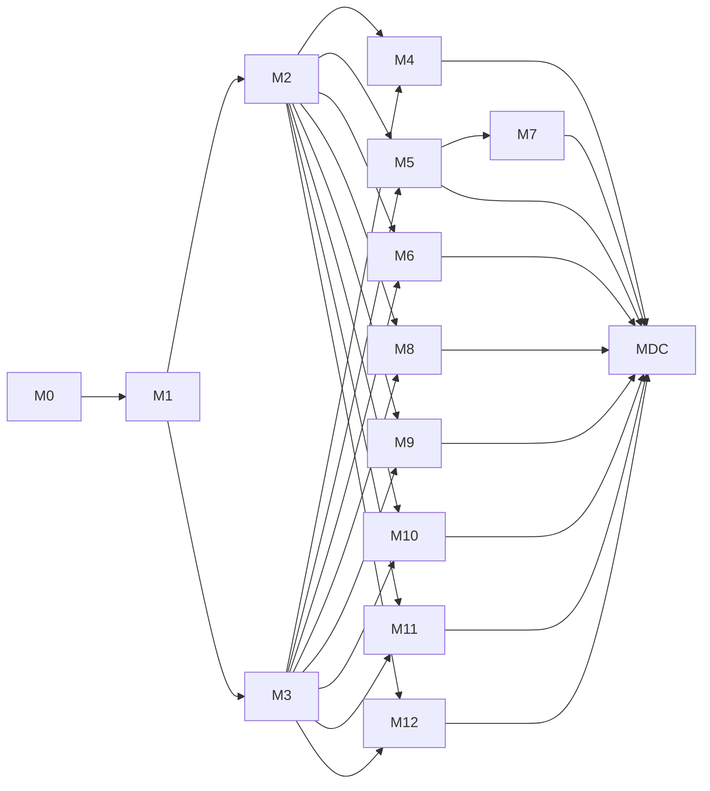

# Tasks: Unified Test Catalog Management Editor (OGC-949)

**Organization**: by **Milestone** (Constitution Principle IX), not user-story
phase. Detailed acceptance criteria are **authoritative in the linked Jira child
stories**; tasks reference them, they do not restate them.

> **Branch strategy revision (2026-06-11, maintainer direction)**: ONE feature
> branch (`feat/ogc-949-m0-methods-port` → `develop`, PR #3709) carries spec +
> all milestone implementation. Every "Create branch `feat/ogc-949-m{N}-…`" /
> "Open M{N} PR" task below is **superseded**: read them as "begin the
> milestone's commit series on the feature branch" / "update PR #3709's body
> with the milestone's AC checklist". Milestones remain the sequencing +
> verification unit.

**Elaboration tiers** (see plan.md):

- **Tier A — M0, M1**: full TDD breakdown now (RED → GREEN → verify → PR).
- **Tier B — M2..M12, M-DC**: one task per Jira child story + an **ELABORATE
  gate** as the first non-setup task. Story tasks expand into TDD sub-tasks only
  when the milestone starts. `/speckit.implement` on a Tier-B branch must run the
  ELABORATE gate before any implementation task.
- **Tier C — M13..M20 (v2)**: one DEFERRED stub per milestone; not on any branch.

**Task-ID ranges** (pre-allocated so ELABORATE inserts never renumber):
M0 `T001–T099` · M1 `T100–T199` · M2 `T200–T249` · M3 `T250–T299` ·
M4 `T300–T349` · M5 `T350–T449` · M6 `T450–T499` · M7 `T500–T599` ·
M8 `T600–T649` · M9 `T650–T699` · M10 `T700–T749` · M11 `T750–T799` ·
M12 `T800–T849` · M-DC `T850–T899` · v2 stubs `T900+`.

**Format**: `- [ ] T### [P?] [US#] [OGC-###] description — path (AC: OGC-### …)`.
`[P]` = parallelizable within its milestone. `[US#]` maps to spec user stories.

---

## Phase M0 — Reconciliation (Tier A) · branch `feat/ogc-949-m0-reconcile`

**Status: fully elaborated.** No user story (engineering). Blocks M1.
**Independent Test**: quickstart.md#m0.

- [x] T001 Create branch `feat/ogc-949-m0-methods-port` (off the spec branch, carrying the spec context; PR targets develop) and open a draft PR
- [x] T002 [P] Inventory PR #3706 (commit `c9b623391`) contents against develop — recorded in research.md §R1. **Finding**: 15 of 17 files port cleanly; 2 frontend files are demo-silnas-entangled (see T003)
- [x] T003 [OGC-750] Ported the test-catalog-scoped Methods substance — `testmethod/**` backend, `039-test-method-links.xml` (+base.xml), `Method`/`Method.hbm.xml`, `MethodCreate*`, `DisplayListController` endpoint, `MethodsSection.jsx`, 27 `en.json` keys. **Deliberately dropped** (port policy): `TestModifyEntry.jsx` Methods-tab mount (woven into demo-silnas compliance-Tabs UI absent on develop → editor mount deferred to M6/M2) and `SearchResultForm.jsx` (NCE/holding-time, unrelated). `MethodsSection.jsx` ships orphaned until M6 wires it.
- [x] T004 [OGC-750] Local backend compile BUILD SUCCESS. **DB-backed verification (changeset apply on clean DB + Methods tests + endpoint smoke) runs cold in CI Checkpoint-Backend** — authoritative signal on the PR.
- [x] T005 Open the Methods-port PR → develop
- [x] T006 [P] OGC-285 ↔ OGC-761 labels boundary recorded (consume OGC-285's `test_label_preset_link`) — research.md §R2
- [x] T007 [P] PR #3546 (admin SideNav) sequencing vs M2/OGC-927 — research.md §R4
- [x] T008 [P] v1 permission gate confirmed = `hasRole('ADMIN')` + UI menu hide, no OGC-384 dependency — research.md §R3, spec FR-004
- [x] T009 Jira discrepancies flagged for user action (OGC-747/927 child-count drift; OGC-940 sequencing) — research.md §R5
- [x] T010 M0 PR opened; decision records (R1–R5) committed on the spec/feature branch before M1

---

## Phase M1 — Schema migrations + backend foundation (Tier A) · branch `feat/ogc-949-m1-schema`

**Status: fully elaborated.** User story: **US1 (P1)**. Depends on M0.
**Independent Test**: quickstart.md#m1 — lossless migration on a populated DB.
Detailed ACs: Jira [OGC-936](https://uwdigi.atlassian.net/browse/OGC-936)–[OGC-939](https://uwdigi.atlassian.net/browse/OGC-939). Schema detail: data-model.md.

### Setup

- [x] T100 ~~Create branch `feat/ogc-949-m1-schema`~~ Superseded by single-branch strategy — M1 continues on `feat/ogc-949-m0-methods-port` (PR #3709)
- [x] T101 [P] Reconcile the existing `org.openelisglobal.unitofmeasure.UnitOfMeasure` entity against the master-list target — resolved in R9: **ALTER existing** (add code/ucum_code/is_active), never recreate (data-model.md translation table)

### RED — tests first

- [x] T102 [US1] Migration **losslessness test** — `ComponentBackfillMigrationTest` seeds legacy-shaped TEST/TEST_RESULT/RESULT_LIMITS rows with null component_id, runs `041-component-backfill.sql`, asserts pre/post counts equal, one PRIMARY per test, every row repointed, PRIMARY copies legacy shape, and **idempotency**. Green cold. (real tables; FRS aliases `test_range`/`test_select_list_option` — R9)
- [ ] T103 [P] [US1] ORM validation tests (failing) for new valueholders (`TestResultComponent`, `TestSampleHandling`, `PanelTest`, `TestSectionAssignment`, `TestActivationAcknowledgment`) — must run <5s, no DB — `src/test/java/org/openelisglobal/.../orm/`

### GREEN — Liquibase changesets (data-model.md ordering)

- [x] T110 [US1] [OGC-936] Changeset `040-test-domain-amr-whonet.xml`: `TEST.DOMAIN` (+CLINICAL backfill + CHECK), `test_amr_config` (+FK), `whonet_antibiotic_codes` — **shipped** commit `3ed42f06a` incl. `Test.java`/`Test.hbm.xml` `domain`; verified cold (TestServiceTest 41 green). **AMR flag reuses existing `test.antimicrobial_resistance`** — the originally-added `is_amr_test` was a duplicate, removed (research.md §R11). WHONET seed deferred (needs Madagascar source).
- [x] T111 [US1] [OGC-937] Changeset `041-result-components.xml`: `test_result_component` + PRIMARY-per-test backfill (`041-component-backfill.sql`); `component_id` FK on **RESULT_LIMITS** + **TEST_RESULT** + backfill; `test_result_interpretation` (new). Verified cold by T102.
- [x] T112 [US1] [OGC-938] Changeset `042-handling-uom-displayorder.xml`: `test_sample_handling` (FRS-grounded — **3** handling checkboxes, not 6) + inert `test_sample_handling_history` (D-09); ALTER `UNIT_OF_MEASURE` (+code/ucum_code/is_active — reused, not recreated); ALTER `SAMPLETYPE_TEST` (+display_order, deterministic row_number backfill). Applies cold; TestServiceTest green. `PANEL_ITEM` reused; multi-section junction deferred to M2 (R9)
- [x] T113 [US1] [OGC-939] Changeset `043-acknowledgment-terminology.xml`: `test_activation_acknowledgment`; `test_terminology_mapping` + `TEST.LOINC` backfill (one LOINC row per test). Applies cold; TestServiceTest green. Test-name localization REUSES existing LOCALIZATION/LOCALIZATION_VALUE (R9)
- [x] T114 [US1] Changesets `040`–`043` wired into `base.xml` in order

### GREEN — valueholders + DAOs + foundation services

- [ ] T120 [P] [US1] Valueholders (JPA/Hibernate annotations) for the new tables — `src/main/java/org/openelisglobal/testcatalog/valueholder/**`
- [ ] T121 [P] [US1] DAOs + DAOImpl for the new valueholders
- [ ] T122 [US1] Foundation service(s): test create requires `domain`, resolves units to master list (FR-011), creates PRIMARY component — `@Transactional` in service only

### Verify + PR

- [ ] T130 [US1] Make T102/T103 green; run `liquibase update` then `rollback` clean on a populated DB
- [ ] T131 [US1] Dry-run the migration against a production-like dump; record counts in the PR body
- [ ] T132 `mvn spotless:apply` + open M1 for review (may split into per-changeset PRs ≤2,500 LOC)

---

## Phase M2 — Editor scaffold + permissions + states (Tier B) · branch `feat/ogc-949-m2-scaffold`

**Status: in progress — shell + gate landed; clone (944) is a follow-up.** User story: **US2 (P1)**. Depends on M1. **M0 #3546 decision resolved: PR #3546 CLOSED, no sidenav dependency (research.md R4).**
**Independent Test**: quickstart.md#m2.

- [x] T200 (superseded — single branch; M2 continues on the feature branch / PR #3709)
- [x] T201 ELABORATE M2: contract base corrected to `/rest/test-catalog` (R10); editor-shell envelope shaped. Clone payload (944) deferred with that story.
- [x] T202 [US2] [OGC-941] Editor shell + SideNav routing + breadcrumb — `frontend/src/components/admin/testCatalog/TestCatalogEditor.jsx` + route in `Admin.jsx` (`/MasterListsPage/TestCatalogEditor/:testId?`) + SideNav entry in `AdminSideNav.jsx` + 19 en.json keys. Backend envelope `GET /rest/test-catalog/tests/{testId}` (`TestCatalogEditorRestController`).
- [x] T203 [US2] [OGC-942] Permission gating: REST `@PreAuthorize("hasRole('ADMIN')")`; UI entry under ADMIN SecureRoute. **`TestCatalogEditorRestControllerSecurityTest` green** — 401 unauth / 403 non-admin / 404 admin-reaches-controller.
- [x] T204 [US2] [OGC-943] Standard states: empty (no testId) / loading / error in the shell (no-permission handled by SecureRoute + API 403).
- [ ] T205 [US2] [OGC-944] Editor header CTAs present (Save / Save as new test… / Cancel); **clone modal + `POST /rest/test-catalog/tests/{id}/clone` is the remaining M2 follow-up** (buttons currently notify "ships with sections").
- [x] T206 [US2] M2 commits land on PR #3709 (single-branch)

---

## Phase M3 — Test List View + filters + pagination (Tier B)

**Status: in progress — list + filters + pagination + click-to-open landed; URL-state + extra filters are follow-ups.** User story: **US3 (P1)**.
**Independent Test**: quickstart.md#m3.

- [x] T250 (superseded — single branch / PR #3709)
- [x] T251 ELABORATE M3: `/rest/test-catalog/tests` list endpoint (domain/status/amr/search/page/pageSize → {page,pageSize,total,rows}).
- [x] T252 [US3] [OGC-945] Carbon DataTable, click-to-open row → editor `/TestCatalogEditor/{testId}`. (AC: OGC-945)
- [x] T253 [US3] [OGC-946] Domain + Status dropdown filters + name search (Section/SampleType/ResultType filters are follow-ups). (AC: OGC-946)
- [x] T254 [US3] [OGC-947] Carbon Pagination (server-side page/pageSize); URL-state sync is a follow-up. (AC: OGC-947)
- [x] T255 [US3] [OGC-948] Domain + AMR Tags render; **Coverage-incomplete Tag wired with Ranges/M7** (backend returns false for now). (AC: OGC-948)
- [x] T256 [US3] M3 commits land on PR #3709 (single-branch). Verified by `TestCatalogEditorBasicInfoIntegrationTest.listTests_filtersByDomainAndPaginates`.

---

## Phase M4 — Basic Info (Tier B) · branch `feat/ogc-949-m4-basicinfo` [P]

**Status: in progress — section reads/saves the M1 schema; modals + name editing are follow-ups.** User story: **US4 (P2)**.
**Independent Test**: `TestCatalogEditorBasicInfoIntegrationTest` (round-trip + 422 + 404) green cold.

- [x] T300 (superseded — single branch / PR #3709)
- [x] T301 ELABORATE M4: backend section pattern established — `GET`/`PUT /rest/test-catalog/tests/{id}/basic-info`.
- [ ] T302 [US4] [OGC-950] Name / Reporting Name / Code / Description — **read-only for now** (editing touches localization; follow-up). (AC: OGC-950)
- [x] T303 [US4] [OGC-951] Domain radio group + server-side enum validation (422 on invalid). Switch-confirmation **modal** is a follow-up (no destructive section-visibility change in v1 — fix M-04). (AC: OGC-951)
- [ ] T304 [US4] [OGC-952] AMR flag toggle persists (reuses `antimicrobial_resistance`); **conditional WHONET fields** are the follow-up. (AC: OGC-952)
- [x] T305 [US4] [OGC-953] Status flags (Active/Orderable) persist; activation-gate hook stubbed until M7 Ranges. (AC: OGC-953)
- [x] T306 [US4] M4 commits land on PR #3709 (single-branch)

Frontend: `BasicInfoSection.jsx` (form: Domain radio, AMR/Active/Orderable toggles, read-only name/code/description) wired into the shell's `basic-info` section. Backend: `TestCatalogEditorRestController` `basic-info` GET/PUT. Verified by the integration test above.

---

## Phase M5 — Sample & Results (Tier B) · branch `feat/ogc-949-m5-sample-results`

**Status: story-level — TDD elaboration pending.** User story: **US5 (P2)**. Depends on M2, M3. **Unblocks M7.** Heaviest section — pair with M7, same owner.
**Independent Test**: quickstart.md#m5.

- [ ] T350 Create branch `feat/ogc-949-m5-sample-results`; open draft PR
- [ ] T351 **ELABORATE M5**: re-run `/speckit.tasks` scoped to M5; extend contracts with the `sample-results` payload (components, options, interpretations); append quickstart.md#m5. Do NOT implement before this.
- [ ] T352 [US5] [OGC-961] Sample Types FilterableMultiSelect + Default ComboBox (AC: OGC-961)
- [ ] T353 [US5] [OGC-962] Result Components sub-table (compact + multi-component) (AC: OGC-962)
- [ ] T354 [US5] [OGC-963] Inline-add Unit ComboBox + master-list write (AC: OGC-963)
- [ ] T355 [US5] [OGC-964] Select List Options sub-table per component (AC: OGC-964)
- [ ] T356 [US5] [OGC-965] Result Interpretations table per component (AC: OGC-965)
- [ ] T357 [US5] [OGC-966] Add/Edit Interpretation modal (adaptive value field) (AC: OGC-966)
- [ ] T358 [US5] [OGC-967] Color dropdown + live preview + Copy-from-Test modal (AC: OGC-967)
- [ ] T359 [US5] [OGC-968] Per-component Accordion wrapper for multi-component tests (M-03) (AC: OGC-968)
- [ ] T360 [US5] Open M5 PR → develop

---

## Phase M6 — Methods (Tier B, port-verification) · branch `feat/ogc-949-m6-methods-port` [P]

**Status: story-level — code ported in M0; this milestone verifies + integrates into the editor.** User story: **US6 (P3)**. Depends on M2, M3 (code from M0).
**Independent Test**: quickstart.md#m6.

- [ ] T450 Create branch `feat/ogc-949-m6-methods-port`; open draft PR
- [ ] T451 **ELABORATE M6**: re-run `/speckit.tasks` scoped to M6; confirm the M0-ported Methods code mounts in the editor shell; append quickstart.md#m6. Do NOT change behavior before this.
- [ ] T452 [US6] [OGC-954] Verify Linked methods table + Link Method modal on develop (AC: OGC-954)
- [ ] T453 [US6] [OGC-955] Verify Create New Method inline form (Master Lists create + link) (AC: OGC-955)
- [ ] T454 [US6] [OGC-956] Verify Default method radio + Effective Date + Copy-from-Test (AC: OGC-956)
- [ ] T455 [US6] Open M6 PR → develop (port-verification, not reimplementation)

---

## Phase M7 — Ranges + Coverage Validation (Tier B) · branch `feat/ogc-949-m7-ranges`

**Status: story-level — TDD elaboration pending.** User story: **US7 (P2)**. Depends on M5 (`component_id`).
**Independent Test**: quickstart.md#m7 — neonatal bilirubin coverage + activation-ack audit.

- [ ] T500 Create branch `feat/ogc-949-m7-ranges`; open draft PR
- [ ] T501 **ELABORATE M7**: re-run `/speckit.tasks` scoped to M7; extend contracts with `ranges` + activation payloads; append quickstart.md#m7. Do NOT implement before this. (Reuse `org.openelisglobal.resultlimits.ResultLimit`.)
- [ ] T502 [US7] [OGC-969] Structured view (accordion per range type, grouped by sex) (AC: OGC-969)
- [ ] T503 [US7] [OGC-970] Add/Edit Range modal (critical adaptive fields) (AC: OGC-970)
- [ ] T504 [US7] [OGC-971] Coverage Validation panel (Male/Female cards, GAP/OVERLAP) (AC: OGC-971)
- [ ] T505 [US7] [OGC-972] Fill Gap + Copy-to-other-sex actions (AC: OGC-972)
- [ ] T506 [US7] [OGC-973] Activation Acknowledgment modal + audit writes (H-03 + R-01) (AC: OGC-973)
- [ ] T507 [US7] [OGC-974] Table view (sortable Carbon DataTable + bulk actions) (AC: OGC-974)
- [ ] T508 [US7] [OGC-975] Visual view (demographic selector + stacked bars) (AC: OGC-975)
- [ ] T509 [US7] [OGC-976] `applicable_range` API endpoint for result-entry consumers (AC: OGC-976)
- [ ] T510 [US7] Wire the M4 activation-gate stub to the real coverage check
- [ ] T511 [US7] Open M7 PR → develop

---

## Phase M8 — Sample Storage (Tier B) · branch `feat/ogc-949-m8-storage` [P]

**Status: story-level — TDD elaboration pending.** User story: **US8 (P3)**. Depends on M2, M3.
**Independent Test**: quickstart.md#m8.

- [ ] T600 Create branch `feat/ogc-949-m8-storage`; open draft PR
- [ ] T601 **ELABORATE M8**: re-run `/speckit.tasks` scoped to M8; extend contracts with the `storage` payload; append quickstart.md#m8. Do NOT implement before this.
- [ ] T602 [US8] [OGC-977] Storage Conditions + Max Duration + Stability Notes (AC: OGC-977)
- [ ] T603 [US8] [OGC-978] Special Handling + Disposal Method/Timeframe + Special Instructions (AC: OGC-978)
- [ ] T604 [US8] [OGC-979] Override Restricted toggle + in-progress-order behavior (M-05) (AC: OGC-979)
- [ ] T605 [US8] Open M8 PR → develop

---

## Phase M9 — Panels (Tier B) · branch `feat/ogc-949-m9-panels` [P]

**Status: story-level — TDD elaboration pending.** User story: **US9 (P3)**. Depends on M2, M3.
**Independent Test**: quickstart.md#m9.

- [ ] T650 Create branch `feat/ogc-949-m9-panels`; open draft PR
- [ ] T651 **ELABORATE M9**: re-run `/speckit.tasks` scoped to M9; extend contracts with the `panels` payload; append quickstart.md#m9. Do NOT implement before this.
- [ ] T652 [US9] [OGC-980] Add-panel typeahead picker (FilterableMultiSelect) (AC: OGC-980)
- [ ] T653 [US9] [OGC-981] Create New Panel button + inline form + post-creation notification (AC: OGC-981)
- [ ] T654 [US9] [OGC-982] Expandable rows + position editor (drag/numeric/keyboard) (AC: OGC-982)
- [ ] T655 [US9] Open M9 PR → develop

---

## Phase M10 — Terminology Mappings (Tier B) · branch `feat/ogc-949-m10-terminology` [P]

**Status: story-level — TDD elaboration pending.** User story: **US10 (P3)**. Depends on M2, M3.
**Independent Test**: quickstart.md#m10.

- [ ] T700 Create branch `feat/ogc-949-m10-terminology`; open draft PR
- [ ] T701 **ELABORATE M10**: re-run `/speckit.tasks` scoped to M10; extend contracts with the `terminology` payload; append quickstart.md#m10. Do NOT implement before this.
- [ ] T702 [US10] [OGC-957] Mappings table (Source/Code/Relationship/Actions) (AC: OGC-957)
- [ ] T703 [US10] [OGC-958] Add Mapping form (Source + Code + Relationship) (AC: OGC-958)
- [ ] T704 [US10] Open M10 PR → develop

---

## Phase M11 — Analyzers read-only (Tier B) · branch `feat/ogc-949-m11-analyzers` [P]

**Status: story-level — TDD elaboration pending.** User story: **US11 (P3)**. Depends on M2, M3.
**Independent Test**: quickstart.md#m11.

- [ ] T750 Create branch `feat/ogc-949-m11-analyzers`; open draft PR
- [ ] T751 **ELABORATE M11**: re-run `/speckit.tasks` scoped to M11; append quickstart.md#m11. Reuse `org.openelisglobal.analyzer` field mappings. Do NOT implement before this.
- [ ] T752 [US11] [OGC-959] Read-only analyzers table derived from test-code mappings (AC: OGC-959)
- [ ] T753 [US11] [OGC-960] Info card + empty state (AC: OGC-960)
- [ ] T754 [US11] Open M11 PR → develop

---

## Phase M12 — Display Order (Tier B) · branch `feat/ogc-949-m12-display-order` [P]

**Status: story-level — TDD elaboration pending.** User story: **US12 (P3)**. Depends on M2, M3.
**Independent Test**: quickstart.md#m12.

- [ ] T800 Create branch `feat/ogc-949-m12-display-order`; open draft PR
- [ ] T801 **ELABORATE M12**: re-run `/speckit.tasks` scoped to M12; extend contracts with the `display-order` payload; append quickstart.md#m12. Do NOT implement before this.
- [ ] T802 [US12] [OGC-983] Sample Type ComboBox + initial list render (AC: OGC-983)
- [ ] T803 [US12] [OGC-984] Drag-drop reorder + keyboard arrows (AC: OGC-984)
- [ ] T804 [US12] [OGC-985] Auto-save on drop → `SAMPLETYPE_TEST.display_order` (FRS alias `test_sample_type.display_order`) (AC: OGC-985)
- [ ] T805 [US12] Open M12 PR → develop

---

## Phase M-DC — Legacy decommission + release readiness (Tier B) · branch `feat/ogc-949-mdc-decommission`

**Status: story-level — TDD elaboration pending.** No user story (release gate). Depends on **M4–M12 all merged**.
**Independent Test**: full regression + grep gate (no legacy controller/JSX remains) + Playwright suite.

- [ ] T850 Create branch `feat/ogc-949-mdc-decommission`; open draft PR
- [ ] T851 **ELABORATE M-DC**: re-run `/speckit.tasks` scoped to M-DC — enumerate every legacy controller/JSX to remove and every route to redirect; append quickstart.md#mdc. Do NOT delete before this inventory is reviewed.
- [ ] T852 [OGC-940] Remove legacy Test/TestSection/Panel/Method admin controllers + REST under `src/main/java/org/openelisglobal/testconfiguration/**` (AC: OGC-940)
- [ ] T853 [OGC-940] Remove legacy React admin under `frontend/src/components/admin/testManagementConfigMenu/**`; redirect old routes to the new editor (AC: OGC-940)
- [ ] T854 [OGC-940] FR-D01: remove the 5 stale `editor.sidenav.*` i18n keys from `en.json`
- [ ] T855 Grep gate: assert no legacy test-catalog admin controller/JSX remains; run full backend + Jest + Playwright suites
- [ ] T856 Open M-DC PR → develop (v1 release-readiness gate)

---

## Phase v2 — Deferred (Tier C) — not elaborated

Each requires a `/speckit.plan` revision + scoped `/speckit.tasks` before any
implementation. These stubs exist only for traceability; they are on no branch.

- [ ] T900 DEFERRED [OGC-760] M13 Test-Reagent linkage backend — not elaborated
- [ ] T901 DEFERRED [OGC-761] M14 Labels section (consumes OGC-285 presets) — not elaborated
- [ ] T902 DEFERRED [OGC-762] M15 Reagents section (blocked by M13) — not elaborated
- [ ] T903 DEFERRED [OGC-763] M16 Alerts section (authoring here; delivery via Notification system) — not elaborated
- [ ] T904 DEFERRED [OGC-764] M17 Reflex & Calc read-only — not elaborated
- [ ] T905 DEFERRED [OGC-765] M18 Compliance section (blocked by OGC-528 on develop) — not elaborated
- [ ] T906 DEFERRED [OGC-766] M19 Sample Storage audit history (activates v1 triggers) — not elaborated
- [ ] T907 DEFERRED [OGC-767] M20 Localization Hardening — not elaborated

---

## Dependencies & parallelization

- **Serial spine**: M0 → M1 → (M2 ∥ M3) → M5 → M7 → … → M-DC.
- **Parallel lane after M2+M3**: M4, M6, M8, M9, M10, M11, M12 (independent).
- **M5 → M7** sequenced (component_id); same owner recommended.
- **M-DC** waits on all section milestones (M4–M12) merged.
- **v2 (M13–M20)** waits on M-DC; M18 additionally waits on OGC-528 reaching develop.

## Implementation strategy

- **MVP = M0 + M1 + M2 + M3** (foundation: schema migrated, editor shell + list
  view usable, admin-gated) — demonstrable before any section ships.
- Then the **P2 chain** (M4, M5→M7) delivers the clinically meaningful core.
- Section lane (M6, M8–M12) fans out in parallel.
- **M-DC last** — delete legacy only once the replacement is proven (FR-001/Principle X).
