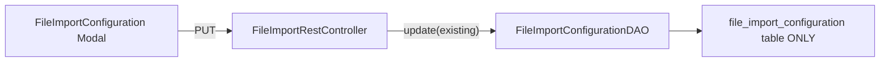
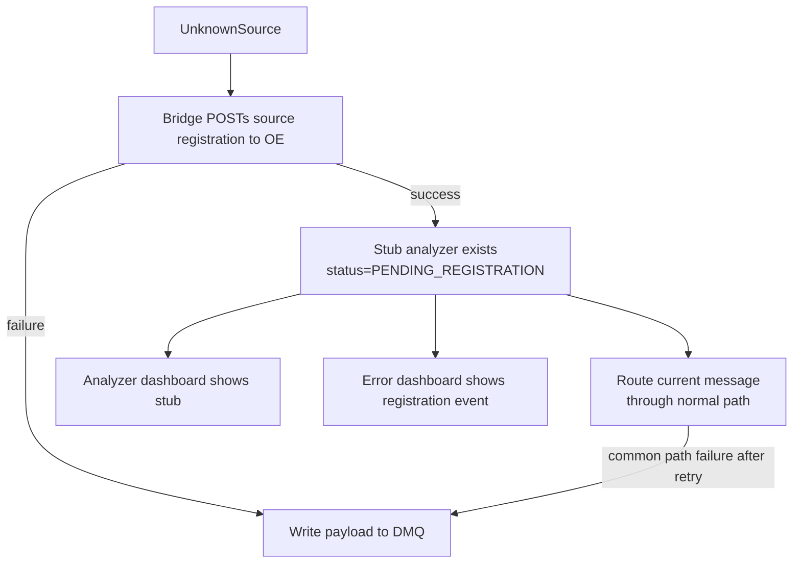

# OGC-526: Analyzer Bridge File Config Propagation Fix

## Probable Root Cause (strong inference, not yet confirmed at runtime)

When a user edits file import config via the "Configure File" UI modal, the save
path is:



Based on code trace, this path does **not** sync unified FILE fields onto the
`Analyzer` entity, and does **not** call `registerWithBridge()`. So:

- The `analyzer.import_directory` / `file_pattern` / `column_mappings_json` /
  `file_format` columns stay stale
- The bridge never learns about the directory change
- The bridge's file watcher keeps watching the old directory (or nothing)

The **working** path (create-from-profile) does both sync steps explicitly in
`[FileImportServiceImpl.autoCreateFromProfile()](src/main/java/org/openelisglobal/analyzer/service/FileImportServiceImpl.java)`
at lines 681-699.

**Important caveat:** This is a strong inference from code structure, not a
runtime-confirmed fact. Herbert's report ("the update does not take effect") is
ambiguous enough to cover either "save returns 200 but bridge ignores it" or
"save itself fails silently." Phase 0 exists to confirm which scenario applies
before writing the fix.

**Bridge runtime watcher clarification:** The bridge CAN update FILE watchers at
runtime — but only when OE pushes a registration via the bridge's
`/api/analyzers/register` endpoint (see
`[AnalyzerRegistrationController.java](tools/openelis-analyzer-bridge/src/main/java/org/itech/ahb/controller/AnalyzerRegistrationController.java)`
lines 144-154, which calls `fileWatcher.addWatchDirectory()`). The bridge does
NOT poll the database or listen for DB changes. So the gap is not "bridge can't
hot-reload" — it's "nothing triggers the registration push after a file-config
save."

## Possible simpler root cause: migration not run

If Liquibase changeset `007-unify-analyzer-transport-config` did not run on the
deployed server (e.g., OE was deployed without a clean restart that triggers
Liquibase), then the unified columns (`import_directory`, `file_pattern`, etc.)
don't exist on the `analyzer` table at all. In that case, the bridge startup
registrar reads from the old `file_import_configuration` table, save works
correctly into that table, but the bridge never re-reads after startup. One
`SELECT` on `databasechangelog` resolves this. Phase 0 checks this locally;
Herbert or ops should check the deployed server.

## Scope

**In scope (Bug 1 — probable code defect, pending Phase 0 confirmation):**

- `FileImportRestController` PUT and POST handlers missing Analyzer entity sync
  and bridge re-registration
- Targeted E2E test that reproduces the broken update-then-verify path

**In scope (Bug 2 — unknown source auto-discovery):**

- Add `PENDING_REGISTRATION` to `AnalyzerStatus` enum so auto-discovered
  analyzers are visually distinct on the dashboard
- Add a lightweight OE endpoint for the bridge to report discovered sources
- Bridge POSTs discovered source metadata (IP, protocol hint, transport) to OE
  on first encounter
- OE creates a stub `Analyzer` in `PENDING_REGISTRATION` with IP pre-filled;
  admin completes configuration
- Also create an `AnalyzerError` entry for the error dashboard (visibility in
  both surfaces)

**Out of scope:**

- Rewriting the dual-table architecture (file_import_configuration + analyzer
  unified fields)
- Auto-routing messages to pending-registration stubs (clinical safety: only
  fully configured analyzers route)
- Migration/upgrade tooling for pre-bridge deployments

## Phase 0: Verify preconditions before coding

Before writing any fix, confirm the actual failure mode. This takes 5 minutes
and prevents building the wrong solution.

**Step 1: Confirm migration ran locally**

```sql
SELECT id, author, filename, dateexecuted
FROM databasechangelog
WHERE id LIKE '%007-unify%' OR id LIKE '%013-007%';
```

If zero rows: the unified columns don't exist, and the fix is "ensure migration
runs" — not a code change.

**Step 2: Trace the save request end-to-end locally**

On the running harness stack, use the API directly (same path the UI takes):

```bash
# 1. Find a FILE analyzer ID
curl -sk https://localhost/api/OpenELIS-Global/rest/analyzer/analyzers \
  | jq '.analyzers[] | select(.name | test("QuantStudio")) | {id, name, importDirectory}'

# 2. Read its file config
curl -sk https://localhost/api/OpenELIS-Global/rest/analyzer/file-import/configurations/analyzer/<ID> \
  | jq '{id, importDirectory, filePattern}'

# 3. Update importDirectory to a new value
curl -sk -X PUT \
  https://localhost/api/OpenELIS-Global/rest/analyzer/file-import/configurations/<CONFIG_ID> \
  -H 'Content-Type: application/json' \
  -d '{"importDirectory":"/data/analyzer-imports/test-propagation/incoming",
       "filePattern":"*.xls","fileFormat":"EXCEL","active":true,"hasHeader":true,"delimiter":","}'

# 4. Re-read file config (should show new value)
curl -sk https://localhost/api/OpenELIS-Global/rest/analyzer/file-import/configurations/analyzer/<ID> \
  | jq '.importDirectory'

# 5. Read unified Analyzer entity (should show new value IF propagation works)
curl -sk https://localhost/api/OpenELIS-Global/rest/analyzer/analyzers/<ID> \
  | jq '.importDirectory'
```

If step 4 shows the new value but step 5 shows the old value: confirms the
propagation gap. If neither updated: the save itself is broken (different bug).
If both updated: the issue is bridge-side only.

**Step 3: Confirm bridge watcher behavior on registration push**

After confirming the DB state, manually push a registration to the bridge and
check its logs:

```bash
curl -sk -X POST https://localhost:8443/api/analyzers/register \
  -H 'Content-Type: application/json' \
  -d '{"oeAnalyzerId":"<id>","sourceId":"/data/analyzer-imports/new-path/incoming","name":"Test","protocol":"FILE","filePattern":"*.xlsx"}'
```

If the bridge logs show "Registered watch directory:
/data/analyzer-imports/new-path/incoming" — the bridge hot-reload works, the gap
is just that OE never calls it.

## Phase 1: Reproduce with a targeted test (Red)

Extend **existing demo and foundational tests** rather than creating new spec
files. The update-then-verify flow is useful demo content showing the full
lifecycle.

**Primary: extend
`[file-import-ui.spec.ts](frontend/playwright/tests/demo/harness/file-import-ui.spec.ts)`
(demo video test)**

This spec already walks through: create analyzer, configure file import, test
connection. Add steps after the initial save:

- **Step 8b (new):** Re-open the Configure File modal, change the directory
  path, save again
- **Step 8c (new):** Read `GET /rest/analyzer/analyzers/{id}` via API and assert
  `importDirectory` matches the updated value

This reproduces Herbert's exact scenario and produces a useful video artifact
showing create, configure, update, verify.

**Secondary: extend
`[file-import.spec.ts](frontend/playwright/tests/foundational/harness/file-import.spec.ts)`
persistence test (~line 73)**

The existing API-level update + re-read test gets one additional assertion:
after the PUT and file-config re-read, also read the unified Analyzer entity and
assert `importDirectory` matches.

Step 8c / the additional assertion will fail before the fix, confirming the
propagation gap.

## Phase 2: Fix the propagation gap (Green)

The fix goes in the service layer so that any caller of `FileImportService`
insert/update gets the propagation behavior, not just the REST controller.

**Approach: Override insert/update in `FileImportServiceImpl`**

In
`[FileImportServiceImpl.java](src/main/java/org/openelisglobal/analyzer/service/FileImportServiceImpl.java)`,
override `insert()` and `update()` to sync unified FILE fields onto the
`Analyzer` entity and trigger bridge re-registration after the DAO write
succeeds. The class already has `@Autowired AnalyzerService analyzerService`. It
needs `BridgeRegistrationService` injected as well.

After the base `super.insert(config)` / `super.update(config)`:

```java
private void syncToAnalyzerAndBridge(FileImportConfiguration config, String sysUserId) {
    try {
        Analyzer analyzer = analyzerService.get(String.valueOf(config.getAnalyzerId()));
        if (analyzer != null) {
            analyzer.setImportDirectory(config.getImportDirectory());
            analyzer.setFilePattern(config.getFilePattern());
            analyzer.setColumnMappings(config.getColumnMappings());
            analyzer.setFileFormat(config.getFileFormat());
            analyzer.setSysUserId(sysUserId);
            analyzerService.update(analyzer);

            bridgeRegistrationService.registerFile(
                analyzer.getId(), analyzer.getName(),
                config.getImportDirectory(), config.getFilePattern(),
                config.getColumnMappings());
        }
    } catch (Exception e) {
        LogEvent.logWarn(this.getClass().getSimpleName(), "syncToAnalyzerAndBridge",
            "Failed to sync FILE config to Analyzer/bridge: " + e.getMessage());
    }
}
```

This mirrors the existing pattern in `autoCreateFromProfile()` (lines 681-699 of
the same file) and puts the sync next to the only other place that already does
it, making both paths consistent.

**Why service, not controller:** Any future caller of
`fileImportService.update()` (API, scheduled job, migration) automatically gets
the propagation. The `autoCreateFromProfile` method in this same class already
does the identical sync, so the pattern is already established here.
`BridgeRegistrationService` is a `@Service` — injecting it into another service
is standard Spring wiring, not a layered architecture violation (it's a
transport-level service, not a controller concern).

**Files to change:**

- `[FileImportServiceImpl.java](src/main/java/org/openelisglobal/analyzer/service/FileImportServiceImpl.java)`
  — override `insert()`/`update()`, add `syncToAnalyzerAndBridge` method, inject
  `BridgeRegistrationService`
- `[FileImportService.java](src/main/java/org/openelisglobal/analyzer/service/FileImportService.java)`
  — no interface change needed (insert/update are inherited from
  `BaseObjectService`)

## Phase 3: Verify the fix (Green confirmation)

Re-run the Phase 1 test. Steps 5-6 should now pass:

- `GET /rest/analyzer/analyzers/{id}` returns updated `importDirectory`
- Bridge registration reflects the new watch directory

Also re-run the existing test suite to ensure no regressions:

- `file-import.spec.ts` (foundational persistence tests)
- `file-import-ui.spec.ts` (demo UI flow)
- `analyzer-demo-flow.spec.ts` (full FILE demo flows)

## Phase 4: Bug 2 — Unknown source registration

The bridge should treat an unknown source as a registration problem first, not a
long-lived pending-processing state. The flow is:

- unknown source detected
- attempt source registration in OE
- if registration succeeds, route the current message immediately through the
  normal common path
- if registration fails, write the payload to DMQ and surface the failure

### Design



### OE side changes

**1. Add `PENDING_REGISTRATION` to `AnalyzerStatus` enum**

In
`[Analyzer.java](src/main/java/org/openelisglobal/analyzer/valueholder/Analyzer.java)`,
add `PENDING_REGISTRATION` to the `AnalyzerStatus` enum. This status means
"bridge discovered an unknown source; admin needs to complete configuration."
The dashboard already renders status badges per-analyzer — this just adds a new
value.

**2. Add `UNREGISTERED_SOURCE` to `AnalyzerError.ErrorType` enum**

In
`[AnalyzerError.java](src/main/java/org/openelisglobal/analyzer/valueholder/AnalyzerError.java)`,
add `UNREGISTERED_SOURCE`. This gives error dashboard visibility alongside the
stub.

**3. Add source-registration endpoint to `AnalyzerRestController`**

New endpoint: `POST /rest/analyzer/discovered-sources`

Request body (what the bridge sends):

```json
{
  "sourceId": "35.82.68.83",
  "protocol": "ASTM",
  "protocolHint": "GeneXpert PC",
  "transport": "TCP"
}
```

Behavior:

- Check if an `Analyzer` with this `ip_address` already exists → if yes, return
  its ID and status
- If not, create a stub `Analyzer` with:
  - `ip_address` = sourceId
  - `status` = `PENDING_REGISTRATION`
  - `name` = protocolHint or "Unknown Analyzer (sourceId)" as placeholder
  - All other fields null/default
- Also create an `AnalyzerError` with `errorType = UNREGISTERED_SOURCE`,
  `severity = WARNING`, `errorMessage` containing the source details
- Return the created/existing analyzer ID plus whether registration is
  sufficient to proceed with immediate routing

This endpoint is idempotent: the bridge can call it on every unknown message and
OE will only create one stub per unique source IP.

**4. Liquibase migration**

Add the `PENDING_REGISTRATION` status value to the check constraint if one
exists, or rely on the `@Enumerated(EnumType.STRING)` JPA mapping (Hibernate
stores the string directly, no DDL constraint to update unless there's a CHECK
constraint).

### Bridge side changes

**5. Bridge attempts source registration on unknown source**

In
`[MessageNormalizer.java](tools/openelis-analyzer-bridge/src/main/java/org/itech/ahb/normalizer/MessageNormalizer.java)`,
when `resolvedAnalyzerId` is null/blank (~line 150):

- POST to OE's discovered-sources endpoint with `sourceId`, `protocol`,
  `protocolHint`, `transport`
- Use the existing `HttpForwardingRouter`'s HTTP client configuration (OE base
  URL is already configured)
- On success:
  - log the created/existing analyzer ID
  - resolve the source again from the refreshed registration state
  - if resolution now succeeds, continue routing the current message through the
    normal path immediately
  - if resolution still fails, write the payload to DMQ with reason
    `SOURCE_REGISTRATION_INCOMPLETE`
- On failure (OE unreachable or registration endpoint rejects), write the
  payload to DMQ with reason `SOURCE_REGISTRATION_FAILED`

**6. Add filesystem DMQ as the final destination**

The bridge already uses filesystem quarantine patterns for FILE processing
failures. Reuse that approach for a transport-agnostic DMQ:

- configurable directory, e.g. `/data/bridge-dead-letters`
- one file per failed payload
- sidecar metadata file or embedded metadata containing:
  - sourceId
  - sourcePort
  - protocol
  - transport
  - protocolHint
  - timestamp
  - failure reason

DMQ is used only for:

- source registration failure / incomplete registration after the attempted
  registration step
- normal routing failures after the existing retry policy is exhausted

It is **not** the primary path for unknown sources when registration succeeds.

### What the admin sees

- **Analyzer Dashboard:** New row with status badge `PENDING_REGISTRATION`, name
  like "GeneXpert PC (unregistered)", IP already filled in
- **Error Dashboard:** `UNREGISTERED_SOURCE` warning with the source IP and
  protocol hint
- **Admin action:** Click the stub → Edit → select plugin type, fill name,
  complete config → Save → status transitions to `SETUP`/`ACTIVE`, bridge
  registration fires automatically via the existing `registerWithBridge` path

### What stays the same

- If the registration attempt succeeds sufficiently to bind the source, the
  triggering message goes through the normal message path immediately
- Common-path errors remain common-path errors; they are unrelated to
  registration state and use the same retry/DLQ behavior
- Existing analyzer CRUD, registration, and dashboard behavior is unchanged
- The bridge-to-OE HTTP path reuses the existing forwarding client configuration

## Deliverable order

1. Verify preconditions locally — migration, save trace, bridge registration
   (Phase 0)
2. Write failing test for Bug 1 (Phase 1) — only if Phase 0 confirms the
   propagation gap
3. Apply file-config propagation fix in `FileImportServiceImpl` (Phase 2)
4. Confirm Bug 1 test passes + run existing suite (Phase 3)
5. Implement unknown source registration: OE endpoint + bridge POST + status
   enum (Phase 4)
6. Add bridge DMQ for registration/common-path terminal failures
7. Format, commit, push, monitor CI

Phases 1-3 (Bug 1), Phase 4 (Bug 2 registration), and Phase 5 (DMQ) are separate
commits on the same branch for independent reviewability.

If Phase 0 reveals the migration didn't run (locally or on the deployed server),
the immediate fix is ensuring the migration executes — the code fix still
applies but may be lower priority.
