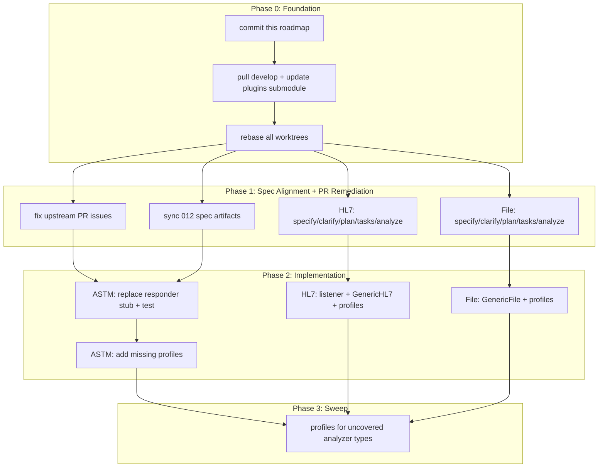

# Madagascar Analyzer Roadmap V2

**Supersedes**:
[madagascar-profile-streams-roadmap.md](specs/roadmaps/madagascar-profile-streams-roadmap.md)
(v1) **Companion**:
[madagascar-atlassian-alignment.md](specs/roadmaps/madagascar-atlassian-alignment.md)
**Date**: 2026-03-05

This document is both the execution plan and the daily operational roadmap for
Madagascar analyzer integration. The first execution step is to commit this file
to `specs/roadmaps/madagascar-analyzer-roadmap-v2.md`.

## Source-of-Truth Links

### Cross-Stream

- [Confluence: Analyzer Integration Tracker](https://uwdigi.atlassian.net/wiki/spaces/mdgoe/pages/1097531396/OpenELIS+Global+Analyzer+Integration+Tracker)
- [Confluence: Workplan](https://uwdigi.atlassian.net/wiki/spaces/mdgoe/pages/1111523331/Workplan)
- [Confluence: 2026-03-05 Meeting Notes](https://uwdigi.atlassian.net/wiki/spaces/mdgoe/pages/1127153666/2026-03-05+Meeting+notes)
- [specs/roadmaps/madagascar-profile-streams-roadmap.md](specs/roadmaps/madagascar-profile-streams-roadmap.md)
  (v1, superseded by this document)
- [specs/roadmaps/madagascar-atlassian-alignment.md](specs/roadmaps/madagascar-atlassian-alignment.md)
- [specs/011-madagascar-analyzer-integration/spec.md](specs/011-madagascar-analyzer-integration/spec.md)
  (umbrella)

### ASTM

- [specs/012-generic-astm-plugin-profiles/spec.md](specs/012-generic-astm-plugin-profiles/spec.md)
  — Status: Draft, has uncommitted changes
- [specs/012-generic-astm-plugin-profiles/plan.md](specs/012-generic-astm-plugin-profiles/plan.md)
- [specs/012-generic-astm-plugin-profiles/tasks.md](specs/012-generic-astm-plugin-profiles/tasks.md)
  — M1 mostly done, M2 partial, M3/M4 unchecked
- [specs/012-generic-astm-plugin-profiles/contracts/analyzer-profiles-api.yaml](specs/012-generic-astm-plugin-profiles/contracts/analyzer-profiles-api.yaml)
  — has uncommitted changes
- [projects/analyzer-profiles/astm/genexpert-astm.json](projects/analyzer-profiles/astm/genexpert-astm.json)
- [src/main/java/org/openelisglobal/analyzerimport/analyzerreaders/ASTMAnalyzerReader.java](src/main/java/org/openelisglobal/analyzerimport/analyzerreaders/ASTMAnalyzerReader.java)
- Jira: [OGC-337](https://uwdigi.atlassian.net/browse/OGC-337),
  [OGC-335](https://uwdigi.atlassian.net/browse/OGC-335)

### HL7

- **No spec artifacts exist yet** — `specs/013-`\* directory does not exist
- [projects/analyzer-profiles/hl7/mindray-bc5380.json](projects/analyzer-profiles/hl7/mindray-bc5380.json)
- [projects/analyzer-profiles/hl7/mindray-bs360e.json](projects/analyzer-profiles/hl7/mindray-bs360e.json)
- [plugins/analyzers/GenericHL7/README.md](plugins/analyzers/GenericHL7/README.md)
- [plugins/analyzers/GenericHL7/ARCHITECTURE.md](plugins/analyzers/GenericHL7/ARCHITECTURE.md)
- [specs/011-madagascar-analyzer-integration/research/hl7-analyzer-messaging-validation.md](specs/011-madagascar-analyzer-integration/research/hl7-analyzer-messaging-validation.md)
  (research from umbrella)
- [specs/012-generic-astm-plugin-profiles/.tmp/OGC-325 — HL7 Analyzer Mapping Addendum](specs/012-generic-astm-plugin-profiles/.tmp/)
  (design reference stashed in 012)
- [HL7 Analyzer Mapping design reference](https://caseyi.github.io/openelis-work/#/analyzer-integration/hl7-analyzer-mapping)
- Jira: [OGC-325](https://uwdigi.atlassian.net/browse/OGC-325),
  [OGC-326](https://uwdigi.atlassian.net/browse/OGC-326),
  [OGC-327](https://uwdigi.atlassian.net/browse/OGC-327), optional
  [OGC-336](https://uwdigi.atlassian.net/browse/OGC-336)

### File Import

- **No spec artifacts exist yet** — `specs/014-`\* directory does not exist
- [frontend/src/components/analyzers/AnalyzerForm/AnalyzerForm.jsx](frontend/src/components/analyzers/AnalyzerForm/AnalyzerForm.jsx)
- [frontend/src/components/analyzers/FileImportConfiguration/FileImportConfiguration.jsx](frontend/src/components/analyzers/FileImportConfiguration/FileImportConfiguration.jsx)
- [frontend/src/components/analyzers/constants.js](frontend/src/components/analyzers/constants.js)
- [src/main/java/org/openelisglobal/analyzerimport/analyzerreaders/FileAnalyzerReader.java](src/main/java/org/openelisglobal/analyzerimport/analyzerreaders/FileAnalyzerReader.java)
- [src/main/java/org/openelisglobal/analyzer/service/FileImportServiceImpl.java](src/main/java/org/openelisglobal/analyzer/service/FileImportServiceImpl.java)
- [Flat File Analyzer Config design reference](https://caseyi.github.io/openelis-work/#/analyzer-integration/flat-file-analyzer-config)
- [Analyzer File Upload design reference](https://caseyi.github.io/openelis-work/#/analyzer-integration/analyzer-file-upload)
- Jira: [OGC-324](https://uwdigi.atlassian.net/browse/OGC-324),
  [OGC-329](https://uwdigi.atlassian.net/browse/OGC-329),
  [OGC-344](https://uwdigi.atlassian.net/browse/OGC-344),
  [OGC-348](https://uwdigi.atlassian.net/browse/OGC-348),
  [OGC-350](https://uwdigi.atlassian.net/browse/OGC-350),
  [OGC-351](https://uwdigi.atlassian.net/browse/OGC-351),
  [OGC-417](https://uwdigi.atlassian.net/browse/OGC-417),
  [OGC-418](https://uwdigi.atlassian.net/browse/OGC-418)

## Validated Direction

- Keep the existing parallel worktree model. The HL7 and File worktrees are
  implementation lanes, not disposable coordination artifacts.
- Treat the
  [Analyzer Integration Tracker](https://uwdigi.atlassian.net/wiki/spaces/mdgoe/pages/1097531396/OpenELIS+Global+Analyzer+Integration+Tracker)
  as the freshest cross-project source of truth.
- Scope the ASTM lane to GeneXpert bidirectional **results** first, then
  polish/test GenericASTM and add missing ASTM profiles. Defer additional
  bidirectional capabilities.
- Wondfo belongs to the **File lane** (CSV first, per OGC-344). ASTM path
  (OGC-345) is deferred and blocked by OGC-344.
- Keep the generic-file-first direction for the File lane, but ground it in the
  real existing file-import/admin code rather than treating the repo as
  greenfield.
- HL7 and File lanes **must not begin implementation** until their SpecKit
  coordination specs are created, clarified, planned, and tasked.

## Analyzer Matrix

HJRA + LA2M site focus. `LA2M Central` is a site label, not an analyzer.

| Analyzer           | Primary Stream | Jira    | Plugin Status      | Profile Status                   | Confidence |
| ------------------ | -------------- | ------- | ------------------ | -------------------------------- | ---------- |
| GeneXpert XVI      | ASTM           | OGC-335 | GenericASTM exists | `genexpert-astm.json` exists     | High       |
| Mindray BC-5380    | HL7            | OGC-327 | GenericHL7 planned | `mindray-bc5380.json` exists     | High       |
| Mindray BS-200     | HL7            | OGC-326 | GenericHL7 planned | Missing (bs360e may be reusable) | High       |
| Mindray BS-300     | HL7            | OGC-326 | GenericHL7 planned | Missing                          | Medium     |
| QuantStudio 7 Flex | FILE           | OGC-348 | No GenericFile yet | Missing                          | High       |
| QuantStudio 5      | FILE           | OGC-348 | No GenericFile yet | Missing                          | High       |
| Wondfo Finecare    | FILE (CSV)     | OGC-344 | No GenericFile yet | Missing                          | Medium     |
| FluoroCycler XT    | FILE           | OGC-351 | No GenericFile yet | Missing                          | Low        |
| Tecan Infinite F50 | FILE           | OGC-417 | No GenericFile yet | Missing                          | Low        |
| Multiskan FC       | FILE           | OGC-418 | No GenericFile yet | Missing                          | Low        |
| Attune CytPix      | FILE           | OGC-350 | No GenericFile yet | Missing                          | Low        |

### Confidence Notes

- **BS-300**: Likely shares HL7 interface with BS-200, but not explicitly
  validated in the same Jira ticket set. Shared profile is a design assumption,
  not a settled fact.
- **Wondfo**: OGC-344 (CSV) is the primary path. OGC-345 (ASTM) is explicitly
  blocked by OGC-344. Do not treat as ASTM.
- **FluoroCycler XT**: Native `.at` files are not parseable; CSV export or LIMS
  protocol still unresolved (OGC-351).
- **Attune CytPix**: FCS-only output; middleware or preprocessing likely
  required (OGC-350).
- **Tecan F50, Multiskan FC**: Low-confidence specs, no real exports yet
  (OGC-417, OGC-418).

## Worktree Inventory & Lane Ownership

All worktrees exist on this server. Exact state as of 2026-03-10:

| Worktree      | Path                             | Branch                                                            | Commit      | Lane    | Status                                              |
| ------------- | -------------------------------- | ----------------------------------------------------------------- | ----------- | ------- | --------------------------------------------------- |
| ASTM (active) | `/home/ubuntu/OpenELIS-Global-2` | `feat/012-ogc-337-generic-astm-plugin-profiles-m3-bidi-genexpert` | `b1dcc0d61` | ASTM    | Uncommitted changes to 012 spec/tasks/contracts     |
| ASTM (legacy) | `/home/ubuntu/oe-astm-012`       | `feat/012-ogc-337-generic-astm-plugin-profiles-m1-plugin-config`  | `b64045730` | Archive | Untracked `analysis-report-2026-03-05.md`; preserve |
| Roadmap       | `/home/ubuntu/oe-roadmap-012`    | `spec/012-ogc-337-generic-astm-plugin-profiles`                   | `b64045730` | Docs    | Clean; will hold this roadmap                       |
| HL7           | `/home/ubuntu/oe-hl7-013`        | `spec/013-hjra-hl7-stream-alignment`                              | `b64045730` | HL7     | Clean; no spec artifacts yet                        |
| File          | `/home/ubuntu/oe-file-014`       | `spec/014-hjra-file-stream-alignment`                             | `b64045730` | File    | Clean; no spec artifacts yet                        |

All worktrees except main repo are at `b64045730` (the roadmap v1 commit).
`origin/develop` is 4 commits ahead at `3cb0b683c`.

## Develop Sync & Upstream PR Reconciliation

### Merged PRs (all merged 2026-03-09 to develop)

| PR    | Repo    | Title                                   | Key Changes                                                                                                 |
| ----- | ------- | --------------------------------------- | ----------------------------------------------------------------------------------------------------------- |
| #3024 | Main    | Fixes to the Generic Analyzer framework | AnalyzerTypeManagement UI, PluginMenuService (new), AnalyzerResultsController, Liquibase seed data `007-`\* |
| #3026 | Main    | Liquibase preconditions                 | Adds preconditions to existing changesets (017, 023, 024, 009) including our storage changesets             |
| #3028 | Main    | Duplicate testMappings check            | AnalyzerServiceImpl duplicate-check logic                                                                   |
| #62   | Plugins | Fix Generic Plugin to Load Results      | GenericASTMAnalyzer, GenericASTMLineInserter, GenericHL7 changes, test updates                              |

### Required Actions Before Lane Work

1. **Pull develop**: Local develop at `b64045730` is 4 commits behind
   `origin/develop`. Run
   `git fetch origin && git checkout develop && git merge origin/develop`.
2. **Update plugins submodule**: `origin/develop` still pins plugins to
   `4e4cb39` (pre-PR #62). The merged plugin changes (GenericASTM/GenericHL7
   fixes) are NOT yet reflected in the main repo submodule ref. Need to update
   submodule pointer and commit.
3. **Rebase all worktrees**: After develop is updated, rebase each branch on
   develop. Expected conflicts:

- ASTM feature branch: `AnalyzerServiceImpl.java` (modified by #3024 and #3028),
  possibly `PluginMenuService.java` (new file from #3024), Liquibase files
- HL7 and File spec branches: should be clean rebases (no implementation content
  yet)
- Roadmap branch: should be clean

4. **Validate plugin state post-rebase**: After submodule update, verify
   `GenericASTMAnalyzer.java` and `GenericASTMLineInserter.java` include the #62
   fixes. Verify GenericHL7 test changes are present.

### Issues Introduced by Merged PRs

Code review of the merged PRs found several issues that must be fixed before or
during lane work:

**Architecture violations (from #3024):**

- **EAGER fetch on `Analyzer.analyzerType`**: Changed from `FetchType.LAZY` to
  `FetchType.EAGER` in `Analyzer.java`. Constitution requires `JOIN FETCH` in
  services, not global EAGER. Every Analyzer query now always loads its
  AnalyzerType even when not needed. Fix: revert to LAZY and add explicit
  `JOIN FETCH` in the service methods that need it.
- `**Hibernate.initialize()` in controller\*\*:
  `AnalyzerTypeRestController.analyzerTypeToMap()` calls
  `Hibernate.initialize(type.getInstances())` directly. This forces lazy loading
  in the controller layer instead of the service layer. Fix: move to service
  with `JOIN FETCH`.
- **Menu registration in controller**: `AnalyzerRestController.createAnalyzer()`
  calls `pluginService.registerAnalyzerMenuAndPermission()`. Business logic
  belongs in the service layer. Fix: move to `AnalyzerServiceImpl.insert()` or a
  post-insert hook.
- **Multiple DB queries per request**:
  `AnalyzerResultsController.getAnalyzerIdFromRequest()` queries by name, then
  `getAnalyzerTypeNameFromRequest()` queries again by ID. Two round trips where
  one would suffice. Fix: consolidate into a single service call.

**Semantic rename without field rename (from #3024):**

- `**MappedTestName.analyzerId` now stores analyzer TYPE IDs\*\*:
  `AnalyzerTestNameCache` line 166 does
  `mappedTest.setAnalyzerId(mapping.getAnalyzerTypeId())`. The field was
  silently repurposed. All code calling `getAnalyzerId()` now gets a type ID.
  This is internally consistent after all the #3024 changes, but fragile — any
  future code assuming it returns a physical analyzer ID will silently break.
  Fix: rename the field to `analyzerTypeId` for clarity, or add a clear code
  comment documenting the semantic change.

**i18n gaps (from #3024):**

- **Missing French translations**: 28 new keys added to `en.json` only.
  Constitution requires at minimum en + fr. Fix: add `fr.json` entries.
- **Incorrect helper text**: `identifierPattern` helper says "Regex pattern for
  matching sample identifiers" but it actually matches analyzer H-segment
  identifiers (manufacturer/model from ASTM header field 4). Fix: correct the
  description.

**Styling (from #3024):**

- **Inline styles in `AnalyzerTypeManagement.jsx`**: Multiple
  `style={{ marginBottom: "1rem" }}`. Should use Carbon spacing tokens per
  constitution. Fix: replace with Carbon token classes.

### What Each Lane Must Do With Upstream PRs

- **ASTM**: Adopt `GenericASTMAnalyzer` as the base (including #62 fixes).
  Replace the placeholder `buildResponse()` in `GenericASTMLineInserter` with
  real ASTM query-response logic. Resolve merge conflicts in
  `AnalyzerServiceImpl.java` during rebase. Fix the EAGER fetch and
  controller-layer architecture violations as part of ASTM lane work.
- **HL7**: Verify `PluginMenuService` handles GenericHL7 registration correctly.
  Confirm `AnalyzerTypesPage` workflow is consistent with HL7 analyzer setup.
  Adopt GenericHL7 test updates from #62.
- **File**: Same PluginMenuService and AnalyzerTypesPage verification. Reconcile
  file-import UI with GenericFile plugin direction.

### Plugin-Submodule State (after updating to include PR #62)

- [GenericASTMAnalyzer.java](plugins/analyzers/GenericASTM/src/main/java/org/openelisglobal/plugins/analyzer/genericastm/GenericASTMAnalyzer.java):
  Implements `AnalyzerImporterPlugin` with `isTargetAnalyzer()` (H-segment
  pattern match), `getAnalyzerLineInserter()`, and `getAnalyzerResponder()`. The
  responder returns the `GenericASTMLineInserter` instance.
- [GenericASTMLineInserter.java](plugins/analyzers/GenericASTM/src/main/java/org/openelisglobal/plugins/analyzer/genericastm/GenericASTMLineInserter.java):
  Handles result-record processing. PR #62 added `AnalyzerResponder`
  implementation with a **placeholder** `buildResponse()` that returns only the
  analyzer name string. This stub is not functional ASTM query-response logic
  and must be replaced before bidirectional queries are safe.
- The AnalyzerType-ID mapping direction looks intentional: test mappings are
  keyed by analyzer type, physical analyzer IDs are injected later during
  persistence. Treat as validated baseline. Note the `MappedTestName.analyzerId`
  semantic rename risk documented above.

## Spec Alignment & SpecKit Stages

### ASTM (012) — Sync Existing Spec

The 012 spec set is the most mature but needs sync:

- **spec.md**: Status is still "Draft". Has uncommitted modifications in the
  main repo working tree. Needs to be updated to reflect current M3 progress and
  committed.
- **tasks.md**: M1 mostly checked, M2 partially checked, M3/M4 unchecked. Has
  uncommitted modifications. Some task descriptions reference the M1 recovery
  strategy (manual-apply from closed PRs) which is now stale. Needs cleanup to
  reflect the merged #2972 baseline and the upstream PR reconciliation.
- **contracts/analyzer-profiles-api.yaml**: Has uncommitted modifications. Needs
  review and commit.
- **plan.md**: Needs review to confirm it still matches reality after the
  upstream merges.

Actions:

1. Review and commit the pending spec/tasks/contract changes
2. Update spec status from Draft to In Progress
3. Reconcile tasks.md with the merged upstream baseline (remove stale M1
   recovery references)
4. Run `/speckit.analyze` to validate consistency across spec/plan/tasks

### HL7 (013) — Full SpecKit Cycle Required

No spec artifacts exist. The `specs/013-`\* directory does not exist. Before
implementation can start, the HL7 lane must complete a full SpecKit cycle.

Available inputs for the SpecKit prompts (from v1 roadmap and research):

- Jira: OGC-325 (MLLP listener), OGC-326 (BS-series), OGC-327 (BC-5380),
  optional OGC-336 (GeneXpert HL7)
- Repo: GenericHL7 plugin code, README, ARCHITECTURE doc, HL7 profiles (bc5380,
  bs360e)
- Research:
  `specs/011-madagascar-analyzer-integration/research/hl7-analyzer-messaging-validation.md`
- Design ref: HL7 Analyzer Mapping Addendum (stashed in `specs/012-*/.tmp/`)
- External:
  [HL7 Analyzer Mapping](https://caseyi.github.io/openelis-work/#/analyzer-integration/hl7-analyzer-mapping)

SpecKit stages to run in `oe-hl7-013`:

1. `/speckit.specify` — Create the 013 coordination spec. Use this prompt:
   > Create the HJRA HL7 stream coordination spec. This is a planning artifact,
   > not an implementation request. Use these as source-of-truth inputs:
   > Confluence tracker page 1097531396, workplan page 1111523331, meeting notes
   > page 1127153666, Jira OGC-325 (HL7 listener), Jira OGC-326 (Mindray
   > BS-series HL7), Jira OGC-327 (Mindray BC-5380 HL7), optional Jira OGC-336
   > (GeneXpert HL7 alternative), repo profiles in
   > projects/analyzer-profiles/hl7, plugins/analyzers/GenericHL7/README.md,
   > plugins/analyzers/GenericHL7/ARCHITECTURE.md, and the HL7 Analyzer Mapping
   > design reference. Produce a coordination spec that defines stream
   > boundaries, analyzer allocation, issue-bundle sequencing, profile
   > assumptions, branch recommendations, and any true gaps that still require
   > new follow-on specs. Exclude implementation, profile
   > editing/sharing/library features, and do not invent a fake single Jira
   > umbrella.
2. `/speckit.clarify` — Resolve ambiguities (max 3 rounds)
3. `/speckit.plan` — Create plan.md with architecture decisions and constitution
   check
4. `/speckit.tasks` — Create tasks.md with dependency-ordered breakdown
5. `/speckit.analyze` — Validate consistency across the new spec/plan/tasks

### File Import (014) — Full SpecKit Cycle Required

No spec artifacts exist. The `specs/014-`\* directory does not exist. Before
implementation can start, the File lane must complete a full SpecKit cycle.

Available inputs for the SpecKit prompts:

- Jira: OGC-324 (upload UI), OGC-329 (file config), OGC-344 (Wondfo CSV),
  OGC-348 (QuantStudio), OGC-350 (Attune), OGC-351 (FluoroCycler), OGC-417
  (Tecan F50), OGC-418 (Multiskan FC)
- Repo: FileAnalyzerReader.java, FileImportServiceImpl.java,
  FileImportConfiguration.jsx, AnalyzerForm.jsx, constants.js
- External:
  [Flat File Analyzer Config](https://caseyi.github.io/openelis-work/#/analyzer-integration/flat-file-analyzer-config),
  [Analyzer File Upload](https://caseyi.github.io/openelis-work/#/analyzer-integration/analyzer-file-upload)

SpecKit stages to run in `oe-file-014`:

1. `/speckit.specify` — Create the 014 coordination spec. Use this prompt:
   > Create the HJRA file import stream coordination spec. This is a planning
   > artifact, not an implementation request. Use these as source-of-truth
   > inputs: Confluence tracker page 1097531396, workplan page 1111523331,
   > meeting notes page 1127153666, Jira OGC-324 (upload/review UI), Jira
   > OGC-329 (file configuration and watcher behavior), Jira OGC-344 (Wondfo
   > CSV), Jira OGC-348 (QuantStudio), Jira OGC-350 (Attune CytPix), Jira
   > OGC-351 (FluoroCycler XT), Jira OGC-417 (Tecan Infinite F50), Jira OGC-418
   > (Multiskan FC), current OpenELIS file-import code in
   > FileAnalyzerReader.java and FileImportServiceImpl.java, current analyzer UI
   > in FileImportConfiguration.jsx and AnalyzerForm.jsx, and the Flat File
   > Analyzer Config plus Analyzer File Upload design references. Produce a
   > coordination spec that defines stream boundaries, issue-bundle sequencing,
   > analyzer allocation, export blockers, branch recommendations, and the
   > architecture delta between the current Jira assumptions and the desired
   > plugin-owned parser boundary. Exclude implementation, profile
   > editing/sharing/library features, and do not invent a fake single Jira
   > umbrella.
2. `/speckit.clarify` — Resolve ambiguities (max 3 rounds)
3. `/speckit.plan` — Create plan.md with architecture decisions and constitution
   check
4. `/speckit.tasks` — Create tasks.md with dependency-ordered breakdown
5. `/speckit.analyze` — Validate consistency across the new spec/plan/tasks

### Branch Naming for Implementation (from v1 roadmap)

When HL7 and File lanes advance from coordination specs to implementation, they
should spawn issue-specific branches:

**HL7 implementation branches:**

- `feat/013-ogc-325-hl7-listener-foundation`
- `feat/013-ogc-326-bs-series-hl7`
- `feat/013-ogc-327-bc5380-hl7`

**File implementation branches:**

- `feat/014-ogc-324-upload-review-ui`
- `feat/014-ogc-329-file-config-foundation`
- `feat/014-ogc-348-quantstudio-import`
- `feat/014-ogc-344-wondfo-csv-import`
- `feat/014-ogc-350-attune-file-path`
- `feat/014-ogc-351-fluorocycler-import`
- `feat/014-ogc-417-tecan-f50-import`
- `feat/014-ogc-418-multiskan-fc-import`

These branches should be created from the coordination branches only after the
SpecKit cycle is complete and the issue bundle sequence is frozen.

## Parallel Lane Diagram

## ASTM Lane Scope

Use the active ASTM branch
(`feat/012-ogc-337-generic-astm-plugin-profiles-m3-bidi-genexpert`) in the main
repo as the implementation lane.

Primary goals:

- Replace the placeholder `buildResponse()` in `GenericASTMLineInserter` (added
  by PR #62) with real GeneXpert bidirectional **results** logic. The current
  stub returns only the analyzer name and is not functional ASTM query-response
  behavior.
- Rebase on updated develop (including the recently merged PRs). Expect merge
  conflicts in `AnalyzerServiceImpl.java`.
- Polish and test GenericASTM end-to-end after rebasing.
- Add missing ASTM profiles for priority analyzers after GeneXpert results-path
  stability.

Anchor files:

- [specs/012-generic-astm-plugin-profiles/spec.md](specs/012-generic-astm-plugin-profiles/spec.md)
- [specs/012-generic-astm-plugin-profiles/tasks.md](specs/012-generic-astm-plugin-profiles/tasks.md)
- [specs/012-generic-astm-plugin-profiles/contracts/analyzer-profiles-api.yaml](specs/012-generic-astm-plugin-profiles/contracts/analyzer-profiles-api.yaml)
- [projects/analyzer-profiles/astm/genexpert-astm.json](projects/analyzer-profiles/astm/genexpert-astm.json)

## HL7 Lane Scope

Repurpose the HL7 worktree (`oe-hl7-013` on
`spec/013-hjra-hl7-stream-alignment`) as the GenericHL7 implementation lane.

**Prerequisite**: Complete SpecKit cycle (specify/clarify/plan/tasks/analyze)
before any implementation.

Primary goals:

- Implement the full HL7 lane and test end-to-end.
- Treat OGC-325 (shared MLLP listener) and GenericHL7 completion as one
  implementation bundle.
- Validate BC-5380 with the existing profile first.
- Add BS-200 profile after the listener path is working. BS-300 likely shares
  the same profile, but this is a design assumption; validate before committing
  to a shared profile.
- Use the current profile files as seeds, not as final scope.

Anchor files:

- [projects/analyzer-profiles/hl7/mindray-bc5380.json](projects/analyzer-profiles/hl7/mindray-bc5380.json)
- [projects/analyzer-profiles/hl7/mindray-bs360e.json](projects/analyzer-profiles/hl7/mindray-bs360e.json)
- [plugins/analyzers/GenericHL7/README.md](plugins/analyzers/GenericHL7/README.md)
- [plugins/analyzers/GenericHL7/ARCHITECTURE.md](plugins/analyzers/GenericHL7/ARCHITECTURE.md)

Key clarification:

- BC-5380 and BS-series are HL7. Do not let stale ASTM examples in older docs
  pull this lane off course.

## File Lane Scope

Repurpose the File worktree (`oe-file-014` on
`spec/014-hjra-file-stream-alignment`) as the GenericFile implementation lane.

**Prerequisite**: Complete SpecKit cycle (specify/clarify/plan/tasks/analyze)
before any implementation.

Primary goals:

- Build toward a GenericFile plugin as a peer to GenericASTM and GenericHL7.
- Reconcile that target with the existing partial file-import/admin
  implementation already in:
  - [AnalyzerForm.jsx](frontend/src/components/analyzers/AnalyzerForm/AnalyzerForm.jsx)
  - [FileImportConfiguration.jsx](frontend/src/components/analyzers/FileImportConfiguration/FileImportConfiguration.jsx)
- Treat OGC-329 and OGC-324 as a coupled foundation, not separate unrelated
  steps.
- Implement and test the file lane fully before scaling profiles.

Priority within the lane:

1. QuantStudio 7 Flex and QuantStudio 5 (strongest file anchor, validated
   against real Madagascar exports)
2. Wondfo Finecare CSV (OGC-344 is the primary path; ASTM deferred per OGC-345
   blocking dependency)
3. Tecan Infinite F50 and Multiskan FC (low confidence, pending real exports)
4. FluoroCycler XT (blocked by export format uncertainty)
5. Attune CytPix (blocked by FCS-only output)

Open design question:

- [constants.js](frontend/src/components/analyzers/constants.js) maps `FILE` to
  `ASTM_LIS2_A2` with the comment "FILE is transport, default message format is
  ASTM." This may be intentional for file transport of ASTM-formatted content,
  but it raises the question of whether GenericFile needs to support non-ASTM
  formats (pure CSV, tab-delimited, etc.). The file lane must resolve this
  before implementation starts.

## Outstanding Profiles Sweep

After the three plugin lanes are stable:

- Add and test profiles for target analyzers not yet covered by the core
  implementations.
- Use this roadmap's analyzer matrix to drive the order.
- Keep the sweep focused on the HJRA + LA2M list first.

## Execution Order

### Phase 0: Foundation

1. **Commit this roadmap** to `specs/roadmaps/madagascar-analyzer-roadmap-v2.md`
   (in the roadmap worktree)
2. **Sync develop**: Pull `origin/develop` to get the recently merged PRs
   (#3024, #3026, #3028, #3010). Update plugins submodule to include PR #62.
   Commit submodule update.
3. **Rebase all worktrees** on updated develop. Resolve ASTM feature branch
   conflicts (`AnalyzerServiceImpl.java`, possibly Liquibase files). HL7, File,
   and Roadmap branches should rebase cleanly.

### Phase 1: Spec Alignment + PR Remediation (can run in parallel across lanes)

1. **Fix upstream PR issues**: Address architecture violations from #3024 (EAGER
   fetch, Hibernate.initialize in controller, menu registration in controller,
   redundant DB queries), add missing French i18n, fix identifierPattern helper
   text, replace inline styles with Carbon tokens. This can be done as a
   standalone fix PR or folded into the ASTM lane rebase.
2. **Sync ASTM spec (012)**: Commit pending spec/tasks/contracts changes. Update
   spec status. Clean up stale M1 recovery references in tasks.md. Run
   `/speckit.analyze` to validate.
3. **HL7 SpecKit cycle (013)**: Run `/speckit.specify`, `/speckit.clarify`,
   `/speckit.plan`, `/speckit.tasks`, `/speckit.analyze` in `oe-hl7-013`.
   Creates `specs/013-hjra-hl7-stream-alignment/` with spec.md, plan.md,
   tasks.md.
4. **File SpecKit cycle (014)**: Run `/speckit.specify`, `/speckit.clarify`,
   `/speckit.plan`, `/speckit.tasks`, `/speckit.analyze` in `oe-file-014`.
   Creates `specs/014-hjra-file-stream-alignment/` with spec.md, plan.md,
   tasks.md.

### Phase 2: Implementation (lanes run in parallel)

1. **ASTM lane**: Replace the `buildResponse()` placeholder with real GeneXpert
   bidirectional results logic, test end-to-end, then add missing ASTM profiles
2. **HL7 lane**: Implement full listener + GenericHL7 path, validate BC-5380,
   add BS-200 profile (and BS-300 if validated). Spawn issue-specific branches
   as defined in the branch naming section.
3. **File lane**: Define GenericFile core shape against current file-import
   code, implement and test with QuantStudio first, then Wondfo CSV and
   remaining file profiles. Spawn issue-specific branches as defined in the
   branch naming section.

### Phase 3: Sweep

1. **Outstanding profiles sweep**: Fill remaining gaps from the analyzer matrix

## Daily Backlog

### Today

_(empty; populate when execution begins)_

### In Progress

_(empty)_

### Blocked

_(empty)_

### Waiting on Real Files / Captures

- FluoroCycler XT: need confirmed CSV export or LIMS protocol
- Attune CytPix: need viable export path beyond FCS
- Tecan F50: need real Magellan exports
- Multiskan FC: need real SkanIt exports

### Next Profiles to Add

_(populated from analyzer matrix during execution)_

## Open Risks & Evidence Gaps

- **Plugins submodule desync**: `origin/develop` pins plugins to pre-PR #62.
  Must be fixed before any lane work or GenericASTM/GenericHL7 code will be
  stale.
- **BS-300 profile assumption**: No explicit Jira validation that BS-300 shares
  the BS-200 HL7 interface. Shared profile is a design assumption.
- **Wondfo phase order**: Roadmap v1 resolved CSV-first, but confirm with
  stakeholders that ASTM path (OGC-345) remains deferred.
- **FluoroCycler XT**: Native `.at` not parseable; blocked until export format
  is resolved.
- **Attune CytPix**: FCS-only; blocked until middleware or CSV export is
  available.
- **Tecan F50 / Multiskan FC**: Low-confidence specs; need real exports from
  site.
- **FILE-to-ASTM_LIS2_A2 default**: May be intentional (ASTM-formatted content
  via file transport), but GenericFile needs to support non-ASTM formats. Design
  resolution required before file lane implementation.
- **Upstream PR issues**: Merged PRs introduced architecture violations (EAGER
  fetch, controller-layer Hibernate.initialize, business logic in controllers),
  a semantic field rename (`MappedTestName.analyzerId` now stores type IDs),
  missing French i18n, and incorrect helper text. Must be remediated before or
  during lane work.
- **Upstream PR alignment**: All PRs merged but submodule not updated. ASTM
  feature branch rebase will likely conflict in `AnalyzerServiceImpl.java`.
- **012 spec drift**: Uncommitted modifications to spec.md, tasks.md, and
  contracts. Must be committed and reconciled before ASTM implementation
  resumes.

## Guardrails

- Do not collapse the parallel worktrees into one lane.
- Do not delete worktrees before preserving unique artifacts.
- Do not treat `LA2M Central` as an analyzer.
- Do not assume the old file-import path is the target architecture; the File
  lane should aim at a GenericFile direction.
- Do not ignore the merged upstream baseline. Reconcile to it and document
  intentional overrides.
- Do not assign Wondfo to the ASTM lane. CSV (OGC-344) is the primary path per
  roadmap v1.
- Do not treat BS-300 as confirmed until the shared-profile assumption is
  validated.
- Do not start HL7 or File implementation before their SpecKit cycles are
  complete.
- Do not start any lane work before develop is synced and the plugins submodule
  is updated.
